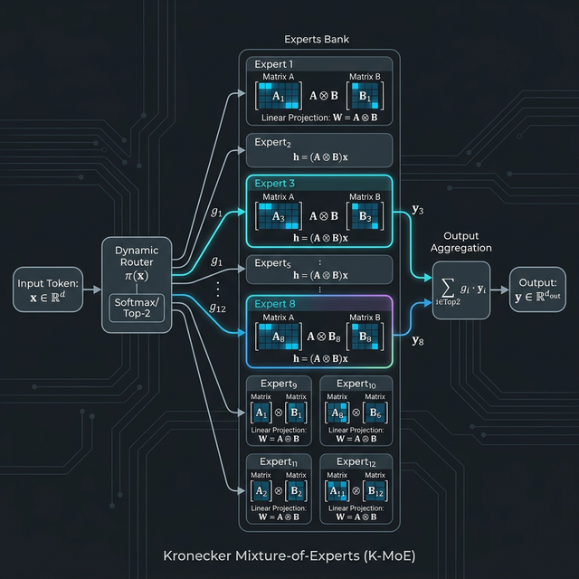

# Kronecker-MoE (K-MoE) 架構完整解析

## 1. 架構簡介 (Overview)

**Kronecker-MoE (K-MoE)** 是一種專為大型語言模型 (如 Mamba、Transformer) 設計的極致參數壓縮與高效能替換技術。它將傳統神經網路中最佔據記憶體與運算資源的「稠密線性投影層 (Dense Linear Projection Layer)」替換為基於**「Kronecker 矩陣分解」**與**「稀疏混合專家 (Sparse Mixture-of-Experts)」**的強大複合架構。

傳統的大規模矩陣如果過於龐大（例如：從 $D_{in}$ 映射到 $D_{out}$），不僅拉升了 VRAM 的占用，也嚴重拖慢計算。K-MoE 利用等價的幾何變換公式，以極少的參數儲存量，卻能模擬出擁有上千個子專家切片的高維特徵空間。

**K-MoE 視覺架構圖 (Visual Diagram)**：


**K-MoE 完整架構圖 (ASCII Diagram)**：

```text
       [ 輸入特徵向量 x / 矩陣 X ]
                   │
                   v
          +------------------+
          |                  |  <-- 計算出 N 個專家的指派機率 (G_i)
          |  Dynamic Router  |      並負責載荷平衡 (Load Balancing)
          |   (x · Theta)    |
          |                  |
          +------------------+
                   │
                   v
     [ Top-K 篩選 (例如 K=2, N=1024) ]
            /             \
           /               \
          v                 v                 休眠
    +-----------+     +-----------+       +-----------+
    | 專家 1    |     | 專家 2    |       | 專家 N    |
    |  (A1, B1) |     |  (A2, B2) |  ...  |  (AN, BN) |
    |           |     |           |       |           |
    | A1·X·B1^T |     | A2·X·B2^T |       | (零計算量)|
    +-----------+     +-----------+       +-----------+
          \                 /
           \               /
            v             v
       +-----------------------+
       |   特徵匯聚 Weighted     |  <-- 依照 Router 機率點積合成:
       |  (Output Aggregation) |      Y_final = G_1*Y_1 + G_2*Y_2
       +-----------------------+
                   │
                   v
           [ 輸出特徵 Y ]
```

---

## 2. 核心數學原理 (Mathematical Foundation)

### 2.1 Kronecker 矩陣分解 (Kronecker Factorization)

在傳統的 `nn.Linear` 中，我們需要一個巨大的權重矩陣 $W \in \mathbb{R}^{D_{out} \times D_{in}}$。當維度達到數萬時，參數量會呈現平方級別爆炸。

K-MoE 的第一個核心思想是：**將巨大矩陣 $W$ 拆解為兩個極小矩陣的 Kronecker 積 (Kronecker Product)**。
假設我們將輸入維度分解為 $D_{in} = p_1 \times p_2$，輸出維度分解為 $D_{out} = q_1 \times q_2$。
我們構建兩個小矩陣：

- $A \in \mathbb{R}^{q_1 \times p_1}$
- $B \in \mathbb{R}^{q_2 \times p_2}$

在數學上，原本的權重可以視為：$W \approx A \otimes B$

### 2.2 零記憶體膨脹的高效運算 (Efficient Computation Identity)

Kronecker 積如果直接展開，依然會產生極大的矩陣，導致記憶體崩潰（這就是絕對不能用 `torch.kron` 的原因）。K-MoE 運用了高等線性代數中的一個核心恆等式 (Kronecker-Vector Product identity)：

若要把輸入向量 $x \in \mathbb{R}^{D_{in}}$ 乘上 $W$，我們可以先將 $x$ 變換成矩陣形式 $X \in \mathbb{R}^{p_1 \times p_2}$，然後執行以下運算：
$$ Y = A X B^T $$
最後再將 $Y$ 攤平 (Flatten) 回一維向量。
**這與計算 $(A \otimes B)x$ 得到的結果在數學上是完全等價的！** 但我們只需對小矩陣作極限速的批次矩陣乘法 (Batch Matrix Multiplication, `bmm`)。

### 2.3 變異數補償初始化 (Variance Preservation)

Kronecker 相乘在空間映射時，會有「變異數相乘放大」的現象：$Var(Y) \approx Var(A) \times Var(X) \times Var(B)$。這會產生嚴重的梯度爆炸或消失（梯度粉碎）。
K-MoE 透過嚴格校準常態分佈的標準差，讓：
$$ Var(A) = Var(B) = \sqrt{\frac{1}{Fan*{in}}} $$
（其中 $Fan*{in} = p_1 \times p_2$）。這樣便能在初始化時保證 $Var(Y) \approx Var(X)$，維持梯度的完美平滑傳遞。

### 2.4 混合專家機制 (Mixture-of-Experts, MoE) 的數學表述

K-MoE 捨棄了單一的全域稠密矩陣，將 Kronecker 分解技術與 MoE 結合。網路不再只有一組 $A$ 與 $B$，而是宣告了 $N$ 組獨立的專家矩陣庫，每組專家 $i$ 皆維護一對專屬的小型權重 $\{A_i, B_i\}$。

對於給定的輸入特徵向量 $x$，系統設置了一個可學習的「路由器 (Router)」權重矩陣 $\Theta$，用於產生對這 $N$ 個專家的分配分數 (Logits)：
$$ H(x) = x \cdot \Theta $$

接著使用 Softmax 計算每個專家 $i$ 的分配機率 $G_i(x)$：
$$ G*i(x) = \frac{\exp(H_i(x))}{\sum*{j=1}^N \exp(H_j(x))} $$

在推論階段，系統利用 $\text{Top-}K$ 篩選機制，僅喚醒機率最高的 $K$ 個專家（例如設定 $K=2$, $N=1024$）。對於被選中的專家 $k$，系統執行前述的 Kronecker 等效運算 $Y_k = A_k X B_k^T$，最後再透過算出的機率加權合成最終結果：
$$ Y*{final} = \sum*{k \in \text{Top-}K} G_k(x) \cdot Y_k $$
這樣的數學表述，使得神經網路能在擁有龐大數量 $N$ 的決策空間中維持巨大的模型容量（Capacity），但每次前向傳播卻只花費相當於啟動 $K$ 組微小矩陣的超低 FLOPs 計算功力。

### 2.5 MIMO Rank、Top-K 與總專家數 N 的計算強度關係

在替換原有 Mamba-3 的 `x_up_proj` 與 `out_proj` 時，我們面對的是核心狀態展開與投射，這深受 MIMO (Multi-Input Multi-Output) 架構中 **秩 (Rank, $R$)** 參數的影響。理解 $R$、$K$、$N$ 的數學關係是效能最佳化的關鍵：

- **MIMO Rank ($R$)**:
  決定了特徵從基底空間被映射或展開的多樣性維度。在 K-MoE 中，傳統巨大矩陣（如 $P \to P \times R$）被拆解到微矩陣 $A_i$ 與 $B_i$ 中，$R$ 隱含在矩陣的邊長 $p$、$q$ 因子內。$R$ 越大，單一專家 $i$ 執行 $A_i X B_i^T$ 時的基礎 FLOPs 就越高。
- **Top-$K$ (活躍專家數)**:
  $K$ 決定了「計算強度乘數」。對於每一個輸入，無論模型後面建了多少倉庫，我們只會執行 $K$ 次微型矩陣乘法。因此，該網路層的**實際計算延遲 (FLOPs) 與 $K \cdot R$ 成正比**，但與 $N$ 無關！
- **總專家數 $N$ (模型容量 Capacity)**:
  $N$ 代表「解空間的廣度」。增加 $N$（如 1024 或 4096）**完全不會增加推論時的 FLOPs 運算延遲**，只會線性增加靜態 VRAM 權重佔用。

**綜合數學三角關係：**
傳統 Dense 層的計算複雜度為 $\mathcal{O}(D_{in} \cdot D_{out} \cdot \dots)$。
在 K-MoE 中，給定 Batch 特徵量 $T$，單層計算複雜度被精準壓縮為：
$$ \mathcal{O}\Big( T \cdot K \cdot \big(\text{FLOPs}(A_i X B_i^T, R)\big) \Big) + \text{Router}\mathcal{O}(T \cdot N) $$
*(註：Router 乘法 $\mathcal{O}(T \cdot N)$ 花費極低，因為它只是一維映射。)\*

這三者的關係讓我們在系統設計時擁有一項「**無痛擴容超能力**」：如果我們需要讓模型變得更聰明（擴展 Capacity），我們只需放心大膽地**調高 $N$**；只要保持活躍數 $K$（通常是 2）與基礎乘數 $R$ 不變，整個模型的**計算速度 (Speed)** 將幾乎維持不變！

### 2.6 與原本 Mamba-3 公式的無縫融合對照 (Mamba-3 Integration Formula)

為了更清楚展示 K-MoE 是如何徹底替換線性層但保持外在行為一致，我們來對照 **原始 Mamba-3** 與 **K-MoE 增強版 Mamba-3** 進入核心 SSM 狀態的關鍵公式變化：

**原始 Mamba-3 的投影層 (Dense Projections)**：
在原本的 `Mamba3Block` 中，有兩個佔據多數參數的稠密矩陣：

1. **特徵升維 (x_up_proj)**：將輸入映射至 MIMO 秩 (Rank $R$)。
   $$ x*{up} = x' \cdot W*{up} $$
2. **輸出降維 (out_proj)**：將內部狀態 $y$ 降維回原本模型寬度。
   $$ y*{out} = (y \odot z*{act}) \cdot W*{out} $$
   其中 $W*{up}$ 與 $W_{out}$ 都是非常巨大的全域權重矩陣。

**K-MoE 替換後的公式 (K-MoE Projections)**：
導入 K-MoE 後，原先龐大且單調的 $W$ 轉換為具備 1024 條動態路徑的高維決策空間。對於輸入 $x'$ 或內部特徵 $y$，投影公式轉變為：

1. **特徵升維 (kmoe_x_up_proj)**：
   $$ x*{up} = \sum*{k \in \text{Top-K}} G_k^{\text{up}}(x') \cdot \Big(A_k^{\text{up}} X' (B_k^{\text{up}})^T\Big) $$
2. **輸出降維 (kmoe_out_proj)**：
   $$ y*{out} = \sum*{k \in \text{Top-K}} G*k^{\text{out}}(y \odot z*{act}) \cdot \Big(A*k^{\text{out}} Y*{\text{state}} (B_k^{\text{out}})^T\Big) $$

**公式轉換意義：**

- $G_k(\cdot)$ 代表 Router 計算出的動態權重分數。這意味著 Mamba-3 在處理每個字詞 (Token) 時，會**根據語境脈絡當下，動態決定用哪幾個微型矩陣來展開或壓縮狀態**，不再是死板地乘以同一個巨大的 $W$。
- $X'$ 與 $Y_{\text{state}}$ 是為了符合 Kronecker 乘法而經過重新排列組合 (Reshape) 的特徵矩陣。
- 對於 Mamba-3 核心的狀態機 (SSM Scan) 與序列收斂機制而言，這項修改**完全被封裝在投影層內**，輸入的形狀與輸出的形狀 $100\%$ 與原先相同！Mamba-3 的掃描引擎甚至不會發覺它的齒輪已經從單臂怪力換成了擁有 1024 個微型引擎的智能變速箱。

---

## 3. 架構設計與運行機制 (Architecture Design)

結合 Kronecker 分解與 MoE 機制，整體運算流程如下：

**K-MoE 運行機制流程圖 (ASCII Flowchart)**：

```text
                  [ 輸入 Token 特徵 x ]
                           │
      +--------------------+--------------------+
      │                                         │
      v                                         v
 [ 1. 路由器分配 ]                         [ 3. 稀疏觸發 ]
 (Dynamic Router)                      (Sparse Activation)
      │                                         │
      ├─> 計算 1024 個專家機率                  │
      │   (Softmax + Top-K)                     │
      v                                         v
 [ 獲得 Top-2 專家 ID & 機率 ] ───────> (僅喚醒 Top-2 專家矩陣，其餘休眠)
      │                                         │
      │                                         v
      │                           +---------------------------+
      │                           │ 2. 專家儲存庫 (Experts Bank)│
      │                           │   (專屬微小矩陣 A_k, B_k)   │
      │                           +---------------------------+
      │                                         │
      │                                         v
      │                                [ 計算 Y_k = A_k X B_k^T ]
      │                                         │
      +--------------------+--------------------+
                           │
                           v
                   [ 4. 特徵匯聚 ]
               (Output Aggregation)
     ( Y_final = G_1 * Y_1 + G_2 * Y_2 ) * Scale + Bias
                           │
                           v
                     [ 最終輸出 ]
```

1. **專家儲存庫 (Experts Bank)**：
   我們不只建一組 $A$ 和 $B$。我們配置了 $N$ 組專家（例如 $N=1024$）。每個專家 $i$ 都有自己專屬的微型參數 $\{A_i, B_i\}$。即使有 1024 個專家，因為每個矩陣被拆散得很小，總參數量反而比原本單一顆 Dense Layer 還低。
2. **路由器分配 (Dynamic Router)**：
   輸入的 Token 會先進入一個微型的線性 Router。Router 會為這個 Token 對 1024 個專家打分數，並透過 Softmax 結合 `Top-K` 篩選，選出最適合處理該特徵的主力專家（如 Top-2）。
3. **稀疏觸發 (Sparse Activation)**：
   系統「只會」把 Token 的特徵 $X$ 丟給選出的 Top-2 專家進行 $Y_k = A_k X B_k^T$ 計算，剩餘的 1022 個專家進入休眠，不消耗 FLOPs。
4. **特徵匯聚 (Aggregation)**：
   將這兩個專家的輸出，根據 Router 算出的機率權重進行加權總和（Weighted Sum），最終乘以學習到的純量 `$scale$` 與加上 `$bias$` 後輸出。為了維持與原本 `Linear` 層一樣的數學空間特性，**專家內部移除任何非線性函數 (無 SiLU，無 LayerNorm)** 以還原純粹的線性代數空間。

---

## 4. 關鍵突破：防止專家餓死 (Expert Starvation & Load Balancing)

在 MoE 架構中，Router 為了偷懶，經常會在最初幾步陷入只把所有特徵派給「1 號專家與 2 號專家」的死局，導致剩餘的專家永遠拿不到梯度，稱為模態崩潰 (Mode Collapse) 或專家餓死。

針對這個問題，K-MoE 引入了嚴格的**輔助負載平衡損失 (Auxiliary Load Balancing Loss, $L_{aux}$)** 機制。

### 負載平衡數學定義

對於擁有 $N$ 個專家與一個 Batch 內有 $T$ 個 Token 的調度：

- **$f_i$ (Dispatch Fraction)**: 專家 $i$ 在整個 Batch 中「實際被選中次數」的比例平均。
- **$P_i$ (Routing Probability)**: 所有 Token 給予專家 $i$ 的「平均預測期望機率」。

強迫 Router 全局分佈均勻的輔助損失定義為這兩者的內積放大：
$$ L*{aux} = N \sum*{i=1}^N f_i \cdot P_i $$

當分佈越極端，$L_{aux}$ 就越大；只有當所有特徵完美均勻分配給 1024 個專家時（每個拿到 $\frac{K}{N}$），這個 Loss 才會降到最低。這強制了每個微型專家矩陣都會在訓練期間收到信號。

---

## 5. 多層深度擴展 (Multi-Layer Scalability)

在堆疊了數十層 Block 的巨型模型（如 Mamba-3LM）中，K-MoE 的整合模式基於**「逐層累積、統一結算」**。

1. **層層上報 (Layer-wise Reporting)**：
   每一層的 `Mamba3Block` 在進行前向傳播 (Forward pass) 計算輸出特徵時，都會一併將各自的 $L_{aux}$ 往上回傳。
2. **總部加總 (Global Accumulation)**：
   外層 Model (Language Model 主控端) 會準備一個變數 `total_aux_loss`。隨著 Token 通過 Layer 1, Layer 2 ... 直到 Layer $L$，外層循環會把每一層的 $L_{aux}$ 累加起來。
3. **Alpha 罰分整合 (Alpha Penalty Integration)**：
   最終在計算模型的預測語言 Cross Entropy (CE) 誤差時，引入一個超參數 $\alpha$（一般設為 $0.01$），將它作為正則項加進最終的 Loss 中：
   $$ \text{Final Loss} = \text{CE Loss} + \alpha \times \sum*{l=1}^L (L*{aux}^{(l)}) $$

只要執行 `Final_Loss.backward()`，PyTorch 核心就能透過神經網路深度的鏈鎖律，把平衡信號一次打回這幾十層當中的幾萬名專家路由器裡！
