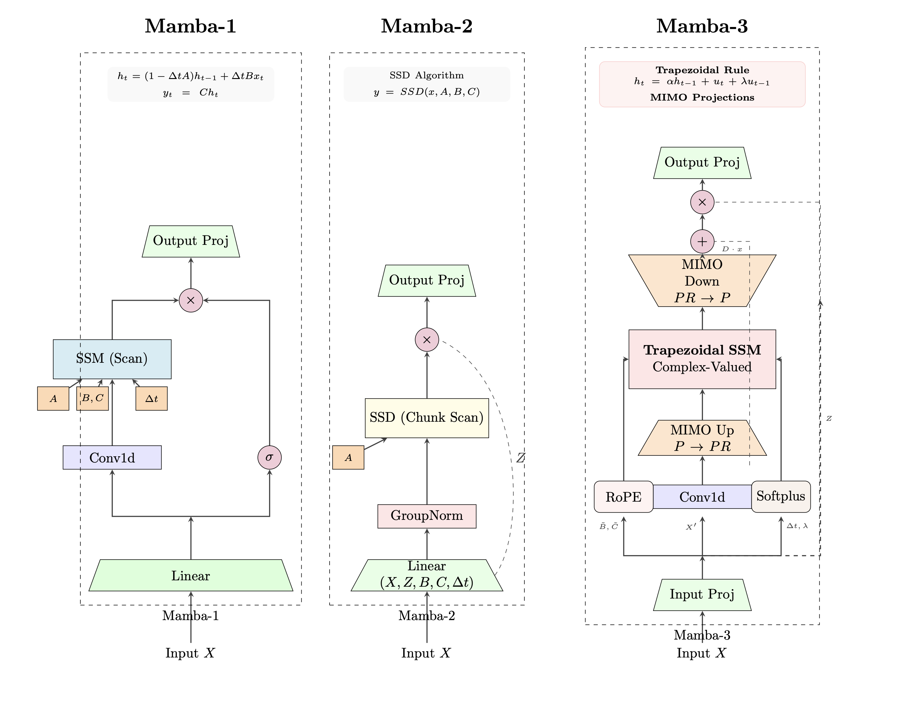
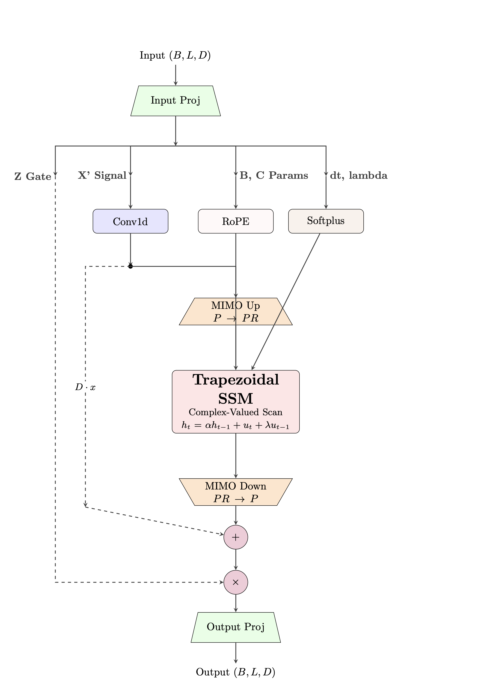

# Mamba-3



> **Mamba-3: Enhanced State Space Models with Trapezoidal Discretization and MIMO Projections**\
> Research Implementation\
> Technical Report: [Internal Documentation](docs/)



> **Detailed Data Flow**: Single Mamba-3 block architecture showing Trapezoidal SSM with MIMO projections

## About

Mamba-3 is an advanced iteration of the Selective State Space Model architecture that integrates **Trapezoidal Rule Discretization** and **Multi-Input Multi-Output (MIMO) Projections**. By replacing the standard Euler method with a higher-order discretization scheme, Mamba-3 achieves superior temporal resolution and long-term dependency modeling. The implementation incorporates engineering best practices from Mamba-2, such as **Chunk-wise Parallel Scan** for numerical stability and **Log-Space Initialization**, ensuring robust performance on sequences up to 32K tokens with machine-level precision ($1.82 \times 10^{-11}$).

Key improvements over Mamba-1/2:

- **Trapezoidal Discretization**: Second-order approximation for more accurate continuous-to-discrete mapping
- **MIMO Projections**: Rank-based expansion (12% latency for 4x capacity)
- **Complex-Valued Dynamics**: RoPE-based simulation of complex SSMs in real-valued framework
- **Vision Support**: Integrated Vision Mamba with Snake Scan and bidirectional processing

## Installation

```bash
git clone <repo-url>
cd mamba3
pip install torch numpy
```

**Requirements:**

- Python 3.8+
- PyTorch 2.0+
- CUDA 11.6+ (for GPU acceleration)

**Optional dependencies for training:**

```bash
pip install timm scikit-learn matplotlib tqdm
```

## Usage

### Mamba-3 Block

The core module of this repository is the Mamba-3 block with Trapezoidal SSM and MIMO projections.

Source: [model.py](model.py)

```python
import torch
from model import Mamba3Block, Mamba3Config

# Initialize with default parameters
config = Mamba3Config(
    d_model=512,      # Model dimension
    d_state=64,       # SSM state dimension
    d_head=64,        # Head dimension
    n_groups=1,       # Number of groups (MQA/GQA)
    mimo_rank=4,      # MIMO rank (Free Lunch capacity)
    expand=2,         # Expansion factor
    use_conv=False,   # Optional 1D convolution
    use_parallel_scan=True  # Chunk-wise parallel scan
)

model = Mamba3Block(config).cuda()

# Forward pass (Batch, Seq, Dim)
x = torch.randn(4, 2048, 512).cuda()
y = model(x)  # (4, 2048, 512)
assert y.shape == x.shape
```

### Vision Mamba

Vision Mamba adapts Mamba-3 for image classification with patch embedding and bidirectional processing.

Source: [vision_mamba.py](vision_mamba.py)

```python
from vision_mamba import VisionMamba

model = VisionMamba(
    img_size=32,
    patch_size=4,
    depth=4,
    embed_dim=128,
    d_state=64,
    d_head=32,
    n_groups=1,
    expand=2,
    mimo_rank=8,
    use_conv=True,      # Recommended for vision
    num_classes=100,
    bidirectional=True  # Vim-style bidirectional
).cuda()

# Forward pass
images = torch.randn(8, 3, 32, 32).cuda()
logits = model(images)  # (8, 100)
```

### Configuration Reference

The `Mamba3Config` class encapsulates all architectural hyperparameters.

#### Core Architecture

| Parameter   | Default | Type  | Description                                                                         |
| :---------- | :------ | :---- | :---------------------------------------------------------------------------------- |
| `d_model`   | 256     | `int` | Model dimension $D$. The input/output dimension of the block.                       |
| `d_state`   | 64      | `int` | State dimension $N$. Size of the recurrent state $h_t$.                             |
| `d_head`    | 64      | `int` | Head dimension $P$. Dimension per head in the multi-head mechanism.                 |
| `n_groups`  | 1       | `int` | Number of GQA/MQA groups $G$. If $1$, it is Multi-Query Attention (MQA).            |
| `mimo_rank` | 4       | `int` | MIMO Rank $R$. The intermediate rank for Up/Down projections (Free Lunch capacity). |
| `expand`    | 2       | `int` | Expansion factor $E$. Determines internal width $D_{inner} = E \times D$.           |

#### Mamba-3 Specifics

| Parameter           | Default   | Type    | Description                                                                    |
| :------------------ | :-------- | :------ | :----------------------------------------------------------------------------- |
| `use_conv`          | `False`   | `bool`  | Enables the optional local 1D convolution before SSM.                          |
| `d_conv`            | 4         | `int`   | Kernel size for the optional 1D convolution.                                   |
| `use_parallel_scan` | `True`    | `bool`  | Enables the Chunk-wise Parallel Scan (SSD algorithm). Essential for stability. |
| `chunk_size`        | 256       | `int`   | Size of chunks for the parallel scan. Values of 128 or 256 are recommended.    |
| `rms_norm_eps`      | $10^{-5}$ | `float` | Epsilon value for numerical stability in RMSNorm layers.                       |

#### Mamba-2 Initialization (Advanced)

| Parameter       | Default      | Type    | Description                                                                     |
| :-------------- | :----------- | :------ | :------------------------------------------------------------------------------ |
| `dt_min`        | 0.001        | `float` | Minimum value for timescale $\Delta t$. Determines finest temporal resolution.  |
| `dt_max`        | 0.1          | `float` | Maximum value for timescale $\Delta t$. Determines longest temporal dependency. |
| `dt_init_floor` | $10^{-4}$    | `float` | Numerical lower bound clamp for initial $\Delta t$.                             |
| `dt_limit`      | `(0.0, inf)` | `tuple` | Running clamp range for $\Delta t$ during forward pass. Usage: `(0.001, 0.5)`.  |
| `A_init_range`  | `(1, 16)`    | `tuple` | Range for log-uniform initialization of decay parameter $A$.                    |

## Architecture Details

### Trapezoidal Rule Discretization

Unlike the Euler method used in prior works ($h_t = (1 - \Delta t A)h_{t-1} + \Delta t B x_t$), Mamba-3 approximates the integral of the state equation using the Trapezoidal Rule. The discrete-time update rule is formulated as:

$$
h_t = \alpha h_{t-1} + u_t + \lambda u_{t-1}
$$

Where:

- $\alpha = \exp(\Delta t \cdot A)$ represents the state decay.
- $u_t = \text{sigmoid}(\lambda) \cdot \Delta t \cdot x_t$ is the weighted current input.
- $\lambda$ is a learnable mixing coefficient initialized to $-3.0$ (sigmoid $\approx 0.047$), allowing the model to adaptively balance current and past inputs.

### Complex-Valued States via RoPE

To capture oscillatory dynamics inherent in complex-valued systems, we employ Rotary Position Embeddings (RoPE) on the input projections $B$ and $C$.

$$
\tilde{B} = \text{RoPE}(B, \theta \cdot \Delta t)
$$

This operation rotates the projection matrices in the complex plane defined by the learnable frequency $\theta$ and time-step $\Delta t$, effectively simulating complex state transitions without explicit complex number arithmetic.

### Multi-Input Multi-Output (MIMO) Projections

Standard SSMs project input $X$ directly to state dimension $N$. Mamba-3 introduces an intermediate rank $R$, decoupling the recurrent state dimension from the input dimension:

1.  **Up-Projection**: $X \xrightarrow{W_{up}} \mathbb{R}^{P \times R}$
2.  **SSM Contraction**: Input to SSM becomes $u = \sum_{r} B_r \cdot X_r$
3.  **Down-Projection**: Output $y = W_{down}(\text{SSM}(u))$

This "Free Lunch" optimization allows scaling the effective capacity (Rank $R=1 \to 16$) with only a 12% increase in latency.

### Numerical Stability & Optimization

To ensure training stability on modern hardware, we adopt several key engineering optimizations:

- **Chunk-wise Parallel Scan (SSD)**: Decomposes the sequence into chunks of size $Q=256$. Intra-chunk operations use matrix multiplication, while inter-chunk states are propagated sequentially. This yields $O(L/Q)$ sequential steps and prevents gradient explosion.
- **Inverse Softplus Initialization**: Initializes the raw `dt_bias` parameter such that $\text{softplus}(\text{bias})$ exactly matches a log-uniform distribution over $[0.001, 0.1]$.
- **Dt Limit**: Clamps $\Delta t$ during the forward pass to prevent numerical instability in exponential terms.

## Experimental Results

### Numerical Precision

We validated the implementation against a double-precision (FP64) sequential reference.

| Metric               | Value                  | Note                     |
| :------------------- | :--------------------- | :----------------------- |
| **Max Error (FP64)** | $1.82 \times 10^{-11}$ | Machine Epsilon          |
| **Max Error (FP32)** | $1.51 \times 10^{-7}$  | Standard Float Precision |
| **Long Sequence**    | 32,768 tokens          | Stable (No NaN)          |

### Computational Efficiency (MIMO)

Scaling the MIMO rank $R$ significantly increases capacity with marginal cost.

| Rank ($R$)         | Latency Relative to Baseline | Throughput Impact |
| :----------------- | :--------------------------- | :---------------- |
| 1 (Baseline)       | $1.00\times$                 | -                 |
| 4 (Recommended)    | $1.03\times$                 | -3%               |
| 16 (High Capacity) | $1.12\times$                 | -12%              |

### Training Dynamics

- **Initialization**: $A$ follows a log-uniform distribution over $[1, 16]$, covering diverse memory horizons.
- **Gradient Flow**: All parameters, including $\Delta t$ and $\lambda$, receive non-zero gradients, confirmed by the test suite.
- **Stability**: Successfully trains on CIFAR-100 with mixed precision (AMP) without gradient clipping issues.

## Testing

### Unified Test Suite

Run the comprehensive test suite with either unittest or pytest:

```bash
# Run all tests with unittest (default)
python test_suite.py

# Run all tests with pytest (verbose output)
pytest test_suite.py -v

# Run specific pytest tests
pytest test_suite.py::test_mamba3_gradient_flow -v
pytest test_suite.py::test_mamba3_numerical_precision -v
```

**Test Coverage:**

The unified `test_suite.py` includes both unittest and pytest-based tests:

**Unittest Tests (20 tests):**

- ✅ Forward pass shape consistency
- ✅ RoPE rotation mechanism
- ✅ Backward pass and gradient computation
- ✅ Mamba-2 initialization (A_log, dt_bias, lambda)
- ✅ Gradient flow through all parameters
- ✅ Numerical stability (dt_limit, long sequences, mixed precision)
- ✅ Parallel scan vs sequential scan equivalence
- ✅ Grouped SSM (MQA/GQA) parameter scaling
- ✅ Vision Mamba integration
- ✅ Overfitting sanity check

**Pytest Tests (8 parametrized tests):**

- ✅ Forward shape with multiple configurations (seqlen, rank, groups, scan mode)
- ✅ Numerical precision (parallel vs sequential, FP32/FP16)
- ✅ Long sequence stability (up to 32K tokens)
- ✅ Gradient flow verification
- ✅ MIMO rank scaling efficiency
- ✅ Configuration variants (conv, groups)
- ✅ Parameter initialization ranges

**Test Parameters:**

- Sequence lengths: 128, 256, 512, 1024, 2048, 4096, 8192, 32768
- MIMO ranks: 1, 4, 8, 16
- Group configurations: 1, 2, 4
- Precision: FP32, FP16
- Scan modes: Parallel (chunk-wise), Sequential (reference)

## Training

### Unified Training Script

For easy deployment, use the standalone `train.py` which includes all dependencies:

```bash
# Single-file training (no external dependencies needed)
python train.py
```

This unified script combines:

- `model.py` - Core Mamba-3 implementation
- `vision_mamba.py` - Vision Mamba wrapper
- `diagnostics.py` - Training diagnostics
- Training logic with all optimizations

### Modular Training (Development)

For development and experimentation, use the modular approach:

```bash
python colab_script.py
```

**Required Files:**

- `model.py` - Core Mamba-3 implementation
- `vision_mamba.py` - Vision Mamba wrapper
- `diagnostics.py` - Training diagnostics and plotting
- `colab_script.py` - Main training script

### Training Features

- Mixed Precision Training (AMP)
- Exponential Moving Average (EMA)
- MixUp Augmentation
- Stochastic Depth (DropPath)
- Cosine Annealing with Warmup
- Comprehensive Diagnostics

**Required Files:**

- `model.py` - Core Mamba-3 implementation
- `vision_mamba.py` - Vision Mamba wrapper
- `diagnostics.py` - Training diagnostics and plotting
- `colab_script.py` - Main training script

## Citation

If you use Mamba-3 in your research, please cite:

```bibtex
@article{mamba3_2024,
  title={Mamba-3: Enhanced State Space Models with Trapezoidal Discretization and MIMO Projections},
  author={Research Implementation},
  journal={Technical Report},
  year={2025}
}
```

**Related Work:**

```bibtex
@article{mamba,
  title={Mamba: Linear-Time Sequence Modeling with Selective State Spaces},
  author={Gu, Albert and Dao, Tri},
  journal={arXiv preprint arXiv:2312.00752},
  year={2023}
}

@inproceedings{mamba2,
  title={Transformers are {SSM}s: Generalized Models and Efficient Algorithms Through Structured State Space Duality},
  author={Dao, Tri and Gu, Albert},
  booktitle={International Conference on Machine Learning (ICML)},
  year={2024}
}
```
