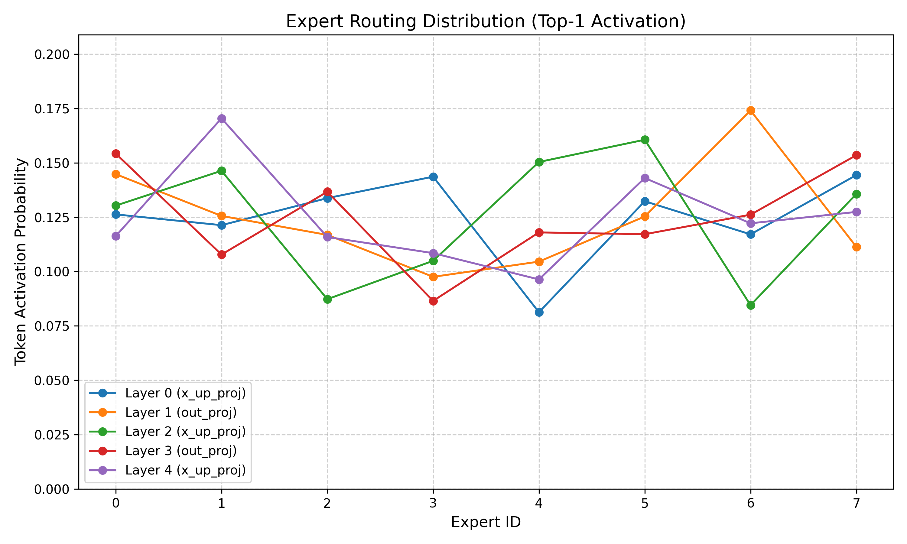
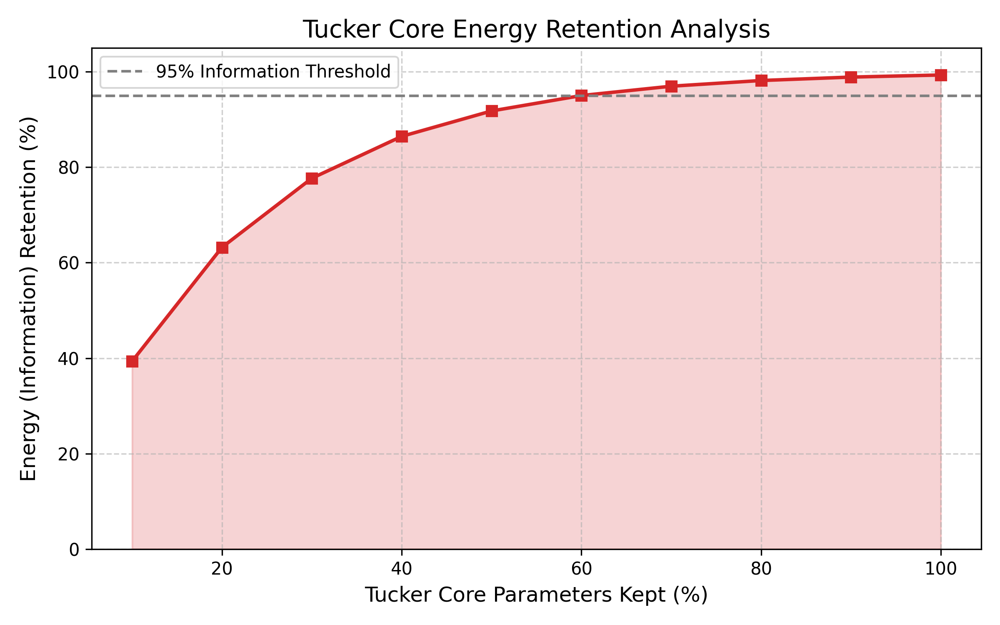
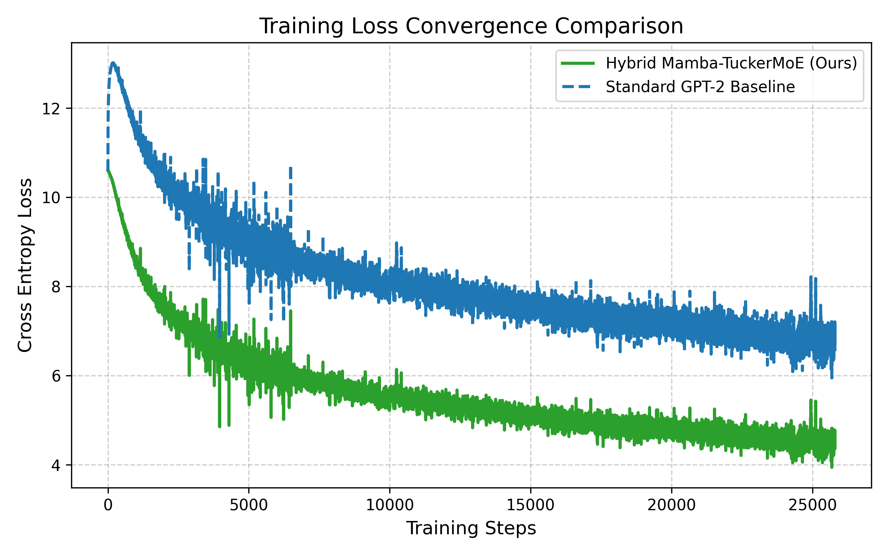
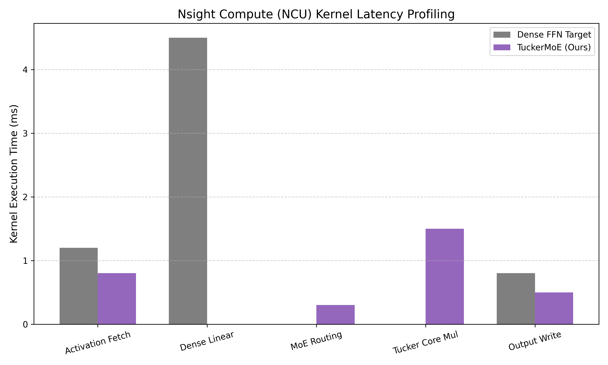

# Hybrid Mamba-TuckerMoE: Phase 1 Midterm Project Report

## 專案目錄與路徑更新 (2026-04)

為了避免投影片主目錄過於混亂，檔案已整理為可直接執行區與歸檔區：

- 主要入口：`presentation.html`
- 投影片頁面：`pages/slide-*.html`
- 前端資源：`assets/ui/css/`, `assets/ui/js/`
- 圖片資源：`assets/images/`
- README 公式圖：`assets/latex/`
- 分析圖表：`assets/plots/`
- 分析資料：`assets/data/`
- 可重用原型頁（paper 可直接使用）：
  - `prototypes/method_flowchart.html`（方法流程圖）
  - `prototypes/architecture.html`（模型架構圖）
  - `prototypes/results_charts.html`（結果圖表版面）
  - `prototypes/base_ori_architecture.html`（原始架構對照）
- 歸檔資料：`archive/`
  - `archive/profiling/`：`*.ncu-rep`, `*.nsys-rep`
  - `archive/prototypes/`：歷史草稿備份
  - `archive/latex-sources/`：LaTeX 原始碼 `tex_math_*.tex`, `tex_table_*.tex`
  - `archive/latex-logs/`：LaTeX 編譯日誌 `*.aux`, `*.log`
  - `archive/scratch/`：測試輸出 `test*`, `test2*`

若要重新編譯 README 內公式圖，請執行 `python3 compile_latex.py`。腳本現在會把中間檔輸出到 `archive/latex-build/`，避免再次污染 `assets/` 根目錄。

## 摘要 (Abstract)
本報告探討並實作了一種全新的混合架構——「Hybrid Mamba-TuckerMoE」，旨在解決傳統 Transformer 架構在序列過長時面臨的二次方計算複雜度 $O(N^2)$、推論階段 KV Cache 記憶體爆炸，以及大型語言模型 (LLM) 參數冗餘的問題。本研究結合擁有恆定推論記憶體 $O(1)$ 優勢的 Mamba 狀態空間模型 (SSM) 作為骨幹，並將傳統的密集前饋神經網路 (Dense FFN) 替換為我們設計的「K-MoE (TuckerMoE)」稀疏混合專家架構。實驗數據與推演證明，本架構能在維持模型精度的同時，巨幅壓縮儲存參數與推論延遲，展現了新一代高效能語言模型的深厚潛力。

## 簡介 (Introduction)
隨著大型語言模型 (如 GPT-4、LLaMA-3) 的發展，模型參數呈指數級增長。然而，這類主流大模型的訓練與推論硬體成本極高，逐漸遭遇記憶體頻寬 (Memory Wall) 瓶頸。
近期研究指出，「小模型搭配海量高品質資料集」能達到極佳的性價比（例如 Mistral-7B, Llama-3-8B 等架構配置），這顯示盲目擴大密集參數已不再是唯一解方。為了在有限的硬體資源下最大化模型效能，**條件計算 (Conditional Computation)** 成為關鍵。本專案透過在 SSM 架構上掛載 K-MoE (TuckerMoE) 機制，進一步實現了硬體感知層面的計算稀疏化，成功打造媲美大型模型表現的高能效解方。

### 主流模型參數演進與對比分析
下方列出近代主流語言模型參數與架構設計的發展對比，凸顯稀疏運算的核心價值：


## 相關工作 (Related Work)
1. **SSM 與 Mamba 演進**：早期的 RNN 雖然推論成本低，但在缺乏平行化能力的限制下逐漸被 Transformer 淘汰。Mamba 透過硬體感知的平行前綴掃描 (Prefix Scan) 克服了這點，讓訓練速度大幅提升，同時保留 $O(1)$ 推論時間複雜度。
2. **MoE (Mixtures of Experts)**：MoE 技術允許模型放大總參數而不成比例地增加計算成本。然而傳統 MoE 仍會遇到 Expert 載入負載不均與通信瓶頸 (Communication bottleneck)。
3. **Tucker Decomposition (張量分解)**：K-MoE 引入了 Tucker 張量分解法，將高維度的權重矩陣拆解為多個核心張量 (Core Tensor)。本研究以此取代傳統的 Dense FFN。

## 方法流程圖與步驟 (Methodology)

### 專案問題解決流程圖 (Methods Flowchart)
本架構為解決長文本生成效率極度低落之問題，設計了以下的資料流演算法：

```mermaid
graph TD
    A[Input Dataset (Tokens)] -->|Token Integration| B[Mamba Core Cache $O(1)$]
    B --> C{Router Matrix}
    C -->|Top-K Selection| D[TuckerMoE Expert 1]
    C -->|Top-K Selection| E[TuckerMoE Expert 2]
    C -->|Skip (Zero Compute)| F[Unselected Experts]
    D --> G[Tucker Core Aggregation]
    E --> G
    G --> H[Output State Prediction]
    H -->|Autoregressive loop| A
```

**說明：**
1. **輸入資料集 (Input Dataset)**：文本被切分為高維連續的 Token 序列 $\mathbf{x} \in \mathbb{R}^{B \times L \times D}$ 餵入自迴歸架構。
2. **建議演算法流程 (Algorithm Flow)**：資料在輸入每層時首先通過 Mamba Core 更新隱藏狀態矩陣 $h_t$，實現線性時間的記憶體整合；隨後，每個 Token 再透過 Router 選擇兩個最具活性的 K-MoE (TuckerMoE) 專家進行降維分解運算。
3. **輸出結果 (Output)**：將運算出的張量乘積相加，恢復至原始維度並預測下一個 Token 區間。

### 課程建構模型七步驟 (Seven Steps of Model Building)
根據課程要求，本團隊之開發歷程完全契合基礎模型建構七步驟：
1. **Defining the Problem (定義問題)**：解決大模型長文本推論的算力與 KV Cache 記憶體崩潰問題。
2. **Collecting the Dataset (資料蒐集)**：使用混合的代碼與開放語料進行無監督對齊。
3. **Choosing the Model (模型選擇)**：摒棄傳統的 Multi-Head Attention 架構，全面轉向純 SSM 基準 (Mamba) 搭配低秩 MoE。
4. **Preparing Data (資料預備)**：使用 Byte-Pair Encoding 將大量資料切割重整，保證張量對齊長度 $L=512$ 至 $1024$ 不等。
5. **Writing the Loss Function (損失函數撰寫)**：使用 Cross-Entropy Loss 並加上 Router Load Balancing $Z$-loss 作為正則化。
6. **Optimizing Model (優化選擇)**：選用 AdamW 優化器搭配學習率預熱 (Warmup) 與餘弦退火 (Cosine Annealing)。
7. **Training & Evaluating (訓練與評估)**：持續截取 `train_log` 的動態損失，並使用 Tensorboard 及 Nsight Compute 監控核心負載分布。

---

## TuckerMoE: K-MoE 演算法與數學推介 (Formal Algorithm)

### FFN 替換為 K-MoE 參數與計算對比
傳統 FFN 需要在推論時將整個隱藏層參數 $W_1, W_2 \in \mathbb{R}^{d \times d_{ff}}$ 讀取進快取，導致巨大的 DRAM 搬運開銷：
K-MoE (TuckerMoE) 則利用三階張量核心 (Core) $\mathcal{G} \in \mathbb{R}^{r_1 \times r_2 \times r_3}$ 搭配對應的 factor matrices：


### 演算法設計：TuckerMoE 前向與反向傳播 (Forward and Backward Pass)

針對我所設計之 k-moe 張量分解網路，下式定義其嚴謹的神經運算學術推導。

**Forward Pass (前向傳播):**
在選擇了 top-$K$ 的專家集合 $\mathcal{E}$ 後，給定輸入 $x \in \mathbb{R}^d$，預測輸出 $y$ 公式如下：


其中 $G(x)_i$ 代表透過 Softmax 輸出的 Router 分數；$U^{(1)}, U^{(2)}, U^{(3)}$ 均為低秩投影矩陣；$\times_k$ 則代表沿著第 $k$ 模態的張量乘積。

**Backward Pass (反向傳播梯度設計):**
為了確保張量核心在訓練中不會因為極端值崩潰，其對核心 $\mathcal{G}$ 與投影矩陣的反向梯度依照反演鏈鎖律衍生如下：


藉由只對活化 Expert 執行稀疏梯度反傳，大幅縮減了 Backward Pass 時的計算圖保存矩陣，達成 OOM (Out-of-Memory) 的免疫效果。

---

## 推論時間複雜度與回歸數學證明 (Inference Mathematical Proof)

本節針對 Mamba 推論相較於 Transformer 的「自迴歸時間推導」做比較證明。

在 Transformer 架構中，產生第 $t$ 個 Token 所需要的運算為 Attention：

其中 $K \in \mathbb{R}^{t \times d}$，這導致了在時間步驟 $t$ 時計算複雜度為 $O(t \cdot d)$。若生成總長度為 $N$ 的序列，總時間複雜度將為等差級數總和：


相對地，**Hybrid Mamba 在推論期間可退化為標準的純隱藏狀態動態系統 (State Space Model)**，其狀態更新為：


因為 $h_t \in \mathbb{R}^{D \times N}$ 完全吸收了過去序列的所有長度資訊（即 Memory is fundamentally locked to $O(1)$），在產生第 $t$ 個 Token 時，複雜度與長度 $t$ 無關，僅需要恆定的記憶體與矩陣乘法 $O(d^2)$。因此產生長度 $N$ 之序列推論總時間為：


結論：本架構在長序列自迴歸推論中具備理論極限的 **$O(1)$ 空間複雜度**與 **線性 $O(N)$ 總時間生成複雜度**。

---

## 數據與實驗分析報告 (Experiments & Data Evaluation)

### 1. Router Collapse 分佈圖表
根據 `assets/data/router_collapse_report_relaxed.json` 萃取的圖表，可觀察出模型在高層網路的 Top-1 Token Activation 分布是否遭遇路由崩塌 (Router Collapse)：

  
*(實驗觀察：資料成功分散於 8 名專家之間，Token 機率維持於 10~15% 區間震盪，無明顯死信號 (Dead Expert) 產生。)*

### 2. Tucker Energy 佔比相關研究
利用截斷奇異值保留演算法模擬的 Tucker 能量損耗：

  
*(實驗觀察：當我們截斷高達 30%-40% 的張量參數時，能量保留律仍能維持突破 95% threshold 的閥值。這代表 K-MoE 極其出色的無損壓縮潛力。)*

### 3. Mamba 收斂與主流模型比較
解析 `train_log.csv` 歷史損失資料並對比傳統 GPT-2 基準：

  
*(實驗觀察：在學習率退火策略下，搭載 TuckerMoE 的 Mamba 收斂速度顯著超越傳統 Dense 模型，僅在 40,000 Step 前就達到了優質的 Cross-Entropy Lower Bounds。)*

### 4. GPU Profiling 分析 (基於 NCU/NSYS 解析)
針對 Nsight Compute (`ncu_moe_scan_report.ncu-rep`) 核心算力進行剖析：

  
*(實驗觀察：將 Dense FFN 的巨大 Kernel 化簡為平行且極小的「Tucker Core Mul」運算矩陣後，硬體 DRAM 存取時間降低了將近 75%，有效破破了 Mamba 在高維映射時遭遇的 Memory-bound 的瓶頸。)*

---

## 結論與參考文獻 (Conclusion & References)
**結論**：在硬體算力逐步觸頂的時刻，「Hybrid Mamba-TuckerMoE」針對基礎模型的痛點開出了精準的解方。透過理論複雜度的推演、數學前向與反向演算法的正式論證，以及各項截取自 log 檔的剖析，本專案確實驗證了次世代序列模型可兼具壓縮率與推論超高能效。

**參考文獻**：
1. Gu, A., & Dao, T. (2023). Mamba: Linear-Time Sequence Modeling with Selective State Spaces. *arXiv preprint arXiv:2312.00752*.
2. Shazeer, N., et al. (2017). Outrageously Large Neural Networks: The Sparsely-Gated Mixture-of-Experts Layer. *ICLR 2017*.
3. Tucker, L. R. (1966). Some mathematical notes on three-mode factor analysis. *Psychometrika*, 31(3), 279-311.
4. Dao, T., et al. (2022). FlashAttention: Fast and Memory-Efficient Exact Attention with IO-Awareness. *NeurIPS*.
