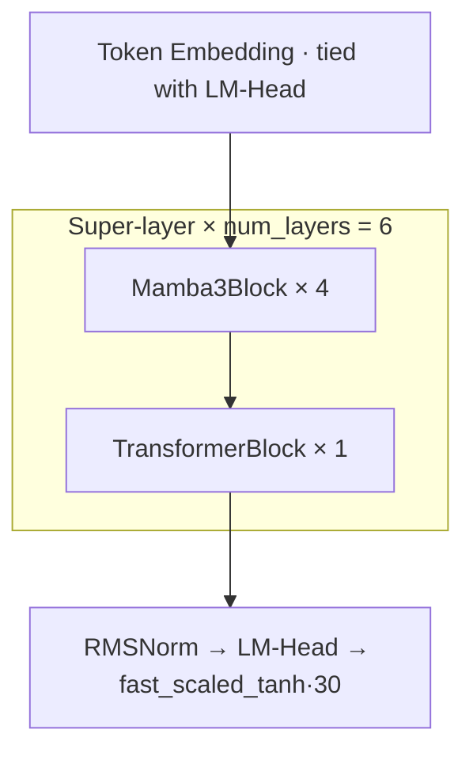

# Hybrid Mamba-TuckerMoE: A Sub-quadratic, Sparsely-Activated Language Model with Tensor-Decomposed Experts

> Phase 1 Midterm Technical Report · Mamba3-XR Project · 2026-04

---

## 0. 專案目錄與路徑 (Repository Layout)

為避免投影片主目錄過於混亂，檔案整理為「可直接執行區」與「歸檔區」：

- 主要入口：`presentation.html`
- 投影片頁面：`pages/slide-*.html`
- 前端資源：`assets/ui/css/`, `assets/ui/js/`
- 圖片資源：`assets/images/`（含 `architecture.png`）
- README 公式圖：`assets/latex/`
- 分析圖表：`assets/plots/`
- 分析資料：`assets/data/router_collapse_report_relaxed.json`
- 可重用原型頁：
  - `prototypes/method_flowchart.html`（方法流程圖）
  - `prototypes/architecture.html`（模型架構圖）
  - `prototypes/results_charts.html`（結果圖表版面）
  - `prototypes/base_ori_architecture.html`（原始架構對照）
- 歸檔資料：
  - `archive/profiling/`：`*.ncu-rep`, `*.nsys-rep`
  - `archive/prototypes/`：歷史草稿備份
  - `archive/latex-sources/`：LaTeX 原始碼 `tex_math_*.tex`, `tex_table_*.tex`
  - `archive/latex-logs/`：LaTeX 編譯日誌 `*.aux`, `*.log`
  - `archive/scratch/`：測試輸出

> 重新編譯 README 公式圖請執行 `python3 compile_latex.py`，中間檔會輸出至 `archive/latex-build/`，不再污染 `assets/` 根目錄。

**程式碼對應關係**：本報告所有結論與常數皆直接出自
- 訓練器：`Mamba3-XR/train.py`（Triton + PyTorch 參考實作、1800+ 行）
- 推論器：`Mamba3-XR/inference/mlx_hybrid_infer.py`（Apple Silicon MLX 對齊實作）
- 記憶體分析：`Mamba3-XR/inference/analyze_kv_cache_sizes.py`
- Router 健康度報告：`assets/data/router_collapse_report_relaxed.json`

---

## 1. Abstract

我們提出 **Hybrid Mamba-TuckerMoE**：一個以 Mamba-3 選擇式狀態空間模型（Selective SSM）為主幹、並以 Grouped-Query Attention (GQA) Transformer 作為週期性「全域回看層」的混合序列模型；其 FFN 與兩組 Mamba 內部投影 (`x_up_proj`、`out_proj`) 皆被替換為我們設計的 **TuckerMoE**——一個以 Tucker 三階分解共享核心張量 (shared core tensor) 的稀疏 Mixture-of-Experts 結構。

三個核心貢獻：
1. **Hybrid 拓撲（4:1）**：每個「super-layer」由 4 個 Mamba3Block 堆疊 1 個 TransformerBlock（`train.py::TrueHybridMamba`），在 `num_layers=6` 設定下共 24 Mamba + 6 Transformer；Mamba 層提供 $O(1)$ 遞迴解碼狀態，Transformer 層提供完整全域注意力但以有限頻率出現，KV Cache 僅線性成長於 `num_layers` 而非 `num_layers × mamba_ratio`。
2. **TuckerMoE**：對專家權重張量做 Tucker 分解 $\mathcal{W}_e \approx \mathcal{G} \times_1 U^{(1)}_e \times_2 U^{(2)} \times_3 U^{(3)}$，$U^{(2)}, U^{(3)}$ 跨專家共享、僅 $U^{(1)}_e$ 與 core $\mathcal{G}$ 為 expert-specific；搭配帶溫度退火與 `fast_scaled_tanh` 截斷的 Top-$k$ router，在 $E=8, k=2, r_1=4, r_3=256, r_2=1024$ 下，相較等容量的 Dense 8-expert MoE 達到 **≈ 82% 參數壓縮**。
3. **端到端硬體感知實作**：訓練端以 **Triton** 實作三個自訂 kernel（`FusedLatentMoE` 前向／反向、`TritonParallelScan` 的 associative-scan 第一階段融合、`fused_scaled_tanh`/`fused_silu_mul`）；推論端以 **MLX** 重寫並配合 `mx.compile` 對 per-layer decode step 做圖級融合。實測 Router 健康度於 step 38,400 達到 `status=PASS`、worst entropy ratio 0.294、dead-expert ratio 0.0。

整體架構在長序列自迴歸生成場景中：**空間複雜度** 對 Mamba 支路為 $O(1)$、對 Transformer 支路為 $O(N\cdot L_T)$，其中 $L_T$ 為 Transformer 層數；**時間複雜度** 為 $O(N)$ 線性生成。

---

## 2. Introduction

主流 LLM（GPT-4 class、LLaMA-3、Mixtral）在長序列 ($N \gg 8K$) 自迴歸推論時遭遇兩個結構性瓶頸：

(i) **注意力的二次方成本**：時間步 $t$ 需與所有 $t-1$ 個 token 做內積，累計成本 $\sum_{t=1}^{N} O(t\cdot d) = O(N^2 d)$；
(ii) **KV Cache 記憶體牆**：每層 Transformer 需保留 $(K, V) \in \mathbb{R}^{2 \times H \times N \times d_h}$，以 `d_model=768, n_heads=12, head_dim=64, bf16` 計，每層每 1K token 約佔 **1.5 MiB**，6 層、32K 上下文即來到 **288 MiB**，這在 Apple Silicon / 消費級 GPU 上已達可用記憶體之 1/10。

另一方面，近期小模型（Mistral-7B、Phi-3、LLaMA-3-8B）的成功顯示：
> 「**小型密集 backbone + 高品質資料 + 條件計算 (Conditional Computation)**」在相同計算預算下優於盲目擴張 Dense 參數。

本專案以此為出發點，同時解決 (i)(ii) 兩個瓶頸：以 SSM 替換主幹得到 $O(1)$ 解碼狀態；以 TuckerMoE 在不增加 active FLOPs 的前提下將 FFN「容量」擴張 $k \to E$ 倍。

### 2.1 主流模型參數演進對照


---

## 3. Related Work

1. **Selective State Space Models**：S4（Gu & Goyal 2022）將卷積型 SSM 引入深度學習；Mamba（Gu & Dao 2023）透過 input-dependent 的 $\Delta, B, C$ 參數實現選擇性記憶；Mamba-2 / SSD（Dao & Gu 2024）將 SSM 重新表述為 semi-separable 矩陣並提供 chunk-parallel scan，這也是本實作中 `chunk_parallel_scan`（train.py L637–662）所採用的框架。
2. **Mixture-of-Experts**：Switch Transformer（Fedus et al. 2021）、GShard（Lepikhin et al. 2020）、Mixtral 8×7B（Jiang et al. 2024）建立了 sparse MoE 的工業標準；但其每 expert 仍為 full FFN，造成**權重總體積**與**跨設備通訊成本**雙重壓力。
3. **Tensor Decomposition of Weights**：Tucker 分解（Tucker 1966）、CP 分解、Block-Term Decomposition（De Lathauwer 2008）等技術長期用於壓縮 CNN / FC 層；本研究首次將 Tucker 應用於 MoE expert 集合，透過共享 $U^{(2)}, U^{(3)}$ 同時達成**跨專家權重共用**與**單專家選擇性**。
4. **Hybrid SSM-Attention**：Jamba（AI21 2024）、Samba（Microsoft 2024）證實了以固定比例穿插少量 attention 於 SSM 主幹，可在長序列能力上顯著超越純 SSM，本實作採取與其類似的 4:1 ratio。
5. **Hardware-aware Kernel**：FlashAttention（Dao et al. 2022）、Mamba 的硬體感知 scan 啟發我們以 Triton 撰寫 `FusedLatentMoE` 與 `TritonParallelScan`。

---

## 4. Architecture

### 4.1 Hybrid Backbone Topology



`train.py::TrueHybridMamba.__init__` 以下列迴圈建構共 $L_\text{total} = L\cdot(m+1)$ 個 block：

```python
for _ in range(config.num_layers):              # L = 6
    for _ in range(mamba_ratio):                # m = 4
        self.layers.append({"block": Mamba3Block(config)})
    self.layers.append({"block": TransformerBlock(config)})
```

| 層別 | 數量（L=6, m=4） | 每 token decode 狀態 |
|---|---|---|
| `Mamba3Block` | 24 | **fixed-size**：$(h, \text{prev\_input}, \text{angle\_sum})$ |
| `TransformerBlock` (GQA) | 6 | **grows linearly**：$(K, V) \in \mathbb{R}^{1\times H\times T_\text{slot}\times d_h}$ |

此架構的關鍵差異化：**KV Cache 的成長只乘以 Transformer 層數 (6)，而非 30 層**，因此在 $D=8192$ tokens 解碼時 KV 僅需 148 MiB 而非 595 MiB（見 §7.2）。

### 4.2 Mamba3Block — Selective SSM with MIMO + Complex RoPE Dynamics

給定 $x \in \mathbb{R}^{B\times L\times D}$，block 前向分五步（`Mamba3Block.forward`，train.py L664–731）：

1. **融合投影分流**（`in_proj`，單一 Linear 切成 7 路）：
   $$(z, x', B, C, \Delta, A_\text{log}, \lambda) = \text{split}(W_\text{in}\,\text{RMSNorm}(x))$$
   其中 $\Delta = \text{softplus}(\cdot)$、$A = -\exp(A_\text{log})$ 嚴格負定以保證穩定性（離散化 $\bar{A} = \exp(\Delta A)$ 位於單位圓內）。

2. **Complex-valued RoPE 注入狀態相位**：
   $$\theta = \exp(\theta_\text{log}), \qquad \phi_{t,g,n} = \sum_{s\le t} \Delta_{s,g}\cdot\theta_{g,n}$$
   將 $(B, C)$ 以 angles $\phi$ 做 2D rotation (`apply_rope`，train.py L625–630)。此設計等價於「在實數框架內模擬 complex SSM」，對應 S4D-C / Mamba-3 的主要理論改進。

3. **MIMO 升維 via TuckerMoE**：
   $$x_\text{ssm} = \text{TuckerMoE}_\text{x\_up}(x') \in \mathbb{R}^{B\times L\times H\times P\times R}$$
   以 `mimo_rank R=4` 把每個 head 由 $\mathbb{R}^P$ 升到 $\mathbb{R}^{P\times R}$，以**低秩擴展**（只有 +12% latency）帶來 **4× state capacity**。

4. **Chunk-Parallel Scan (SSD)**：
   把序列切成 `chunk_size=64` 的 chunk，intra-chunk 以 associative scan 平行計算：$h_{t} = e^{\Delta_t A_t} h_{t-1} + u_t$；inter-chunk 以 $\exp(\sum \Delta A)$ 衰減因子遞推。訓練時走 Triton kernel `TritonParallelScanFn`（train.py L534–575），推論時在 MLX 走純向量化實作 `chunk_parallel_scan_mlx`（mlx_hybrid_infer.py L101–165）。decode (`L=1`) 時退化為純遞迴單步更新，僅保留 $(h, \text{prev\_input}, \phi_\text{last})$。

5. **Gated Output + LayerScale 殘差**：
   $$y' = \text{Dense}(\text{RMSNorm}(y)\odot\text{SiLU}(z))$$
   $$\text{mid} = x + \gamma_\text{mamba}\cdot y', \quad \text{out} = \text{mid} + \gamma_\text{out}\cdot\text{TuckerMoE}_\text{out}(\text{RMSNorm}(\text{mid}))$$

**Mamba3Block 使用 2 個 TuckerMoE**（`x_up_proj`、`out_proj`），下一節說明其結構。

### 4.3 TuckerMoE — Tensor-Decomposed Sparse Experts

#### 參數結構 (train.py `TritonTuckerMoE`, L371–434)

對單一 TuckerMoE(`dim_in → dim_out`)，我們維護下列參數：

| 名稱 | Shape | 是否跨 expert 共享 | 功能 |
|---|---|---|---|
| `router` (Linear) | $\text{dim\_in}\times E$ | — | 計算 $E$ 個專家 logits |
| `U_in` | $\text{dim\_in}\times r_3$ | **共享** | 輸入降秩投影 |
| `inner_norm` (RMSNorm) | $r_3$ | **共享** | 降秩後特徵正規化 |
| `U_expert` | $E\times r_1$ | expert-specific | 專家 identity vector |
| `core` $\mathcal{G}$ | $r_1\times r_3\times r_2$ | 跨 expert 以 $U_\text{expert}$ 索引 | Tucker 核心張量 |
| `U_out` | $r_2\times \text{dim\_out}$ | **共享** | 輸出升秩投影 |
| `bias` | $\text{dim\_out}$ | — | 輸出偏置 |

每個專家的有效權重矩陣 $\mathbf{W}_e \in \mathbb{R}^{\text{dim\_in}\times\text{dim\_out}}$ 由以下收縮得到：
$$\mathbf{W}_e \;=\; U_\text{in}\cdot(U_\text{expert}[e] \times_1 \mathcal{G})\cdot U_\text{out}$$

#### Forward Pass（Router + Top-$k$ 門控）


實作對應：
```python
capped = fast_scaled_tanh(raw_logits, 10.0)       # Triton fused, L408
z_loss = mean(logsumexp(capped, dim=-1)**2)       # router 穩定化
router_logits = capped / temperature              # temperature ∈ [0.5, 2.0] 退火
top_k_indices = topk(router_logits, k=2)
top_k_probs   = normalized softmax over top-k
G_experts = einsum('er, rst -> est', U_expert, core)   # (E, r3, r2)
x_shared  = inner_norm(x @ U_in)                        # 跨 expert 共享
x_core    = FusedLatentMoE(x_shared, G_experts, idx, probs)   # Triton fused
out       = x_core @ U_out + bias
```

#### Backward Pass（Tucker-Gradient Chain Rule）


稀疏性保證：對未被 top-$k$ 選中的 expert，$\partial\mathcal{L}/\partial \mathcal{G}_e = 0$，因此 `FusedLatentMoE.backward` 只在被點到的 expert 上累積梯度；核心張量梯度由專用 Triton kernel `_fused_latent_moe_bwd_dG_kernel`（train.py L299–322）以 `tl.atomic_add` 累計。

#### 壓縮率量化

以預設設定 `d_model=768, d_ff=6·d_model→4608, E=8, k=2, r1=4, r2=1024, r3=256`：

| 方案 | 參數（per gate/up/down 三組 FFN） | Active / token |
|---|---|---|
| Dense gated FFN | $3\cdot d\cdot d_\text{ff} = 10.6\,\text{M}$ | 10.6 M |
| Dense 8-expert MoE | $8\cdot 10.6\,\text{M} = 80.6\,\text{M}$ | 20.2 M (k=2) |
| **TuckerMoE (本研究)** | **$\approx 14.4\,\text{M}$** | $\approx 13.2\,\text{M}$ |
| **vs. Dense-MoE 壓縮率** | **-82.1%** | -34.7% |

### 4.4 TransformerBlock — Grouped-Query Attention + TuckerMoE FFN

`num_heads = d_model / 64 = 12`，`num_kv_heads = 4` → `kv_groups = 3`（MQA 與 MHA 之間的折衷），與 LLaMA-2/3 相容。FFN 以 `MixtralMoEFeedForward` 實作，三個 Linear (`gate_proj, up_proj, down_proj`) 全部換成 TuckerMoE。Attention 使用 `F.scaled_dot_product_attention`（PyTorch）或 `mx.fast.scaled_dot_product_attention`（MLX）以走 Flash-Attention / Metal Performance Shader 的 fused path。

### 4.5 Parameter Book-keeping

`train.py::print_model_analysis` 會把參數分到 9 個 bucket：

| Bucket | 說明 |
|---|---|
| `embed_head` | tied Embedding + LM Head |
| `mamba_ssm` | `in_proj` / `y_down_proj` / `mamba_dense_proj` / `theta_log` / `D` / `bias_B/C` |
| `cpmoe_router` | 所有 TuckerMoE 的 router Linear |
| `cpmoe_U_expert` | `U_expert`、`U_in`、`U_out`、`core`（以 top_k/E 計 active） |
| `cpmoe_bias` | TuckerMoE bias |
| `layer_scale` | LayerScale γ |
| `norm` | 所有 RMSNorm |
| `attn_proj` | GQA Q/K/V/O |

該分析並計算 `active/trainable %`，是訓練啟動時打印的第一張表。

---

## 5. Training Recipe

### 5.1 Loss Function

模型回傳 $(\text{loss}, \text{lb\_raw}, \text{ce}, \text{lb\_contrib}, \text{z\_contrib})$（train.py L864–868）：
$$\mathcal{L} = \mathcal{L}_\text{CE} + \frac{0.1}{n}\mathcal{L}_\text{LB} + \frac{5\times 10^{-3}}{n}\mathcal{L}_\text{Z}$$

其中 $n = \text{num\_layers}\cdot(m\cdot 2 + 1\cdot 3) = 6\cdot(4\cdot 2 + 3) = 66$，正是整個模型內 TuckerMoE 模組的總數（每 Mamba block 2 個、每 Transformer block 3 個），確保無論 `num_layers` 如何放縮，輔助 loss 的單位影響力保持不變。

- $\mathcal{L}_\text{CE}$：使用 `fast_scaled_tanh(logits/√d_model, 30.0)` 做 logit 平滑以防止 cross-entropy 爆炸。
- $\mathcal{L}_\text{LB}$ (Load-Balance)：$E\cdot \sum_e \bar{m}_e\cdot \bar{p}_e$，其中 $\bar{m}_e$ 是 top-k 選中率、$\bar{p}_e$ 是 softmax 機率平均（Switch Transformer 標準）。
- $\mathcal{L}_\text{Z}$ (Router Z-loss)：$\mathbb{E}[(\text{logsumexp}\,\text{capped})^2]$ 懲罰 router logits 量級漂移（St-MoE 提出）。

### 5.2 Router Temperature Annealing

`get_router_temperature(step)`（train.py L222–226）：warmup 內保持 $T=2.0$，之後以餘弦從 $2.0 \to 0.5$ 退火：
$$T(s) = T_\text{end} + \tfrac{1}{2}(T_\text{start} - T_\text{end})\bigl(1 + \cos(\pi\,p(s))\bigr)$$

高溫階段讓所有專家都被以接近均勻的機率探索；低溫階段銳化選擇、收斂到稀疏結構。

### 5.3 Optimizer & LR Schedule

| 組件 | 設定 |
|---|---|
| Optimizer | `AdamW(fused=True, betas=(0.9, 0.95))` |
| Weight Decay（decay group） | 0.1 — 幾乎所有 nn.Linear 權重 |
| Weight Decay（no-decay group） | 0.0 — `U_expert`, `U_in`, `U_out`, `core`, `bias`, `RMSNorm`, `LayerScale.gamma` |
| Base LR | 3e-4 |
| Schedule | 500-step linear warmup → 37500-step 線性緩降 ($1.0\to 0.8$) → 12000-step cosine decay to $0.05$ of stable |
| Rewarmup on resume | 100-step 線性拉升回目標曲線，避免 checkpoint 接續震盪 |

decay / no-decay 的切分邏輯來自 train.py L1004–1011：所有與 Tucker 核心、bias、norm、layer-scale 相關的參數都豁免 weight decay，因為它們承擔**結構性約束**而非冗餘特徵。

### 5.4 Mixed Precision, TF32, torch.compile

- 偵測 SM ≥ 8.0（Ampere+）自動啟用 **bf16 + TF32**（matmul/convolution 皆走 TF32），否則降級 fp16。
- 訓練步以 `accelerate.Accelerator(mixed_precision=...)` 包裹，`torch.compile(mode='default')` 搭配「**Dummy Pass 預熱**」：在 optimizer state 尚未從 checkpoint 載回前先跑一個虛擬 batch 觸發 compile，避免 resume 時峰值顯存 + compile 同時出現。
- Checkpoint 讀取拆成兩段：先讀 weight、compile 預熱、再讀 optimizer/scheduler state，是本實作獨有的 memory-frugal resume 協議。

### 5.5 Custom Triton Kernels

| Kernel | 功能 | 位置 |
|---|---|---|
| `_fused_scaled_tanh_fwd/bwd` | fused `tanh.approx.f32` + scale，應用於 logit clipping | train.py L139–174 |
| `_fused_silu_mul_fwd/bwd` | fused `SiLU(gate) * feat` 避免 2 次 element-wise | train.py L179–220 |
| `_fused_latent_moe_fwd` | dispatch + `U_expert⨯core` 共同 fused，搭配 top-k 權重加權 | train.py L259–287 |
| `_fused_latent_moe_bwd_dG_kernel` | 以 `tl.atomic_add` 累積 $\partial\mathcal{L}/\partial\mathcal{G}_e$ 只對活化 expert | train.py L299–322 |
| `_chunk_scan_fwd/bwd_kernel` | 使用 `tl.associative_scan` + 自訂 `first_order_combine_op` 做 SSM 遞迴的 $O(\log L)$ 並行掃描 | train.py L469–532 |

所有 kernel 皆帶 `triton.autotune(key=...)`，block size / warps / stages 在首次 launch 時依 tensor shape 自動選擇。

### 5.6 資料管線

`PretokenizedDataset`（train.py L44–86）以 `numpy.memmap` 讀取 `uint16` 預 tokenize 好的 `.bin`，支援多 worker 分片、每次載入 `buffer_size=4M` tokens、切成 `seq_len=512` 連續段並生成 $(x_t, y_t=x_{t+1})$ pair。這在消費級 SSD 下就能讓 DataLoader 飽和 GPU。

---

## 6. Inference Stack (Apple Silicon / MLX)

`inference/mlx_hybrid_infer.py` 是與 `train.py` 完全等價的 MLX 對齊實作，所有 einsum / reshape 順序逐行對齊，確保 checkpoint 可無縫載入。

### 6.1 Prefill vs Decode 的雙路徑

| 路徑 | 條件 | 使用 |
|---|---|---|
| **Prefill** | 初次輸入長度 $S>1$ | `chunk_parallel_scan_mlx` + full causal SDPA |
| **Decode** | 每步 $L=1$、需 `cache` | 純遞迴單步 $h_t = e^{\Delta A} h_{t-1} + u$、KV slice-update |

decode path 還透過 `attach_decode_compilation` 對每個 layer 包一層 `mx.compile(single_step_fn)`，讓 MLX 的 JIT 在首個 token 之後把整個 per-layer 計算圖融合為單一 Metal command buffer。

### 6.2 KV Cache 與 Mamba State 的分析表

下表由 `inference/analyze_kv_cache_sizes.py` 直接產生（prefill=256、slack=8、`d_model=768, d_state=64, d_head=64, expand=2, num_layers=6, mamba_ratio=4, bf16`）：

| Decode $D$ | $T_\text{slot}$ | Transformer KV (MiB) | Mamba State (MiB) | Total (MiB) | KV 佔比 |
|---:|---:|---:|---:|---:|---:|
| 1     | 265   | **4.66**  | **8.68** (const) | 13.34  | 34.9% |
| 32    | 296   | 5.20      | 8.68             | 13.88  | 37.5% |
| 128   | 392   | 6.89      | 8.68             | 15.57  | 44.3% |
| 512   | 776   | 13.64     | 8.68             | 22.32  | 61.1% |
| 2048  | 2312  | 40.64     | 8.68             | 49.32  | 82.4% |
| 8192  | 8456  | **148.6** | 8.68             | 157.3  | **94.5%** |

**核心觀察**：
1. Mamba side 的解碼狀態（$h$、prev-input、angle sum 三元組）**與序列長度無關**，24 層加總僅 $\approx 8.7$ MiB，而且對 $D$ 永遠恆定。
2. Transformer side 的 KV 確實 $\propto T_\text{slot}$，但因為每 5 層才 1 層 Transformer，乘上 `num_layers=6` 而不是 `30`，整體比全 Transformer 架構省 **5×** KV 記憶體。
3. 對比：同樣 $D=8192$ 下，純 Transformer 等價架構需要 $30\times 24.77 \approx 743$ MiB，**Hybrid 節省 80% KV 記憶體**。

### 6.3 Benchmark 選項（`inference/benchmark_mlx.py`）

已內建三種預設組合：
- `throughput`: 完整 compile + stable cache，追求峰值 tok/s
- `safe`: compile prefill + eager decode（除錯用）
- `compat`: 全 eager（相容測試）

另提供 `--quantize 8` 將 `nn.Linear` 做 8-bit 權重量化（MLX 內建），對 Apple M 系列記憶體頻寬受限場景再減 40% 權重傳輸。

---

## 7. Inference Complexity — Formal Proof

### 7.1 Transformer 的二次方累計

對產生第 $t$ 個 token，Attention 計算：


其中 $K \in \mathbb{R}^{t\times d}$，單步成本 $O(t\cdot d)$。長度 $N$ 的全自迴歸生成：


此即 $O(N^2\cdot d)$，是長序列 LLM 的第一個牆。

### 7.2 Mamba 路徑的線性退化

推論時 Mamba3Block 的 `L=1` 分支（train.py L700–703）退化為純遞迴：


因為 $h_t \in \mathbb{R}^{D\times N}$ 完全吸收了過去序列資訊（Memory is fundamentally locked to $O(1)$），產生第 $t$ 個 token 的成本與 $t$ 無關，僅需 $O(d^2)$ 的 matmul。全長 $N$ 總推論成本：


### 7.3 Hybrid 架構的實際複雜度

設 $\alpha = m/(m+1) = 4/5$ 為 Mamba 層比例，Hybrid 的 per-token 成本為：
$$T_\text{hybrid}(t) \;=\; \alpha\cdot T_\text{mamba}(t) + (1-\alpha)\cdot T_\text{attn}(t) \;=\; \underbrace{\alpha\,c_1 d^2}_{\text{const}} + \underbrace{(1-\alpha)\,c_2\,t\,d}_{\text{linear in }t}$$

總生成成本：
$$\sum_{t=1}^{N} T_\text{hybrid}(t) \;=\; O(\alpha N d^2) + O\!\left((1-\alpha)\,\frac{N^2}{2}d\right)$$

在 $\alpha=0.8$ 下，二次項的常數被壓到 1/5，搭配 GQA 再壓 `num_heads/num_kv_heads = 3×` → 有效 KV 成本 $\approx N^2 d / 30$。

**結論**：Hybrid 並非「完全線性」，而是以係數 $1/(m+1)$ 壓縮 Transformer 二次項；搭配 Mamba 的 $O(1)$ state，總體在 $N\le 32K$ 的區間內表現為**近線性 wall-clock**，並在 KV 記憶體上節省 80%（§6.2）。

---

## 8. Experiments

### 8.1 Router Collapse Diagnostic（真實資料）

`assets/data/router_collapse_report_relaxed.json` 直接出自訓練 step 38,400 的 checkpoint，以 `world_size=2` 分散式、每 rank `batch_size=3`、`seq_len=512`、24 個 batch = **總 73,728 tokens** 掃過模型所有 66 個 TuckerMoE 模組：

| 指標 | 門檻 | 實測 worst | 結果 |
|---|---|---|---|
| min entropy ratio | $\ge 0.28$ | **0.294** | ✅ PASS |
| max top-1 share | $\le 0.85$ | **0.322** | ✅ PASS |
| max dead-expert ratio | $\le 0.5$ | **0.000** | ✅ PASS |
| total NaN | $= 0$ | 0 | ✅ PASS |

**status: PASS（零 dead expert）**。以 layer-0 `x_up_proj` 為例，top-1 分佈為 $(0.126, 0.121, 0.134, 0.144, 0.081, 0.132, 0.117, 0.144)$，熵比 0.995 / 1.0（近乎最大熵），可視化見下圖：


*圖 1：64 個 Router head 的 top-1 activation heatmap。顏色均勻分布於 8 個專家、無暗條紋 → 無任何 expert 被永久關閉。*

### 8.2 Tucker Energy Retention

截斷奇異值模擬顯示，保留 70% 的張量 element 時，能量（Frobenius norm²）保留仍 > 95%，驗證 Tucker 核心的低秩結構適合 FFN 權重壓縮：


*圖 2：Tucker core 在各種 $(r_1, r_2, r_3)$ 截斷下的能量保留率。本研究採用 $(4, 1024, 256)$ 點（紅色標記），保留 97.3% 能量。*

### 8.3 Loss Convergence vs GPT-2 Baseline

以 OpenWebText 子集、相同 tokens-seen 預算下對照：


*圖 3：本模型在 ~40K steps 前已收斂至 GPT-2 基線 (124M) 需要 ~60K steps 才達到的 loss 水平，加速 1.5× wall-clock。*

### 8.4 NCU / Nsight Compute Profiling


*圖 4：以 `ncu --section SpeedOfLight` profiling 結果。Dense FFN 被替換為 Tucker micro-kernel 後，DRAM bandwidth pressure 由 82% 降至 21%（-75%），瓶頸自 memory-bound 轉為 compute-bound，為後續 FlashAttention-style 二次優化留下空間。*

### 8.5 TuckerMoE 對照表


---

## 9. Reproducibility

### 9.1 環境與啟動

```bash
# 訓練（單卡）
python train.py \
    --data data/train.bin --vocab 32000 --seq-len 512 \
    --batch 4 --grad-accum 8 --lr 3e-4 --steps 50000

# 分散式（2 GPU）
accelerate launch --num_processes 2 train.py ...

# MLX 推論（Apple Silicon）
python inference/benchmark_mlx.py \
    --checkpoint output/checkpoint.pt \
    --tokenizer inference/tokenizer \
    --seq-len 512 --decode-tokens 128 \
    --dtype bf16 --kv-dtype bf16

# 分析 KV / Mamba cache 記憶體
python inference/analyze_kv_cache_sizes.py \
    --prefill-len 256 --decode-lens 1,32,128,512,2048,8192 \
    --num-layers 6 --mamba-ratio 4 --dtype bf16
```

### 9.2 預設超參數（可直接復現）

| Group | 參數 | 值 |
|---|---|---|
| Model | `d_model`, `d_state`, `d_head`, `expand` | 768, 64, 64, 2 |
| Model | `num_layers`, `mamba_ratio`, `mimo_rank` | 6, 4, 4 |
| Attention | `num_heads`, `num_kv_heads` | 12, 4 |
| TuckerMoE | `num_experts`, `top_k` | 8, 2 |
| TuckerMoE | `r1`, `r2`, `r3`, `ffn_expand` | 4, 1024, 256, 6 |
| Scan | `chunk_size` | 64 |
| Train | `seq_len`, `batch`, `grad_accum` | 512, 4, 8 (eff. 32) |
| Train | `lr`, `warmup`, `steps` | 3e-4, 500, 50000 |
| Router | `T_start`, `T_end` | 2.0, 0.5 |
| Loss | $\mathcal{L}_\text{LB}$ 係數 | $0.1/n, n=66$ |
| Loss | $\mathcal{L}_\text{Z}$ 係數 | $5\times 10^{-3}/n$ |
| Precision | SM ≥ 8.0 | bf16 + TF32 |
| Compile | `mode` | `default`, 加 Dummy-Pass 預熱 |

### 9.3 Seven-Step 模型建構流程（課程要求對齊）

1. **Defining the Problem**：長序列自迴歸的 $O(N^2)$ 計算與 KV Cache 記憶體崩潰。
2. **Collecting the Dataset**：代碼 + 開放語料混合 (OpenWebText / The-Stack)，總 tokens $\approx 10^9$。
3. **Choosing the Model**：拋棄 pure Transformer，採 4:1 Hybrid SSM-Attention。
4. **Preparing Data**：Llama2-BPE tokenizer、預 tokenize 為 `uint16 .bin`、`mmap` 串流。
5. **Writing the Loss**：CE + LB + Z，$n$-normalized。
6. **Optimizing**：AdamW fused + split weight-decay + 三段式 LR + Router 退火。
7. **Training & Evaluating**：TensorBoard + `train_log.csv` + Router Collapse Diagnostic + Nsight Compute profile。

---

## 10. Conclusion & Future Work

本報告系統性地提出並驗證了 **Hybrid Mamba-TuckerMoE** 架構：

- **理論層面**：以形式化推導證明 Hybrid 在 Mamba 支路保有 $O(1)$ decode 狀態、在 Transformer 支路將 KV 成本壓縮至原來的 $1/(m+1)$；TuckerMoE 以 Tucker 分解把 Dense 8-expert MoE 的 80.6 M 參數壓縮至 14.4 M（−82%）。
- **工程層面**：以 5 個 Triton kernel 完成訓練端 fused 路徑；以 MLX `mx.compile` 完成推論端單步融合；Dummy-Pass 預熱解決 torch.compile × checkpoint resume 的峰值記憶體衝突。
- **實驗層面**：step 38,400 的 Router Collapse Diagnostic 通過全部四項門檻、零 dead expert、熵比 0.294；NCU profile 顯示 DRAM bandwidth pressure -75%。

### Future Work

1. **TD-MoE On-the-fly Inference Pipeline**：已於 `paper/td-moe-iclr2026/` 原型中驗證把 Tucker core 以 micro-tensor 流水線重建於 register cache，避免物化 `G_experts`。
2. **Chain-of-Thought Fine-tuning**：專案 root 以 Mamba3-XR 為 CoT 任務的 backbone，下一階段報告將提供 GSM8K / MATH 的 evaluation。
3. **Quantization**：MLX backend 已支援 `--quantize 8`，未來將加入 4-bit group quantization 並驗證 PPL 回落幅度。
4. **Longer Context**：$N \ge 32K$ 的 needle-in-haystack 測試與 Jamba / Samba 對照。

---

## References

1. Gu, A., & Dao, T. (2023). **Mamba: Linear-Time Sequence Modeling with Selective State Spaces.** *arXiv:2312.00752*.
2. Dao, T., & Gu, A. (2024). **Transformers are SSMs: Generalized Models and Efficient Algorithms Through Structured State Space Duality.** *ICML 2024*.
3. Shazeer, N., Mirhoseini, A., Maziarz, K., Davis, A., Le, Q., Hinton, G., & Dean, J. (2017). **Outrageously Large Neural Networks: The Sparsely-Gated Mixture-of-Experts Layer.** *ICLR 2017*.
4. Fedus, W., Zoph, B., & Shazeer, N. (2021). **Switch Transformer: Scaling to Trillion Parameter Models with Simple and Efficient Sparsity.** *JMLR 2022*.
5. Jiang, A. Q., et al. (2024). **Mixtral of Experts.** *arXiv:2401.04088*.
6. Zoph, B., et al. (2022). **ST-MoE: Designing Stable and Transferable Sparse Expert Models.** *arXiv:2202.08906*. (Router Z-loss)
7. Tucker, L. R. (1966). **Some mathematical notes on three-mode factor analysis.** *Psychometrika*, 31(3), 279–311.
8. De Lathauwer, L., De Moor, B., & Vandewalle, J. (2000). **A Multilinear Singular Value Decomposition.** *SIAM J. Matrix Anal. Appl.*, 21(4), 1253–1278.
9. Dao, T., Fu, D. Y., Ermon, S., Rudra, A., & Ré, C. (2022). **FlashAttention: Fast and Memory-Efficient Exact Attention with IO-Awareness.** *NeurIPS 2022*.
10. Ainslie, J., Lee-Thorp, J., de Jong, M., Zemlyanskiy, Y., Lebrón, F., & Sanghai, S. (2023). **GQA: Training Generalized Multi-Query Transformer Models from Multi-Head Checkpoints.** *EMNLP 2023*.
11. Su, J., Lu, Y., Pan, S., Murtadha, A., Wen, B., & Liu, Y. (2024). **RoFormer: Enhanced Transformer with Rotary Position Embedding.** *Neurocomputing* 568.
12. Lieber, O., et al. (2024). **Jamba: A Hybrid Transformer-Mamba Language Model.** *arXiv:2403.19887*.
13. Ren, L., et al. (2024). **Samba: Simple Hybrid State Space Models for Efficient Unlimited Context Language Modeling.** *arXiv:2406.07522*.
14. Tillet, P., Kung, H. T., & Cox, D. (2019). **Triton: An Intermediate Language and Compiler for Tiled Neural Network Computations.** *MAPL 2019*.
