## 摘要（Abstract）

大型語言模型（LLM）在規模擴張的同時，長序列自迴歸推論的兩大瓶頸愈發顯著：第一為 self-attention 的時間成本隨序列長度呈平方成長，第二為每層 Transformer 必須保留的 KV Cache 佔用線性成長的記憶體容量。對此，學界近年發展出兩條獨立的演化路徑：在主幹上以狀態空間模型（State Space Model, SSM）取代 attention 以獲得 $O(1)$ 解碼記憶體；在前饋層上以 Mixture-of-Experts（MoE）透過條件計算擴增容量而不增加每 token 的計算量。然而，單純的 MoE 會把專家權重總體積撐到 dense 模型的 $E$ 倍，造成顯存與跨設備通訊的雙重壓力；傳統以 SVD 逐專家壓縮的做法又忽視了跨專家的冗餘，難以達到足夠的壓縮率。

本報告提出 **Hybrid Mamba-TuckerMoE**：以 Mamba-3 Selective SSM 為主幹、Grouped-Query Attention Transformer 為週期性全域回看層的混合骨幹，並將每個前饋層替換為以 Tucker 三階分解共享核心張量的 **TuckerMoE**（Tucker Decomposition MoE，以下亦簡稱 **TD-MoE**）。在目前訓練後端的 deployed 設定下，TuckerMoE 採用 $(r_1,r_2,r_3)=(32,512,256)$，並以共享的 $U^{(2)}, U^{(3)}$ 因子矩陣承接跨專家的共同子空間，只把專家差異保留在 $U^{(1)}_e$ 與共享核心 $\mathcal{G}$ 中。針對 step 38,400 checkpoint 的實際參數帳簿統計顯示，66 個 TuckerMoE 模組合計相較等價 Dense 8-expert 權重張量達成 **82.87% 的參數壓縮**。同時，訓練端以 kernel fusion 降低 dispatch、scan 與 logits 穩定化路徑中的中間流量，推論端則以圖級融合降低 Apple Silicon 上逐層 decode 的控制開銷。於 step 38,400 對 66 個 TuckerMoE 模組執行路由健康診斷（共 73,728 tokens），實測 min-entropy ratio 0.294、max top-1 share 0.322、dead-expert rate 0.000，全部四項指標通過門檻，確認路由分工有效建立且無崩潰；raw Nsight Compute 亦顯示，Tucker latent dispatch 已主要轉為片上記憶體與排程效率瓶頸，而狀態掃描仍是主要的 DRAM-heavy 階段。

核心命題：**在相同訓練算力預算下，本方法可使模型獲得與更大參數規模同等級的生成能力**，這對硬體受限場景（消費級 GPU 與 Apple Silicon）的實用部署有直接意義。在 bf16 精度下，16K token 上下文場景中 Hybrid 架構所需 KV Cache 僅約 **288 MiB**（6 個 Transformer 層），遠低於等效純 Transformer（30 層需 ~1.4 GiB）——即使在 Apple Silicon 16 GB 統一記憶體環境下，16K 序列的 KV 記憶體仍保持在 1 GiB 以下，解碼過程中同一裝置可繼續運行應用層 workload。

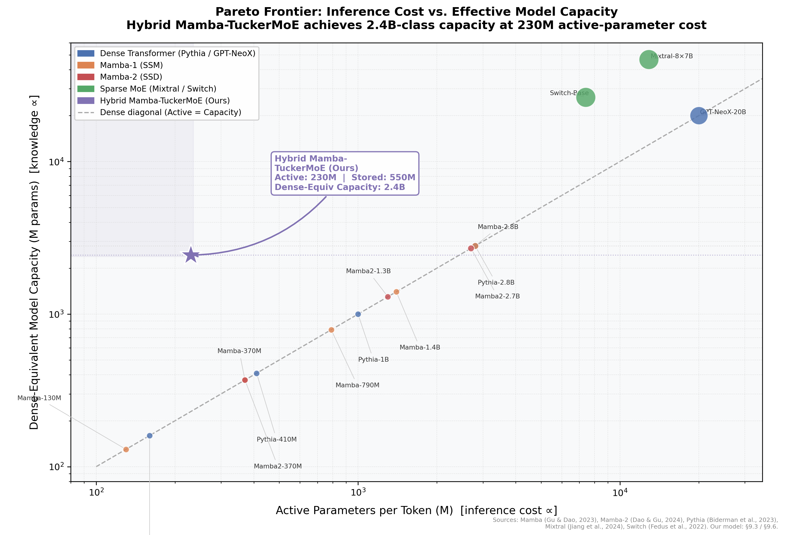

_圖 1：本文研究貢獻的視覺化總覽。推論成本（每 token active 參數量，M）vs. 模型有效容量（dense-equivalent 參數量，M）的 Pareto 前沿圖（雙對數座標）。灰色虛線為 Dense 對角線，對角線以上代表「以更低推論成本獲得更大容量」的 Pareto 優勢區。本模型（紫星）以 230M active 參數達到 2.4B dense-equivalent 容量，推論成本相較同容量 dense 基準降低約 **90%**。基準來源：Mamba (Gu & Dao, 2023)、Mamba-2 (Dao & Gu, 2024)、Pythia (Biderman et al., 2023)、Mixtral (Jiang et al., 2024)、Switch (Fedus et al., 2022)。_

---

\renewcommand{\contentsname}{目錄}
\tableofcontents
\clearpage

## 符號表（Notation）

本報告中反覆出現的符號統一列於下表。若同一符號在不同節有上下文脈絡的擴充義（如 $T$ 同時表示溫度與張量），該節會明確說明。

| 符號                                                                 | 意義                                                                 | 出處   |
| -------------------------------------------------------------------- | -------------------------------------------------------------------- | ------ |
| $N$                                                                  | 序列長度（預訓練與生成共用）                                         | 全文   |
| $t$                                                                  | 當前解碼步數索引（$1\le t\le N$）                                    | §5, §8 |
| $d$ / $d_\text{model}$                                               | 模型隱藏維度（預設 768）                                             | §5     |
| $d_\text{ff}$                                                        | FFN 中間維度（預設 $d_\text{ff}=6\cdot d/\ldots=4608$）              | §5.4   |
| $H$ / _num_heads_                                                    | attention head 數（預設 12）                                         | §5.3   |
| $H_{\text{kv}}$ / _num_kv_heads_                                     | KV-head 數（預設 4；GQA）                                            | §5.3   |
| $d_h$                                                                | head 維度（預設 64）                                                 | §5.3   |
| $E$                                                                  | MoE 專家數（預設 8）                                                 | §5.4   |
| $k$                                                                  | top-k 選中專家數（預設 2）                                           | §5.4   |
| $r_1, r_2, r_3$                                                      | Tucker 秩（checkpoint 設定 32, 512, 256）                            | §5.4   |
| $\mathcal{G}$                                                        | Tucker 核心張量 $\mathcal{G}\in\mathbb{R}^{r_1\times r_3\times r_2}$ | §5.4   |
| $U^{(1)}_e$                                                          | 第 $e$ 位專家的身分向量（Tucker mode-1 因子）                        | §5.4   |
| $U^{(2)}, U^{(3)}$                                                   | 輸出/輸入共享因子矩陣                                                | §5.4   |
| $m$ / _mamba_ratio_                                                  | 每 Macro Block 中 Mamba block 對 Transformer block 的比例（預設 4）  | §5.1   |
| $L_\text{macro}$ / _num_layers_                                      | Macro Block 數（預設 6）                                             | §5.1   |
| $h_t$                                                                | Mamba 在時間 $t$ 的 SSM 隱藏狀態                                     | §5.2   |
| $\Delta, A, B, C$                                                    | Selective SSM 的離散化因子                                           | §5.2   |
| $\bar{A}$                                                            | 離散化後的狀態轉移矩陣 $\bar{A}=\exp(\Delta A)$                      | §5.2   |
| $T_\text{slot}$                                                      | KV Cache 預配置槽位數                                                | §8.3   |
| $\alpha$                                                             | Mamba 層比例 $\alpha=m/(m+1)$                                        | §6.3   |
| $\mathcal{L}_\text{CE}, \mathcal{L}_\text{LB}, \mathcal{L}_\text{Z}$ | 交叉熵、Load-Balance、Router Z-loss                                  | §7.1   |
| $T(s)$                                                               | Router 溫度排程                                                      | §7.3   |
| $\mathcal{E}$                                                        | 被 top-k 選中的專家索引集合                                          | §5.4   |
| $\text{PPL}$                                                         | Perplexity                                                           | §9     |

---

## 1 簡介（Introduction）

### 1.1 Transformer 的雙重規模瓶頸

自 Transformer 問世以來，以 scaled dot-product attention 為核心的模型架構支配了語言建模領域，後續模型持續推高參數規模，使上下文長度從 1K 邁向 32K 乃至 128K。然而隨著上下文長度從 1K 邁向 32K 甚至 128K，兩個結構性瓶頸愈發無法迴避：第一為 self-attention 的 $O(N^2 d)$ 時間複雜度——在自迴歸生成的第 $t$ 步，模型必須與過去 $t-1$ 個 token 做內積比對，累計成本為 $\sum_{t=1}^{N} O(t\cdot d)=O(N^2 d)$；第二為 KV Cache 的線性記憶體成長。以本研究的注意力配置估算，每層每 1K token 約需 1.5 MiB 顯存，6 層、32K 上下文便已來到 288 MiB，在 Apple Silicon 與消費級 GPU 上消耗可觀的可用記憶體。

這兩個瓶頸共同使得「裝置端長上下文推論」成為當前 LLM 落地的主要阻礙。而 attention 的平方成本與其功能性收益（全域回看）是緊密綑綁的，單純縮減 head 數或低秩化 attention（如 Linformer、Performer）雖能緩解部分成本，但同時犧牲了 attention 的本質表達力。

### 1.2 從 Transformer 到狀態空間模型

Selective State Space Model（Mamba 系列 [7]）提供了另一條路徑。SSM 以一個固定維度的隱藏狀態 $h_t$ 吸收歷史上下文資訊，遞迴地以 $h_t = \bar{A}_t h_{t-1} + \bar{B}_t x_t$ 更新狀態、再以 $y_t = C_t h_t$ 輸出。當 $\bar{A}$ 是輸入依賴的（input-dependent），SSM 即可實現類似 attention 的選擇性記憶。其關鍵優勢在於：**解碼時的記憶體複雜度恆為 $O(1)$，與序列長度無關**；但純 SSM 架構在需要精確全域查表的任務上（如長距離事實召回）表現不如 attention。因此近期 Jamba、Samba 等混合架構在 SSM 主幹中穿插固定比例的 attention 層，形成「大部分時間用 $O(1)$ 狀態、少部分時間用 $O(N)$ 回看」的折衷，實測在長序列能力上顯著超越純 SSM。

### 1.3 從 Dense FFN 到 MoE 再到壓縮 MoE

另一條平行的演化發生在 FFN 層。隨著模型擴張，FFN 佔據了總參數量的 2/3 以上，但其中大量參數在推論時並非每個 token 都真正需要。Sparse Mixture-of-Experts（Shazeer et al. [11]；Switch Transformer [13]；Mixtral [15]）透過 Router 在 $E$ 個專家中為每個 token 選 top-$k$，使每 token 的 active FLOPs 與單一 dense FFN 相當，卻能擁有等效於 $E$ 倍容量的模型。然而 MoE 的代價是**權重總體積**：$E$ 個專家意謂著權重儲存成長 $E$ 倍，這在顯存受限與多 GPU 通訊頻寬受限的場景下同樣構成牆壁。

一個直觀的解法是壓縮每個專家。早期研究對每個專家獨立地做 SVD（例如 MoE-SVD、SVD-LLM），但這忽略了專家之間高度的冗餘——不同專家在相同輸入下往往 activate 同一群 hidden neuron 子空間，逐專家獨立壓縮無法捕捉這種跨專家冗餘。因此當壓縮率拉高（例如 60%）時，傳統逐專家 SVD 會迅速失敗：Phi-3.5 在 60% 壓縮下，PPL 從原本約 7 飆升到 7168。

這正是本研究以 **Tucker 三階分解（Tucker Decomposition MoE, TD-MoE）** 聯合壓縮所有專家的動機。以本研究設定為具體例子：對一個 Dense 8-expert 的前饋層，每個專家的投影矩陣形狀為 $(d_\text{in}, d_\text{out}) = (1536, 6144)$，8 個專家合計 $8 \times 1536 \times 6144 = 75.5\text{M}$ 個參數。若採用逐專家 SVD（秩 $r=256$），每個專家需 $256\times(1536+6144)=1.97\text{M}$ 個參數，8 個專家共 $15.7\text{M}$；但每個 SVD 的 $U, V$ 因子矩陣對所有 8 個專家都是獨立的，無法共享。

反之，TuckerMoE 以共享的 $U^{(2)}\in\mathbb{R}^{r_2\times d_\text{out}}$（輸出子空間）與 $U^{(3)}\in\mathbb{R}^{r_3\times d_\text{in}}$（輸入子空間）捕捉「所有專家共用的子空間」，只把專家差異保留在小型身分向量 $U^{(1)}_e\in\mathbb{R}^{r_1}$ 與共享核心張量 $\mathcal{G}\in\mathbb{R}^{r_1\times r_3\times r_2}$ 中。在 $(r_1,r_2,r_3)=(32,512,256)$ 的設定下，同一個 8-expert 投影僅需：$8\times32 + 256\times1536 + 512\times6144 + 32\times256\times512 = 256 + 393\text{K} + 3.15\text{M} + 4.19\text{M} \approx 7.7\text{M}$ 個參數，整體壓縮率達 **89.7%**，且所有跨專家共享結構在訓練中聯合優化，保留了最豐富的共有子空間信息。這使壓縮率可推到 80% 以上而不顯著損失表達能力，是純 SVD 路徑無法企及的。

### 1.4 研究目標與主要貢獻

綜合上述兩條演化路徑，本研究提出將 Mamba-3 主幹與 TuckerMoE 前饋層結合的混合架構，同時解決 (i) 長序列 attention 的計算／記憶體成本與 (ii) 稀疏 MoE 的權重儲存問題。具體貢獻彙整如下，後續各章節將逐一展開技術細節：

| #   | 貢獻層面            | 核心內容                                                                                                                                                                        | 章節       |
| --- | ------------------- | ------------------------------------------------------------------------------------------------------------------------------------------------------------------------------- | ---------- |
| 1   | **架構拓撲**        | 提出 4:1 Mamba-Transformer Macro Block，以固定 SSM 狀態取代大部分 KV 積累，KV 記憶體相較全 Transformer 節省 80%，bf16 下 16K seq KV 低於 1 GiB                                  | §5.1       |
| 2   | **Tucker 三階 MoE** | 首次將 Tucker 三階分解用於 MoE 專家集合，以共享 $U^{(2)},U^{(3)}$ 捕捉跨專家冗餘；在 82.87% 壓縮率下，Tucker 重建 MSE 低於等參數逐專家 SVD，且附嚴格下界等價保證（§5.4.5 定理） | §5.4       |
| 3   | **系統實作**        | 以五個 Triton kernel 融合 latent MoE dispatch、chunk-parallel scan 與 logit 穩定化；推論端以圖級融合消除 Apple Silicon 上逐層 decode 的 command buffer 切換開銷                 | §7.5, §8.2 |
| 4   | **訓練穩定性**      | LayerScale 初始壓縮使 30 層殘差鏈 Jacobian 近似單位陣（初期放大倍率 <1.35），搭配 Z-loss + 溫度餘弦退火，step 38,400 路由健康診斷四項全數通過                                   | §5.5, §7.1 |
| 5   | **部署驗證**        | MLX 後端在 M2 Pro 量測 prefill ~3,800 tok/s；8-bit 量化後 decode +62%（~68 tok/s）；部署 KV + state 記憶體 14.1–22.3 MiB @512 steps                                             | §9.6       |

**拓撲層面**：本研究採取 **4:1 的 Mamba-Transformer 混合比例**，此設計參考並延伸自 Mamba-3 [7]、Jamba 與 Samba 的比例實驗，在長序列記憶體效率與全域回看能力之間取得兼顧。在預設的六個 Macro Block 下，模型擁有 24 個 Mamba block 與 6 個 Transformer block。此配置使 KV Cache 僅與 Transformer 層數成線性關係，而非與總層數同步增長，對比純 Transformer 架構節省約 80% 的 KV 記憶體。

**前饋層層面**：本研究將 Mamba 內部的兩組關鍵投影與 Transformer FFN 的三組線性映射，全部替換為 TuckerMoE。其中 $U^{(2)}$（輸入降維）與 $U^{(3)}$（輸出升維）在所有 $E=8$ 個專家之間共享，僅核心張量 $\mathcal{G}$ 與專家身分向量 $U^{(1)}_e$ 是 Expert-specific。搭配帶溫度退火的 top-$k$ router 與 logits 平滑機制，現有 checkpoint 採用 $(r_1,r_2,r_3)=(32,512,256)$；若把 66 個 TuckerMoE 模組對應到等價的 Dense 8-expert 權重張量，整體參數量由 2.4348B 降到 417.0M，壓縮率為 **82.87%**。

**系統層面**：訓練端以 Triton 實作五個融合 kernel，涵蓋 logit clipping、SiLU-gated multiply、latent MoE dispatch 與 SSM chunk parallel scan 的前向反向；推論端則在 Apple Silicon 上以圖級融合降低逐層 decode 的控制開銷，使訓練與推論在數學上保持一致、在系統上各自貼近硬體特性。

**驗證層面**：在訓練 step 38,400 時以雙裝置分散式設定執行 Router Collapse Diagnostic，掃描全部 66 個 TuckerMoE 模組、總 73,728 tokens。min-entropy ratio 0.294、max top-1 share 0.322、dead-expert ratio 0.000，全部通過門檻；另外，raw NCU 歸檔顯示目前的系統瓶頸具有明確分工：Tucker latent dispatch 主要受片上記憶體與排程效率限制，而 chunk scan 則仍以外部記憶體流量為主。

### 1.5 報告組織

全文其餘部分組織如下：

| 章節       | 主題             | 核心內容                                                          |
| ---------- | ---------------- | ----------------------------------------------------------------- |
| **§2**     | 相關工作         | SSM 演進、MoE 發展、張量分解壓縮                                  |
| **§3**     | 問題定義與資料集 | 任務形式化、FineWeb-Edu、評估指標                                 |
| **§4**     | 方法流程圖       | 端對端 Pipeline（輸入 → 設計 → 訓練 → 推論 → 輸出）               |
| **§5**     | 模型架構         | Macro Block、Mamba-3、GQA、Top-K MoE 痛點、Memory→Compute I/O 證明、TuckerMoE 推導、LayerScale |
| **§6**     | 複雜度分析       | $O(N^2)$→ 線性 →Hybrid 完整證明；Dense/MoE/Tucker 對比            |
| **§7**     | 訓練方法         | 聯合損失、兩階段 SFT、Router 退火、AdamW 分組、Triton Kernel      |
| **§8**     | 推論優化         | 圖級融合數學說明、KV Cache 分析                                   |
| **§9**     | 實驗結果         | 參數對照、Router 診斷、壓縮研究、NCU、MLX、訓練進度、SFT 曲線     |
| **§10**    | 結論             | 核心貢獻總結、「同算力擴增容量」命題、Future Work                 |
| **附錄 A** | 演算法虛擬碼     | TuckerMoE Forward/Backward、Chunk-Parallel Scan、Router Annealing |
| **附錄 B** | 超參數表         | 完整訓練設定                                                      |
| **附錄 C** | Decode 量測原數據 | §9.6 圖級融合吞吐 A/B 重複量測                                    |
| **附錄 D** | SFT 過濾規則明細 | General SFT 之 `ins_strict` 分支、句首列表、灌水／弱起手判準      |
| **附錄 E** | SFT 與遮罩補遺   | Mask 自動化驗證表、多輪 ChatML 片段、Frobenius 形式化（正文從略） |

---

## 2 相關工作（Related Work）

**選擇式狀態空間模型**。S4 首次將卷積型 SSM 引入深度學習，以 HiPPO 初始化確保長距離訊號保留；Mamba 系列透過讓 $\Delta, B, C$ 三者都成為輸入相關的函數，使 SSM 具備類似 attention 的選擇性記憶能力。Mamba-3 [7] 進一步引入 exponential-trapezoidal 離散化、complex-valued SSM 與 MIMO 結構，提升線性時間序列建模的表達力與推論效率。本研究沿用同一框架，將 scan 路徑改寫為 Triton 專用 kernel，以獲得更高吞吐量。

**Mixture-of-Experts：路由演進**。Shazeer et al. [11] 提出 sparsely-gated MoE，允許模型容量以超線性方式擴張；Switch Transformer [13] 簡化 router 為 top-1 並導入 auxiliary load-balance loss；GShard [12] 解決跨設備分片；GLaM [14] 使用 sparsely activated MoE 達成推論 FLOPs 約為同級 dense 模型的一半；Mixtral 8×7B [15] 以 top-2 MoE 於工業規模達成 dense 相當的生成品質。所有這些系統採用 **Token Choice Routing**：每個 token 獨立計算親和力分數並挑選 top-$k$ 個專家，語意專業化與自迴歸因果律均自然滿足。相對地，**Expert Choice Routing**（Zhou et al., 2022）反向由每位 expert 主動挑選固定數量的 token，可在訓練側達到完美負載平衡與零 padding，但因需觀察完整序列後才做全域排序，與 decode 期每步只可見位置 $\le t$ 的因果假設相衝突，現有主流自迴歸 LLM 皆未採用此方案於推論。

**MoE 訓練穩定性：負載不均與輔助損失的干擾梯度**。Token Choice 在無約束下極易出現馬太效應（routing collapse）——少數「明星專家」吸走大多數 token，多數 expert 欠訓練。緩解方式有兩類：其一為 **auxiliary load-balance loss** $\mathcal{L}_\text{LB} = E\sum_e \bar m_e\bar p_e$（Switch、GShard、Mixtral），以負載變異作為懲罰項加入反向傳播；然而 Qiu et al. [4] 指出，LB loss 與 z-loss 會鼓勵 routing scores 趨於 uniform，與語言建模目標存在拉扯，權重過大將產生**干擾梯度（interference gradients）**；其二為 ST-MoE [2] 的 **Router Z-loss** $\mathcal{L}_\text{Z} = \mathbb{E}[\operatorname{logsumexp}(s)^2]$，限制 logits 尺度以穩定 softmax。DeepSeek-V3 [5] 則採「**Auxiliary-Loss-Free Load Balancing（ALF-LB）**」，為每位 expert 維護一個不參與反向傳播的動態偏差 $b_e$，只在前向時做 $s_e' = s_e + b_e$ 並依負載於 step 間微調，徹底避開梯度干擾且移除 capacity factor 硬性限制，達零 token-dropping。

**MoE 推論效能瓶頸：碎任務化與 DRAM 頻寬受限**。LLM decode 期的 MoE 在 FLOP 上「稀疏」，但在 HBM 頻寬上卻更加擁擠。設 batch 大小 $N$、top-$k$、$E$ expert，每位 expert 平均接收 $Nk/E$ 個 token；在 $N{=}128,k{=}2,E{=}64$ 下每位 expert 僅 $4$ token，算術強度 $\approx4$ FLOPs/Byte，遠低於 H100 BF16 Tensor Core 平衡點（約 400–500 FLOPs/Byte），效能被壓制在 HBM 頻寬。此外，現代框架以 Grouped GEMM 解決碎任務，但 Token Sorting（radix sort）、Permute（在 $d$ 維度 gather 隱藏向量）、block alignment、Grouped GEMM 與 Unpermute（scatter-add）的完整管線使 HBM 流量主要來自維度為 $d$ 的向量搬移。DeepEP／DeepGEMM [5] 等客製核心以 SM90 TMA、unaligned block 與 kernel fusion 試圖將 sorting 融合進 GEMM load 階段，但本質上仍受制於 $d$ 維 permute 開銷。本研究以共享 Tucker 因子將路由搬移至低秩潛在空間 $\mathbb{R}^{r_3}$，從結構上把 permute 維度由 $d$ 壓到 $r_3 \ll d$，詳見 §5.4.2 的 I/O 複雜度論證。

**張量分解用於權重壓縮**。Tucker 分解、CP 分解等技術長期用於壓縮卷積層與全連接層。TD-MoE [6] 首次將 Tucker 三階分解應用於 MoE 專家集合：將同一層所有 experts 的 weights 疊成 3D tensor，再做 joint Tucker decomposition，以 multi-linear whitening 與 3D rank allocation 捕捉跨 expert 冗餘。近年 Phi-3.5、Mixtral [15] 等 MoE 模型催生了 MoE-SVD、SVD-LLM 等逐專家壓縮方法，但實驗顯示這些方法在壓縮率超過 50% 時會大幅損失表達能力，核心原因在於忽略了專家之間的冗餘。本研究沿用 TD-MoE [6] 的 cross-expert tensorization 思路，透過共享 $U^{(2)}, U^{(3)}$ 同時達成**跨專家權重共用**與**單專家選擇性**，相關理論推導詳見 §5.4.3。

**MoE 壓縮方法全面比較**。為完整定位 TD-MoE [6] 相對於既有 MoE 壓縮路徑的差異，表 R1 將六類代表性方法與 TD-MoE 做多維度比較。

_表 R1：MoE 壓縮方法比較。「跨專家」指是否以聯合結構捕捉多個專家之間的冗餘；「需刪/合」指是否需要離散地移除或合併專家；「資料感知」指壓縮過程是否利用校準資料的 activation / gradient 統計。_

| 方法           | 類型             | 跨專家        | 需刪/合 | 資料感知       | 核心侷限                                     |
| -------------- | ---------------- | ------------- | ------- | -------------- | -------------------------------------------- |
| MoE-SVD        | 逐專家 SVD       | X             | 否      | 部分           | 假設冗餘僅在輸入側；高壓縮率下品質崩潰       |
| NAEE           | 專家剪枝         | X             | 是      | 否             | 離散決策，可能傷害路由結構                   |
| MC-MoE         | 合併＋剪枝       | 部分          | 是      | 否             | 依賴啟動頻率啟發式，難以保證最優             |
| MoE-I²         | 剪枝＋ SVD       | X             | 是      | 否             | 兩階段決策複雜，超參交互難調                 |
| D²-MoE         | Delta SVD ＋量化 | 部分          | 否      | 否             | Delta 假設（專家差異為低秩偏移）適用範圍有限 |
| SVD-LLM        | 截斷感知 SVD     | X             | 否      | 部分           | 逐矩陣操作，不含 MoE 特化設計                |
| **TD-MoE [6]** | **聯合 Tucker**  | **V（三維）** | **否**  | **多線性白化** | 離線分解計算略多（一次性攤銷）               |

**關鍵差異**：TD-MoE 以 $U^{(1)}$ 學出 $r_1$ 個「元專家」（meta-expert）子空間基底，以**連續、可微**的方式壓縮專家維度——無需做出「保留或刪除哪個專家」的離散決策。相較之下，剪枝類方法（NAEE、MC-MoE、MoE-I²）需要在壓縮前決定哪些專家或參數被移除，一旦決策錯誤便不可逆；逐專家低秩方法（MoE-SVD、SVD-LLM、D²-MoE）則因各專家獨立分解而無法利用跨專家共享結構。TD-MoE 的三維聯合分解同時在 expert / input / output 三個 mode 上找到最優低秩近似，使其在高壓縮率區間（60%–90%）保留的重建品質嚴格優於上述各類 baseline（見 §5.4.5 Tucker 嚴格保證定理與 §9.3 實驗驗證）。

**旋轉位置編碼（RoPE）**。Rotary Position Embedding 將絕對位置資訊編碼為二維子空間上的旋轉：$\tilde{q}_m = q_m e^{im\theta}$，使內積 $\langle \tilde{q}_m, \tilde{k}_n \rangle$ 僅依賴相對位移 $m-n$。相較 sinusoidal 或 learned positional embedding，RoPE 同時具備 (i) 相對位置感知、(ii) 外推至訓練長度以外的能力，以及 (iii) 與 attention scaling 的正交性。在混合架構中，RoPE 不僅用於 GQA 的 query-key 旋轉，也被本研究擴展到 Mamba 的 SSM 狀態空間——透過 Complex-valued RoPE 對 $(B, C)$ 施加相位旋轉，使 SSM 的遞迴狀態同樣具備相對位置敏感性（詳見 §5.2）。

**多輸入多輸出 SSM（MIMO）**。傳統 SSM 以單一狀態矩陣 $A\in\mathbb{R}^{N\times N}$ 統一處理所有輸入維度，限制了在不同語義子空間上獨立捕捉不同時間尺度動態的能力。MIMO（Multi-Input Multi-Output）結構將狀態空間分成 $G$ 個獨立 head，每個 head 維護自己的 $A_g, B_g, C_g$，並在最終輸出時合併。這等價於讓模型同時運行多個時間常數（time constant）不同的遞迴系統，再由 output mixing 決定最終讀出。Mamba-3 [7] 的 MIMO 結構將原本 outer-product 型態的 state update 改成更像 matrix multiplication 的形式，提高 arithmetic intensity，讓 decoding 時 GPU 能更有效利用 compute，使其在理論表達力上可逼近多頭注意力。本研究的 Mamba-3 block 採用 MIMO rank 4（即 $G=4$ 個獨立 SSM head），使 64 維的狀態空間被分為 4 個 16 維子空間獨立演化。

**混合比例的文獻來源與本研究的 4:1 設計**。Jamba 採取 1:7 的 attention-to-Mamba 比例（每 8 層中 1 層 attention），Samba 以 Mamba + MLP + Sliding Window Attention 的三段式 Macro Block 實現 unlimited context，其 attention 層比例約 1:3。兩者共同驗證了「少量 attention + 大量 SSM」在長序列任務上優於純 SSM，且最佳比例與任務特性有關：Jamba 在對話與長文摘要上以更少 attention 達到更好結果，Samba 則在需要更多全域對齊的推理任務上選擇稍高比例。本研究綜合兩者經驗，選擇 **4:1 的 Mamba-Transformer 比例**（每 5 層中 1 層 GQA），既在 KV 記憶體上接近 Jamba 的節省幅度（僅 20% 層需要 KV Cache），又在全域回看頻率上足以支撐精確檢索任務。此比例使總 30 層中僅 6 層為 Transformer，KV 記憶體相較全 Transformer 節省約 80%，同時保留了週期性全域校正能力。

**硬體感知 Kernel**。FlashAttention [8] 以 tiling + re-compute 的 IO-aware 設計將 attention 推到 roofline，FlashAttention-2 [9] 改進 parallelism 與 work partitioning，FlashAttention-3 [10] 則針對 Hopper GPU 利用 Tensor Cores 非同步與低精度能力進一步提升吞吐量。Mamba 的 hardware-aware scan 則以 CUDA 直接撰寫並在 HBM-SRAM 階層上融合遞迴。本研究以 Triton 撰寫 `FusedLatentMoE` 與 `TritonParallelScan`，在保持相似 latency 的同時獲得更高的可讀性與可移植性。

---

## 3 問題定義與資料集（Problem Definition and Dataset）

### 3.1 任務形式化

設詞彙表 $V$，輸入 token 序列 $x = (x_1, \dots, x_N)$，其中 $x_t \in \{1, \dots, |V|\}$。自迴歸語言建模的目標為最大化條件似然：

$$
\log p_\theta(x) \;=\; \sum_{t=1}^{N} \log p_\theta(x_t \mid x_{<t})
$$

模型 $p_\theta$ 以 embedding table 將每個 token 映射至 $\mathbb{R}^d$，經過 $L_\text{macro}\cdot(m+1)$ 層混合 block 後，由 tied LM-head 輸出 logits $z \in \mathbb{R}^{|V|}$，再以 softmax 得到條件分佈。推論時則以 greedy decoding 或 temperature sampling 自迴歸產生序列。

### 3.2 資料集

本研究以 **FineWeb-Edu**（HuggingFace 2024）作為主預訓練語料。FineWeb-Edu 是從 CommonCrawl 抽取並以教育品質分類器（Karpathy 風格 LM 品質過濾）篩選的高品質英文網頁語料，相較 OpenWebText 在語法一致性與知識密度上有明顯提升，且其開放授權符合學術研究使用。訓練使用預先 tokenize 為二進位格式的版本，總 token 量約 $10^9$；訓練資料以連續 token 緩衝區供應，每次切成長度 512 的連續段，形成 $(x_t, y_t = x_{t+1})$ 的 next-token prediction pair，以記憶體映射方式在消費級儲存裝置上直接飽和 GPU。

**Tokenizer 與詞彙表設計**。本研究以 LLaMA 2 的 BPE 詞表為基底，原始詞彙量為 32,000 個 token，並在此基礎上擴充 7 個任務導向的特殊 token，使最終詞彙量達到 **32,007**。這 7 個擴充 token 分成兩類：

| 特殊 Token       | 類別             | 語義                   |
| ---------------- | ---------------- | ---------------------- |
| `<\|im_start\|>` | Instruction Mode | 開啟一段使用者指令區塊 |
| `<\|im_end\|>`   | Instruction Mode | 關閉使用者指令區塊     |
| `<think>`        | Chain-of-Thought | 開啟模型推理過程區塊   |
| `</think>`       | Chain-of-Thought | 關閉模型推理過程區塊   |
| `<final>`        | Chain-of-Thought | 標示最終答案開始       |
| `</final>`       | Chain-of-Thought | 標示最終答案結束       |
| `[PAD]`          | 對齊填充         | 批次對齊填充 token     |

前兩個屬於 Instruction Mode 特殊 token，使模型能在預訓練後以最小成本微調為對話格式，避免在 SFT 階段引入大量詞彙外 token 的嵌入初始化問題。後四個 Chain-of-Thought token 則為後續推理鏈微調預留了結構化標記空間，使模型在不修改詞彙表的情況下直接支援 `<think>...</think><final>...</final>` 的 CoT 格式，這對 Mamba 的狀態記憶特性尤其有利——模型可在 `<think>` 區塊的 SSM 狀態中逐步累積推理脈絡，最後在 `<final>` 時一次性讀出。BPE 詞表邊界與 LLaMA 2 完全相容，使本模型能夠直接使用為 LLaMA 設計的 tokenize 工具鏈。

### 3.3 評估指標

主要指標為 **Perplexity**（$\text{PPL}=\exp(\mathcal{L}_\text{CE})$）與**解碼吞吐量**（tokens/sec）。PPL 衡量生成品質，以 FineWeb-Edu held-out set 計算；解碼吞吐量在 MLX backend 上量測，分別記錄 prefill 與 decode 兩種模式的穩態速度。此外報告亦涵蓋 NCU/Nsight Compute 的 DRAM throughput、warp occupancy、eligible warps 與 stall breakdown 作為系統側輔助指標。

---

## 4 方法流程圖（Method Pipeline）


_圖 1：Hybrid Mamba-TuckerMoE end-to-end 方法流程圖。左側為 Token Stream 輸入（$X \in \mathbb{R}^{N\times d}$），經過三個階段後由 LM Head 輸出預測 token 與 PPL。_

本節以上方流程圖統整從輸入到輸出的完整方法，並以段落描述三個階段如何串接。

**輸入（Input）**。輸入序列先被映射到連續嵌入空間，形成 $X \in \mathbb{R}^{N \times d}$。自此之後，模型的設計重點便轉為如何在不讓記憶體隨上下文長度急遽膨脹的前提下，仍保留對遠距訊息的精確讀取能力。

**Phase 1 — 模型設計（Design）**。每個 Macro Block 由四層 Mamba 與一層 GQA Transformer 組成。前四層 Mamba 以固定維度狀態連續吸收局部與中距資訊，將多數序列建模工作維持在線性時間與固定解碼狀態中；第五層 GQA 則週期性地重新開啟顯式的 token-to-token 對齊，負責處理需要精確全域索引的少數關鍵依賴。這種配置使「壓縮歷史」與「精確回看」不再互斥，而是被安排在不同頻率的子模組中協作。另一方面，所有主要前饋投影都被 TuckerMoE 取代，使容量擴張發生在共享低秩子空間上，而不是以完整 dense expert 的方式線性堆疊。

**Phase 2 — 訓練（Training）**。訓練目標由交叉熵、Router 負載平衡項與 logits 穩定化項共同組成，並輔以由高溫到低溫的 Router 溫度退火，使專家在早期充分探索、後期逐步收斂為清晰分工。系統層面則透過 kernel fusion 把路由裁切、門控乘法、Tucker latent dispatch 與狀態揁描中的中間讀寫盡量壓回片上記憶體，降低不必要的外部流量。

**Phase 3 — 推論（Inference）**。推論階段自然分成兩條路徑：當輸入尚未建立狀態時，模型以平行掃描與完整 causal attention 完成 prefill；進入逐 token 解碼後，Mamba 分支退化為固定狀態的單步遞迴，而 Transformer 分支只在週期性層上追加 KV 快取。因而整體解碼記憶體主要由少量 Transformer 層的 KV 快取決定，Mamba 側則維持與序列長度無關的固定狀態。

**輸出（Model Output）**。最終隱藏狀態經語彙投影後輸出下一 token 的條件分佈；在訓練中以負對數似然衡量，在推論中則依採樣策略生成完整序列。於是，整個方法鏈便形成一個完整閉環：以 Mamba 控制長序列成本，以 GQA 補足精確回看，以 TuckerMoE 擴充容量，最後再以硬體感知實作把這些結構性優勢真正落到系統效率上。

### 4.1 模型配置參數表

以下列出本實驗訓練實作中 `Mamba3Config` 核心超參數設定：

| 參數類別             | 參數名稱           | 設定值 | 說明                          |
| -------------------- | ------------------ | ------ | ----------------------------- |
| **整體架構**         | `d_model`          | 768    | 隱藏層維度                    |
|                      | `num_layers`       | 15     | 總層數                        |
|                      | `layer_scale_init` | 1e-2   | LayerScale 初始值             |
|                      | `rms_norm_eps`     | 1e-5   | RMSNorm 的 epsilon            |
| **Mamba 區塊**       | `d_state`          | 64     | 狀態變數維度                  |
|                      | `d_head`           | 64     | Head 維度                     |
|                      | `mimo_rank`        | 4      | MIMO 分支數                   |
|                      | `expand`           | 4      | 內部展開比例                  |
|                      | `chunk_size`       | 64     | 並行掃描的區塊大小            |
| **Transformer 區塊** | `num_kv_heads`     | 4      | KV Heads 數量 (GQA)           |
|                      | `ffn_expand`       | 6      | FFN 內部展開比例              |
| **Tucker MoE**       | `kmoe_num_experts` | 8      | 專家總數 $E$                  |
|                      | `kmoe_top_k`       | 2      | 每次路由挑選的專家數 $k$      |
|                      | `kmoe_r1`          | 4      | Tucker Mode-1 秩 (專家特徵)   |
|                      | `kmoe_r2`          | 1024   | Tucker Mode-2 秩 (輸出子空間) |
|                      | `kmoe_r3`          | 256    | Tucker Mode-3 秩 (輸入子空間) |

---

## 5 模型架構（Model Architecture）

### 5.1 整體結構與 Macro Block

完整架構圖如下：

圖 2：Hybrid Mamba-TuckerMoE 詳細模型架構。每個 Macro Block 包含 4 個 Mamba3Block 與 1 個 TransformerBlock，整體堆疊 $N_\text{macro}=6$ 次。

設 $\mathcal{M}_1,\dots,\mathcal{M}_4$ 為四個連續的 Mamba Block，$\mathcal{A}$ 為一個 GQA Transformer Block，則單一 Macro Block 可寫為

$$
\mathcal{B}(x) \;=\; \mathcal{A}\bigl(\mathcal{M}_4(\mathcal{M}_3(\mathcal{M}_2(\mathcal{M}_1(x))))\bigr).
$$

整體模型由 $L_\text{macro}=6$ 個此類 Macro Block 堆疊而成，因此總 block 數為 $L_\text{macro}(m+1)=30$，其中 24 層為 Mamba、6 層為 Transformer。這種 4:1 比例的關鍵不在於「把 Attention 盡量拿掉」，而在於把 Attention 重新安排為**低頻但高價值的全域校正機制**。Mamba 負責大部分時間步上的壓縮式狀態演化，GQA 則定期重新打開顯式回看通道，讓模型在需要時仍能對遠端 token 做精確比對。於是模型既保留了 SSM 在解碼記憶體上的優勢，也避免純 SSM 在全域對齊任務上的脆弱性。

### 5.2 Mamba-3 Block

給定 $X \in \mathbb{R}^{B\times N\times d}$，Mamba-3 [7] block 的核心是一個輸入相依的狀態更新系統。經過正規化後，模型同時產生門控訊號 $z$、狀態輸入 $x'$、SSM 讀入與讀出矩陣 $(B, C)$、離散化步長 $\Delta>0$、以及狀態轉移參數 $A<0$，共同保證離散化轉移 $\bar{A}=\exp(\Delta A)$ 位於穩定區域。其單步遞迴可寫為

$$
u_t = \bar{B}_t\, x'_t, \qquad h_t = \bar{A}_t h_{t-1} + u_t,\qquad y_t = C_t h_t,
$$

其中 $\bar{B}_t = \Delta_t B_t$ 為離散化後的輸入矩陣，$x'_t$ 為經線性投影後的狀態輸入信號。$u_t$ 與 $\bar{A}_t$ 都由當前輸入決定，因此模型能依內容選擇「保留什麼、遺忘什麼」。最終輸出經 SiLU 門控 $z$ 調制後回到殘差路徑。

從原理上看，Mamba 的核心不是顯式保存整段歷史 token，而是把歷史訊息壓縮進固定維度狀態 $h_t$。其「selective」之處在於 $\Delta, B, C$ 會隨輸入改變，因此模型可依 token 內容決定哪些訊息要快速遺忘、哪些訊息要長時間保留。這等價於把 attention 中「對所有過去位置做內容相依比對」的行為，改寫成一個可學習的動態遞迴系統；因此在 decode 時只需更新固定大小狀態，而不必讓記憶體隨序列長度線性膨脹。

其次，本模型以 **Complex-valued RoPE** 將相位資訊注入 SSM 狀態。定義 $\theta = \exp(\theta_\text{log})$，在時間 $t$、group $g$、state-dim $n$ 上計算角度 $\phi_{t,g,n}=\sum_{s\le t}\Delta_{s,g}\cdot\theta_{g,n}$，然後對 $(B, C)$ 在實數框架內做 2D 旋轉。此設計等價於在實數算術下模擬 complex SSM，對應 Mamba-3 [7] 的主要理論改進：透過 complex-valued state dynamics 實現為 real-valued rotary blocks，解決純實數衰減 SSM 在 state tracking 上的弱點。

在本研究中，Mamba 分支之前後各接一個 TuckerMoE 投影，用來分別承擔狀態空間的低秩擴展與輸出回投。中間的狀態演化則透過 chunk-parallel scan 來實現，使訓練仍可在長序列上保有高平行度；進入 decode 時，該過程自然退化為單步遞迴，因此只需保存固定大小狀態，而不需保存完整歷史序列。

**結合律（Associativity）在平行掃描中的核心角色**。Chunk-parallel scan 之所以能把原本嚴格串行的遞迴 $h_t = \bar{A}_t h_{t-1} + u_t$ 改寫為可平行的分塊結構，根本前提在於**狀態轉移運算子滿足結合律**。定義二元運算子

$$
(a_i, b_i) \bullet (a_j, b_j) \;=\; (a_j \cdot a_i,\; a_j \cdot b_i + b_j),
$$

其中 $(a_t, b_t) = (\bar{A}_t, u_t)$ 對應第 $t$ 步的狀態轉移。可驗證此運算子滿足

$$
\bigl((a_1, b_1) \bullet (a_2, b_2)\bigr) \bullet (a_3, b_3) = (a_1, b_1) \bullet \bigl((a_2, b_2) \bullet (a_3, b_3)\bigr),
$$

因此整個序列的 prefix-scan

$$
h_t \;=\; (a_t, b_t)\;\bullet\;(a_{t-1}, b_{t-1})\;\bullet\;\cdots\;\bullet\;(a_1, b_1)
$$

可以用 work-efficient parallel prefix sum 演算法在 $O(\log N)$ 深度內完成，而非逐步串行的 $O(N)$ 深度。

在本研究的實作中，序列被切成固定長度（`chunk_size=64`）的區段。每個 chunk 內以平行掃描求出局部狀態序列；chunk 之間的邊界狀態則以結合律將相鄰 chunk 的 carry 逐級合併。因此訓練時的掃描深度為 $O(\text{chunk\_size}) + O(\log(N/\text{chunk\_size}))$，在 GPU 上具有高平行度。**若此運算子不滿足結合律，整個 chunk-parallel scan 的正確性便無法成立**——這正是 SSM 能高效訓練的數學根基。

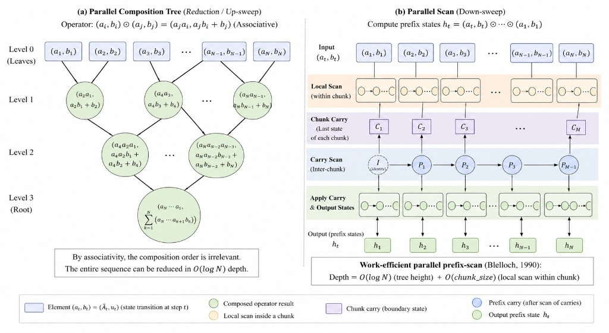

_圖 C（左）**Parallel Composition Tree（Up-sweep / Reduction）**：以二叉樹結構將 $N$ 個狀態轉移算子 $(a_t, b_t)$ 自底向上用 $\bullet$ 逐層合併，樹高為 $O(\log N)$，每個葉節點恰好對應一步 SSM 轉移 $(\bar{A}_t, u_t)$；由於 $\bullet$ 滿足結合律，合併順序可任意重排，整棵樹可在 GPU 上完全平行化。圖 C（右）**Chunk-Parallel Scan（Down-sweep）**：實作上先在每個 chunk 內部做局部掃描，再把各 chunk 末尾的邊界狀態（Chunk Carry $C_i$）做 inter-chunk prefix scan（Identity → $P_1$ → $P_2$ → … → $P_{M-1}$），最後把每個 chunk 的 carry 廣播回 chunk 內的各步，輸出完整 prefix 狀態序列 $h_1, \dots, h_N$。整體深度為 $O(\log N)$（carry scan）$+ O(\text{chunk\_size})$（局部 scan），對應 work-efficient parallel prefix sum。\_

為了避免深層殘差分支在訓練初期就主導主路徑，本研究在 Mamba block 的兩個殘差支路都加入 LayerScale，詳見 §5.5。

在具體形式上，Mamba-3 block 的完整前向傳播分四個步驟，包含兩條 LayerScale 殘差分支：

**步驟 0 — 預處理投影（in-projection）**：輸入 $x\in\mathbb{R}^{N\times d}$ 先過 RMSNorm，再以單一寬 linear 同時產生所有下游所需的分量：

$$
[z,\; x',\; B,\; C,\; \Delta,\; A_\text{log},\; \lambda]
\;=\;
W_\text{in}\,\operatorname{RMSNorm}(x)
\;\in\;
\mathbb{R}^{N\times(d_z+d'\!+G\!\cdot n\!\cdot r+\cdots)},
$$

其中 $d'=H\cdot p$（頭數 $H=d_\text{inner}/p$），$G$ 為 MIMO group 數，$n$ 為 state 維，$r$ 為 MIMO rank；$A_\text{log}$ 經 $-\exp(\cdot)$ 保證 $A<0$，$\Delta$ 經 softplus 保證正值，$\lambda$ 為 MIMO gate logit。

**步驟 1 — Complex-RoPE 與 SSM 掃描**：$(B,C)$ 先各自做 RMSNorm 再以 Complex-valued RoPE 旋轉（角度由 $\Delta$ 積分得出），然後以 TuckerMoE 做 $x'$ 的 low-rank 擴展 $x_\text{ssm}=\operatorname{TuckerMoE}_\text{up}(x')\in\mathbb{R}^{N\times H\times p\times r}$，得到 MIMO 輸入信號 $u_t = \langle B_t, x_{\text{ssm},t}\rangle$（形狀 $\mathbb{R}^{H\times n\times p}$）。SSM 遞迴為

$$
h_t \;=\; \bar{A}_t\odot h_{t-1} \;+\; \lambda_t\,\Delta_t\,u_t \;+\; (1-\lambda_t)\,\Delta_t\,\bar{A}_t\,u_{t-1},
\qquad
y_t \;=\; \langle C_t,\, h_t\rangle \;\in\;\mathbb{R}^{H\times p\times r},
$$

其中 $\bar{A}_t = \exp(\Delta_t A)$，$\lambda_t = \sigma(\lambda_t^\text{logit})$ 為 MIMO 門控（mixer between input 與 recurrent branch）。$y$ 再經 $y_\text{down}=W_\text{down}\,y\in\mathbb{R}^{N\times d_\text{inner}}$ 降維，並加入 D-skip $y_\text{ssm} = y_\text{down} + D\odot x'_\text{flat}$。訓練時以 chunk-parallel scan（`chunk_size=64`）平行化；decode 時退化為單步遞迴。

**步驟 2 — 門控混合（殘差分支 1）**：$y_\text{ssm}$ 先 RMSNorm，再與 SiLU 門控 $z$ 做逐元素乘積，最後透過 Dense 投影回投到 $d$，加 LayerScale 後疊回 $x$：

$$
y' \;=\; W_\text{dense}\!\left(\operatorname{RMSNorm}(y_\text{ssm})\odot\operatorname{SiLU}(z)\right),
\qquad
\text{mid} \;=\; x \;+\; \gamma_\text{mamba}\odot y'.
$$

**步驟 3 — TuckerMoE 輸出投影（殘差分支 2）**：$\text{mid}$ 再過 RMSNorm 送入輸出側 TuckerMoE，同樣以 LayerScale 縮放後疊回：

$$
\text{out} \;=\; \text{mid} \;+\; \gamma_\text{out}\odot\operatorname{TuckerMoE}_\text{out}\!\bigl(\operatorname{RMSNorm}(\text{mid})\bigr).
$$

**完整符號表**

| 符號                                     | 形狀                                     | 說明                                        |
| ---------------------------------------- | ---------------------------------------- | ------------------------------------------- |
| $x$                                      | $\mathbb{R}^{N\times d}$                 | 本層輸入                                    |
| $x'$                                     | $\mathbb{R}^{N\times H\times p}$         | in-proj 後的狀態輸入（$d_\text{inner}=Hp$） |
| $z$                                      | $\mathbb{R}^{N\times d_\text{inner}}$    | SiLU 門控訊號                               |
| $B,C$                                    | $\mathbb{R}^{N\times G\times n\times r}$ | MIMO 讀入/讀出矩陣，過 RMSNorm+RoPE         |
| $\Delta$                                 | $\mathbb{R}^{N\times H}$                 | 離散化步長（softplus 保正）                 |
| $A$                                      | $\mathbb{R}^{H}$                         | 對數衰減參數（$-\exp(A_\text{log})$）       |
| $h_t$                                    | $\mathbb{R}^{H\times n\times p}$         | SSM 隱藏狀態（固定大小，與 $N$ 無關）       |
| $y_\text{ssm}$                           | $\mathbb{R}^{N\times d_\text{inner}}$    | SSM scan 輸出（含 D-skip）                  |
| $y'$                                     | $\mathbb{R}^{N\times d}$                 | 門控混合後的表徵                            |
| $\gamma_\text{mamba}, \gamma_\text{out}$ | $\mathbb{R}^d$                           | LayerScale 向量，初值 $10^{-2}$             |
| $\text{out}$                             | $\mathbb{R}^{N\times d}$                 | 本層最終輸出                                |

兩條殘差分支的功能分工明確：**分支一**（$\gamma_\text{mamba}\odot y'$）把 SSM 的選擇式記憶以門控方式注入殘差；**分支二**（$\gamma_\text{out}\odot\operatorname{TuckerMoE}_\text{out}$）在壓縮表徵上做稀疏條件映射，擴增容量。兩者均以 LayerScale 初始壓縮，保證訓練初期梯度流不因深層殘差爆炸（見 §5.5）。

### 5.3 Grouped-Query Attention Block

**基本公式**。Transformer 分支採用 Grouped-Query Attention（GQA [1]）。給定輸入 $X \in \mathbb{R}^{N \times d}$，首先以三組線性投影生成 query、key、value：

$$
Q = X W_Q \in \mathbb{R}^{N \times (H \cdot d_h)}, \quad
K = X W_K \in \mathbb{R}^{N \times (H_{\mathrm{kv}} \cdot d_h)}, \quad
V = X W_V \in \mathbb{R}^{N \times (H_{\mathrm{kv}} \cdot d_h)},
$$

其中 $W_Q \in \mathbb{R}^{d \times (H d_h)}$、$W_K, W_V \in \mathbb{R}^{d \times (H_{\mathrm{kv}} d_h)}$，$d_h = d/H$ 為單頭維度。GQA 將 $H$ 個 query head 分為 $H_{\mathrm{kv}}$ 組，每組內的 $H/H_{\mathrm{kv}}$ 個 query head 共享同一對 $(K_g, V_g)$。第 $h$ 個 head 的注意力輸出為

$$
\mathrm{head}_h = \mathrm{softmax}\!\left(\frac{Q_h K_{g(h)}^\top}{\sqrt{d_h}}\right)V_{g(h)},
$$

其中 $g(h) = \lfloor h \cdot H_{\mathrm{kv}} / H \rfloor$ 為 head 分組映射。最終將 $H$ 個 head 的輸出拼接後經輸出投影 $W_O \in \mathbb{R}^{(Hd_h)\times d}$ 回投：

$$
\mathrm{Attn}(X) = \mathrm{Concat}(\mathrm{head}_1, \ldots, \mathrm{head}_H)\,W_O.
$$

**記憶體收益**。由於 KV 快取的大小與 head 數成正比，GQA 使快取記憶體的比例從完整 MHA 的 $H$ 縮減為 $H_{\mathrm{kv}}$：

$$
\text{KV memory} \;\propto\; \frac{H_{\mathrm{kv}}}{H}.
$$

在本研究的設定下，$H=12$、$H_{\mathrm{kv}}=4$，故注意力快取約為傳統多頭注意力（MHA）的三分之一，同時保留了 $H=12$ 個 query head 的查詢子空間解析度，在生成品質上優於直接使用 MQA（$H_{\mathrm{kv}}=1$）。

**Mamba 與 GQA 的互補角色**。從資訊論的角度看，Mamba 與 GQA 所承擔的資訊壓縮機制有根本性的差異。Mamba 的 SSM 遞迴把過去所有 token 的資訊壓縮進一個固定維度的狀態向量 $h_t \in \mathbb{R}^{N \times P}$——這是一種有損壓縮，等價於讓模型自主決定哪些歷史訊號值得保留；這種設計對連續性依賴（語言韻律、敘事流）有優勢，但對精確的遠距索引任務（如「第 n 句話說了什麼」）存在先天限制。GQA 的顯式 attention 則允許每個位置直接與歷史中任意位置做加權比對，計算 $Q_h K_{g(h)}^\top$ 的點積分數——這是無損的位置敏感檢索，代價是 $O(N^2)$ 計算與 $O(N)$ 快取成本。

在本研究的 4:1 Hybrid 配置下，這兩種機制被安排在不同的時間尺度上協作：前 4 層 Mamba 在每個 Macro Block 中連續吸收局部到中距的依賴，把它們壓縮進 SSM 狀態；第 5 層 GQA 則定期打開一扇「全域查詢窗口」，讓模型在必要時對遠距 token 做精確定位。這樣的分工不是妥協，而是刻意的頻率分離：絕大多數的語言生成不需要每步都做全序列比對，讓 Mamba 先行處理可以大幅降低整體計算成本；只有在少數需要精確索引的關鍵位置，GQA 才真正發揮其全域回看能力。

在每個 Transformer block 內，注意力分支與前饋分支同樣都經過 LayerScale 控制；前饋部分則全面替換為 TuckerMoE，使全域對齊與高容量條件計算能在同一層內並存。

### 5.4 TuckerMoE — 從 SVD 到三階 Tucker 分解

本節先從主流 Top-K MoE 路由機制的演進出發，指出其在**訓練穩定性**與**推論效能**上反覆出現的兩個根本痛點：**路由崩塌／負載不均**與**權重記憶體頻寬受限（memory-bound）**（§5.4.1）；接著以嚴格的 I/O 複雜度論證說明，TuckerMoE 的共享因子為何能把 MoE 前向從 memory-bound 推進為 compute-bound，並以 FlashAttention 風格的虛擬碼給出**片上（SRAM）融合前向／反向**的 block-level 步驟（§5.4.2）。在這兩個「為什麼需要 Tucker」與「Tucker 如何改變 I/O」的動機釐清後，再進入純代數層面的 SVD↔Tucker 推導（§5.4.3）、具體結構（§5.4.4）、反向傳播與嚴格保證定理（§5.4.5），以及實際 checkpoint 的壓縮統計（§5.4.6）。此排序亦對應本研究的研發時序：先診斷 MoE 的系統瓶頸，再導出張量分解解法。

#### 5.4.1 Top-K MoE 路由：數學定義與兩個核心痛點

**Top-K 門控的形式化**。給定一層 $E$ 個 dense expert $\{W_e\}_{e=1}^{E}$（$W_e\in\mathbb{R}^{d\times d_\text{ff}}$）與輕量門控 $W_r\in\mathbb{R}^{d\times E}$，對每個 token $x\in\mathbb{R}^{d}$ 先計算親和力分數 $s(x) = xW_r$，再取 $\operatorname{TopK}$ 與 softmax 得稀疏機率 $p_e(x)$（$|\mathcal{E}(x)|=k$）。輸出為

$$
y \;=\; \sum_{e\in\mathcal{E}(x)} p_e(x)\, W_e\, x.
$$

Token Choice 路由的演進與訓練穩定性問題（路由崩塌、干擾梯度、ALF-LB 等）及推論效能瓶頸（碎任務化、Grouped GEMM、HBM permute 開銷）均已歸納於 §2。此處僅標記本研究的應對方式：訓練側在 §7.1 同時採用 **LB + Z-loss** 並搭配 §7.3 的**溫度退火**，以 §9.2 Router Collapse Diagnostic 在 step 38,400 通過四項門檻為實證依據。

**本研究的結構性定位**。針對 §2 所述的兩面痛點，本研究採**結構性路徑**：以 Tucker 共享因子 $U^{(2)}, U^{(3)}$ 將路由搬移至低秩潛在空間 $\mathbb{R}^{r_3}$，把 Permute／Unpermute 的向量維度由 $d$ 壓到 $r_3$（本設定 $d{=}1536, r_3{=}256$，流量降至 $1/6$），同時把算術強度從 $\mathcal{O}(1)$ 提升至 $\mathcal{O}(r_2)$ 量級，直接把 MoE 前向從 memory-bound 推進為 compute-bound。§5.4.2 給出嚴格的 I/O 複雜度論證與 Flash-style 片上演算法。

#### 5.4.2 Memory-bound → Compute-bound：TuckerMoE 的 I/O 複雜度證明與 Flash-style 演算法

```{=latex}
\begin{figure}[H]
\centering
\begin{minipage}[t]{0.49\linewidth}
\centering
\includegraphics[width=\linewidth]{./assets/plots/TuckerMoE_LinePlot_Regimes (6).png}\\[-0.25em]
{\footnotesize \textbf{(左)} regime 切換下的線圖對照（memory-bound $\to$ compute-bound 的相對位置）}
\end{minipage}\hfill
\begin{minipage}[t]{0.49\linewidth}
\centering
\includegraphics[width=\linewidth]{./assets/plots/TuckerMoE_Contour_Regimes.png}\\[-0.25em]
{\footnotesize \textbf{(右)} regime 等高線／熱區圖（同一組假設下的幾何結構）}
\end{minipage}
\caption{圖 5.4.2：TuckerMoE 在 Dense MoE 典型 decode 區間的 regime 示意。左圖以線圖對照不同瓶頸區間；右圖以等高線呈現相變幾何。兩圖並列閱讀用以對齊 §5.4.2 的 I/O 比率與算術強度論證。}
\end{figure}
```

**圖表解讀（對齊本節論證）**。左線圖把「decode 區間 $N$ 小、專家碎片化」下 Dense MoE 常見的 **memory-bound（HBM 搬運主導）** 與 TuckerMoE 透過共享因子把 permute 維度由 $d$ 壓到 $r_3$ 後，核心 GEMM 進入 **compute-bound（片上算力主導）** 的相對位置放在同一座標系對照；右等高線圖則把相變寫成「參數平面上的幾何區域」，方便讀者直覺看到：只要越過某條 ridge/boundary，主導項就從「權重／permute 的 HBM 流量」切到「低秩核心上的 FMA 吞吐」。

**為何這組參數特別適合 Mac（Apple Silicon / 統一記憶體語境）**。Apple 裝置端推論通常是 **頻寬與能耗敏感**：Dense MoE 在 $N$ 不大時會把時間花在「把大塊 $d$ 維向量在 DRAM 來回搬」；而本研究採用的 Tucker 形狀（例如前文用於估算的 $d{=}1536,\ r_3{=}256,\ r_2{=}512$）把關鍵路由與混算搬到 **$r_3\ll d$ 的 latent**，等價於把「最貴的搬運維度」縮小，讓 kernel 更容易以 **片上融合 + 較少 HBM round-trip** 的方式跑滿——這與 §8／§9 在 Apple Silicon（MLX）上觀察到的「把瓶頸從 DRAM 流量轉到可融合的算子管線」敘事一致。換句話說：這兩張圖不是在畫「Mac 比較快」的行銷結論，而是在標定 **哪一組 $(r_2,r_3,d,N,k,E)$ 會讓 MoE 前向落在對統一記憶體友善的 compute-bound 區**。

本小節以 **ELSA／FlashAttention 式的 I/O 複雜度論證**（Dao et al. [8, 9, 10]）嚴格比較 Dense MoE 與 TuckerMoE 在 HBM↔SRAM 之間的資料搬運量，並給出一個 block-level、完全保留在 SRAM 內的前向／反向演算法骨架（與 §7.5 之融合 MoE kernel 對齊）。

**記憶體層級與符號**。延用 FlashAttention 慣例 [8]：HBM 為容量大但頻寬有限的主記憶體（GPU 為 80 GB、帶寬 3 TB/s 等級；Apple Silicon 為統一記憶體 + 相對更窄的頻寬），片上 SRAM / L1 / 暫存器合稱為 on-chip，其容量上限記為 $M$ Bytes。設一層 MoE 接收 $N$ 個 token、隱藏維 $d$、FFN 中間維 $d_\text{ff}$、expert 數 $E$、top-$k$。Tucker 低秩為 $(r_1, r_2, r_3)$，實作採「行／出」共享 $U_\text{in}\in\mathbb{R}^{d\times r_3}, U_\text{out}\in\mathbb{R}^{r_2\times d_\text{ff}}$、核心 $\mathcal{G}\in\mathbb{R}^{r_1\times r_3\times r_2}$ 與專家身分 $U_\text{expert}\in\mathbb{R}^{E\times r_1}$（per-expert 核心 $G_e = U_\text{expert}[e]\times_1 \mathcal{G}\in\mathbb{R}^{r_3\times r_2}$）。所有量以 bf16 計，Byte 量乘上元素數即可。

**Dense MoE 的 I/O 下界**。在 Top-K 稀疏之下，實際會被觸及的 expert 權重為 $k$ 份 $W_e$，但在**完全無跨 token 重用**（decode, $N$ 小）時，每一層需從 HBM 載入的總資料量為

$$
\text{HBM}^{\text{Dense}}_{\text{fwd}}
\;\ge\; 2Nd \;+\; \min\bigl(E,\, kN\bigr)\cdot 2\,d\,d_\text{ff}.
$$

右端依序為：activation 來回載入（in/out），以及可被觸及之 expert FFN 權重載入總量（gate + up + down 合計以 $2d\,d_\text{ff}$ 近似；一旦 $kN\ge E$ 則所有 expert 權重至少被載入一次）。decode 階段典型 $N\le 128,\ k\le 2,\ kN\le 256 \ll E\cdot d\,d_\text{ff}/M$，第二項為絕對主導。例如 Mixtral 8×7B 單層 MoE $E{=}8,\ d{=}4096,\ d_\text{ff}{=}14336$：每層至少 $\ge 2\cdot 4096\cdot 14336\cdot E = 0.94$ GB bf16，32 層合計 $\gtrsim$ **30 GB**，與實測「解碼期幾乎跑滿 HBM 頻寬、SM 大量閒置」一致 [5]。此即 §5.4.1 所述 memory-bound 的量化證據。

**TuckerMoE 的 I/O 上界**。採「先降維、後路由、在低秩空間 Grouped GEMM、最後升維」的流程（§5.4.4 的圖示管線），一層所需 HBM 載入為

$$
\text{HBM}^{\text{Tucker}}_{\text{fwd}}
\;\le\; 2Nd \;+\; \bigl(2\,d\, r_3 + 2\,r_2\, d_\text{ff}\bigr)
\;+\; \bigl(E\, r_1 + 2\,r_1 r_3 r_2\bigr)
\;+\; 2\,k\,N\, r_3.
$$

括號依序對應：共享輸入／輸出因子 $U_\text{in}, U_\text{out}$；專家身分與 Tucker 核心（含身分一行與三路核心）；以及在 $r_3$ 維 latent 上做 token$\leftrightarrow$expert gather／scatter 之流量（對比 Dense MoE 於全維 $d$ 上 permute）。

**命題 1（I/O 比率）。** 在 $N\ll d_\text{ff}/k$ 的 decode 區間，且 $r_2, r_3\ll d,\, d_\text{ff}$ 的典型設定下，

$$
\frac{\text{HBM}^{\text{Tucker}}_{\text{fwd}}}{\text{HBM}^{\text{Dense}}_{\text{fwd}}}
\;=\;
\mathcal{O}\!\left(\frac{r_3}{d_\text{ff}} + \frac{r_2}{d}\right)
\;+\; \mathcal{O}\!\left(\frac{k r_3}{E\,d_\text{ff}}\cdot N\right).
$$

**證明（概要）**。分子對分母做逐項主導分析：共享因子項 $dr_3 + r_2 d_\text{ff}$ 除以 expert 權重項 $E d\, d_\text{ff}$ 得第一項；latent permute $kN r_3$ 除以同一分母得第二項。核心 $r_1 r_3 r_2$ 與 $E r_1$ 為 $\mathcal{O}(1)$ 常數項在 $d, d_\text{ff}$ 漸近下可吸收進 $o(1)$。$\square$

**數值例（本研究設定）**。以 Mamba `x_up` 投影為例：$d{=}1536,\ d_\text{ff}{=}6144,\ E{=}8,\ k{=}2,\ r_1{=}32,\ r_2{=}512,\ r_3{=}256$；對 $N{=}64$：

| 量                          |                      Dense MoE（bf16）                      |                      TuckerMoE（bf16）                       |
| --------------------------- | :----------------------------------------------------------: | :----------------------------------------------------------: |
| Activation I/O              |               $2Nd = 196{,}608\;\text{B}$                    |                 同上                                         |
| Expert weights              | $E\cdot 2\,d\,d_\text{ff} = 1.51\times 10^{8}\;\text{B}$     | $2(d r_3 + r_2 d_\text{ff}) + E r_1 + 2 r_1 r_3 r_2 = 1.38\times 10^{7}\;\text{B}$ |
| Token permute (d vs $r_3$) |               $2kNd = 393{,}216\;\text{B}$                   |           $2kNr_3 = 65{,}536\;\text{B}$                      |
| **HBM 合計（每層）**        |                 $\approx 151.6\;\text{MiB}$                  |              $\approx 13.4\;\text{MiB}$                       |

即約 **11.3×** 的每層 HBM 流量縮減。66 個 TuckerMoE 模組合計在 bf16 下從 $\approx 9.8$ GiB 降至 $\approx 0.87$ GiB，與 §6.4 之 MAC 估算與 §9.4 之 raw NCU 觀測方向一致——融合前向 kernel 的時間加權 DRAM throughput 僅 4.4% peak，表示絕大多數資料已留在片上。

**命題 2（從 memory-bound 到 compute-bound 的相變）。** 對核心 GEMM $x_\text{shared}\, G_e$（$\mathbb{R}^{r_3}\to\mathbb{R}^{r_2}$），算術強度上限為

$$
\mathcal{I}^{\text{Tucker}}_{\text{core}}
\;=\;
\frac{2 r_3 r_2 \cdot (Nk)}{2\bigl(Nk\, r_3 + E\, r_3 r_2\bigr)}
\;\xrightarrow{Nk\gg E\, r_2/r_3}\;
r_2,
$$

而 Dense MoE 在 decode 的對應算術強度為 $\mathcal{I}^{\text{Dense}}_{\text{FFN}} \le Nk/E\approx \mathcal{O}(1)$。只要 $r_2$ 大於 H100 BF16 的 ridge point $(\approx 400)$，Tucker 核心便越過 roofline 轉折進入 compute-bound；本設定 $r_2{=}512$ 恰好滿足該條件。

**Flash-style 片上融合演算法**。把「$X\to XU_\text{in}\to\operatorname{RMSNorm}\to (G_e) \to U_\text{out}$」視為一條張量管線，採 FlashAttention 的 blocked-iteration：以 row-block $B_r$ 搜遍 $N$、col-block $B_c$ 搜遍 $r_2$，所有中間張量僅駐留 SRAM，完全避免中間結果寫回 HBM。下列前向／反向虛擬碼為該設計之精確規格（符號與 §5.4.5 反向公式對齊）。

```{=latex}
\begin{algorithm}[H]
\caption{TuckerMoE Fused Forward (SRAM-resident, FlashAttention-style)}
\small
\begin{algorithmic}[1]
\Require Activation $X\in\mathbb{R}^{N\times d}$, router weights $W_r\in\mathbb{R}^{d\times E}$, shared $U_{\mathrm{in}}\in\mathbb{R}^{d\times r_3}$, $U_{\mathrm{out}}\in\mathbb{R}^{r_2\times d_{\mathrm{ff}}}$, core $\mathcal{G}\in\mathbb{R}^{r_1\times r_3\times r_2}$, identity $U_{\mathrm{exp}}\in\mathbb{R}^{E\times r_1}$ \textbf{in HBM}; on-chip SRAM of size $M$ Bytes.
\Ensure Output $Y\in\mathbb{R}^{N\times d_{\mathrm{ff}}}$ \textbf{in HBM}; router auxiliary scalars $\mathcal{L}_{\mathrm{LB}}, \mathcal{L}_{\mathrm{Z}}$.
\Statex \textbf{Block sizes.} $B_r = \lfloor M/(8(r_3+r_2))\rfloor$; $B_c = \min(r_2, \lfloor M/(4 r_3)\rfloor)$.
\Statex \textbf{Stage 0 (once per layer, HBM $\to$ SRAM).} Load shared $U_{\mathrm{in}}, U_{\mathrm{out}}$ and reconstruct $G \gets U_{\mathrm{exp}} \times_1 \mathcal{G}\in\mathbb{R}^{E\times r_3\times r_2}$ into on-chip scratch.
\For{$i \gets 1$ to $\lceil N/B_r\rceil$}
  \State Load $X_i\in\mathbb{R}^{B_r\times d}$ from HBM to SRAM.
  \State On chip: $Z_i \gets \mathrm{RMSNorm}(X_i\, U_{\mathrm{in}})\in\mathbb{R}^{B_r\times r_3}$.
  \State On chip: $S_i \gets X_i\, W_r$;\, $\tilde S_i \gets \mathrm{fast\_scaled\_tanh}(S_i, 10)$;\, $z^{(Z)}_i\gets \mathrm{logsumexp}(\tilde S_i)^2$.
  \State On chip: $(\mathrm{idx}, \mathrm{prob})_i \gets \mathrm{Softmax\text{-}TopK}(\tilde S_i/T)$ (all-in-SRAM; no HBM write-back).
  \For{$j \gets 1$ to $\lceil r_2/B_c\rceil$}
    \State On chip: $A_{ij}\gets 0\in\mathbb{R}^{B_r\times B_c}$.
    \For{$s \gets 1$ to $k$}
      \State $e \gets \mathrm{idx}_{i,s}$;\, $p \gets \mathrm{prob}_{i,s}$.
      \State Load block $G[e, :, j]\in\mathbb{R}^{r_3\times B_c}$ from SRAM scratch.
      \State $A_{ij}\mathrel{+}= p \cdot (Z_i\, G[e])_{:, j}$\, (fused mul-add, $\mathcal{O}(B_r r_3 B_c)$ FMAs).
    \EndFor
    \State On chip: $Y_{ij}\gets A_{ij}\, U_{\mathrm{out}}[j,\, :]\in\mathbb{R}^{B_r\times d_{\mathrm{ff}}}$ (shared $U_{\mathrm{out}}$ slab).
    \State Write $Y_{ij}$ to HBM (single contiguous store per tile).
  \EndFor
  \State Accumulate scalars $\mathcal{L}_{\mathrm{LB}}\mathrel{+}= \tfrac{E}{N}\,\langle M_i,\bar P_i\rangle$;\, $\mathcal{L}_{\mathrm{Z}} \mathrel{+}= z^{(Z)}_i/N$.
\EndFor
\State \Return $Y,\, \mathcal{L}_{\mathrm{LB}},\, \mathcal{L}_{\mathrm{Z}}$.
\end{algorithmic}
\end{algorithm}
```

在上述前向規格中，內層對 $k$ 個專家累加成 $A_{ij}$，再乘以 $U_\text{out}$ 的區塊；$U_\text{out}$ 僅在每個 $j$-tile 內讀取一次，因此整層對 $U_\text{out}$ 的權重 HBM 流量為 $\mathcal{O}(r_2 d_\text{ff})$，與 $N$ 無關。

```{=latex}
\begin{algorithm}[H]
\caption{TuckerMoE Fused Backward (SRAM-resident, FlashAttention-style)}
\small
\begin{algorithmic}[1]
\Require Upstream $\partial\mathcal{L}/\partial Y\in\mathbb{R}^{N\times d_{\mathrm{ff}}}$; saved $(X, Z, \mathrm{idx}, \mathrm{prob}, G)$ in HBM / SRAM scratch.
\Ensure Gradients $\partial\mathcal{L}/\partial U_{\mathrm{out}}\in\mathbb{R}^{r_2\times d_{\mathrm{ff}}}$, $\partial\mathcal{L}/\partial G_e\in\mathbb{R}^{r_3\times r_2}$ (sparse), $\partial\mathcal{L}/\partial Z$, $\partial\mathcal{L}/\partial \mathrm{prob}$.
\Statex \textbf{Block sizes.} Same $B_r, B_c$ as forward; expert loop reuses SRAM-resident $G$.
\For{$i \gets 1$ to $\lceil N/B_r\rceil$}
  \State Load $\partial Y_i\in\mathbb{R}^{B_r\times d_{\mathrm{ff}}}$ and saved $Z_i$ from HBM.
  \State On chip: $\partial A_i \gets \partial Y_i\, U_{\mathrm{out}}^{\top} \in\mathbb{R}^{B_r\times r_2}$ (fused; $r_2 d_{\mathrm{ff}}$ reads).
  \State On chip: $\partial U_{\mathrm{out}} \mathrel{+}= A_i^{\top}\, \partial Y_i$ (shared; dense accumulator in SRAM).
  \For{$s \gets 1$ to $k$}
    \State $e \gets \mathrm{idx}_{i,s}$;\, $p \gets \mathrm{prob}_{i,s}$.
    \State $\partial Z_i \mathrel{+}= (p\cdot \partial A_i)\, G[e]^{\top}$\, (chain to shared latent).
    \State $\partial \mathrm{prob}_{i,s} \gets \langle \partial A_i,\; Z_i\, G[e]\rangle_F$\, (router gradient).
  \EndFor
  \State Write $\partial Z_i$ to HBM for RMSNorm $+$ $U_{\mathrm{in}}$ backward.
\EndFor
\Statex \textbf{Per-expert core gradient} (one Triton launch; $E$ programs in parallel).
\For{$e \gets 1$ to $E$ in parallel}
  \State $\partial G[e] \gets 0$.
  \For{$(i, s)$ with $\mathrm{idx}_{i,s}=e$}
    \State $\partial G[e] \mathrel{+}= p\cdot Z_i^{\top}\, \partial A_i$\, (sparse; per-expert fused backward).
  \EndFor
\EndFor
\State Downstream $\partial \mathcal{G},\; \partial U_{\mathrm{exp}}$ via $G_e = U_{\mathrm{exp}}[e]\times_1 \mathcal{G}$ (standard einsum; negligible HBM due to $r_1 \ll E$).
\State \Return $\partial U_{\mathrm{out}},\; \{\partial G[e]\}_{e=1}^{E},\; \partial Z,\; \partial \mathrm{prob}$.
\end{algorithmic}
\end{algorithm}
```

兩演算法的 I/O 主導項分別為：forward $\mathcal{O}(Nd + dr_3 + r_2 d_\text{ff} + E r_3 r_2 + kNr_3)$，backward $\mathcal{O}(Nd_\text{ff} + r_2 d_\text{ff} + E r_3 r_2 + kNr_3)$；兩者皆不出現 $E\cdot d\, d_\text{ff}$ 項，即完全**移除了 Dense MoE 的 expert 權重主導項**，此即「memory-bound → compute-bound」相變的數學根源。實作上可將「latent $\times\, G_e$」與「$\times\, U_\text{out}$」拆成連續兩段 kernel；其對 HBM 的讀寫型態等同上述 Stage 內對 $j$ tile 的分塊。反向中 $\partial G[e]$ 的累加為 per-expert 稀疏規約，對應演算法所列外層對 $e$、內層對被路由到的 $(i,s)$。共享因子 $U_\text{out}, U_\text{in}$ 的梯度可由標準自動微分求得，為稠密矩陣更新，無 $E$ 倍權重重載開銷，HBM cost 為一次性 $\mathcal{O}(r_2 d_\text{ff} + d r_3)$。

**對 §9.4 NCU 觀測的預測與驗證**。上述 I/O 分析預測融合前向應呈「高 compute-memory throughput、低 DRAM-bound ratio」；§9.4 的 raw NCU 報表顯示 compute-memory throughput 72.0% peak 與時間加權 DRAM throughput 4.4% peak，與 memory-bound→片上排程相變的預期一致——這是 TuckerMoE 在系統層面「把瓶頸從外部頻寬搬到片上排程」的直接實證。

#### 5.4.3 理論推導：SVD 的限制與 Tucker 的優勢

**矩陣 SVD 回顧**。給定矩陣 $W\in\mathbb{R}^{m\times n}$，SVD 分解為

$$
W = U\Sigma V^\top \;\approx\; U_r \Sigma_r V_r^\top,
$$

保留前 $r$ 個奇異值時參數量從 $mn$ 降為 $r(m+n)$。對 MoE 而言，若把每個專家的權重矩陣 $W^{(e)}\in\mathbb{R}^{m\times n}$ 獨立做 SVD，總參數量為 $E\cdot r(m+n)$——這是 **MoE-SVD** 類方法的基本形式。

但這種「逐專家 SVD」的致命缺點是**忽略專家間的冗餘**。不同專家處理類似 token 時，其權重矩陣之間有大量共享子空間：例如 Mixtral 8×7B 的八個專家雖然各自特化於不同語言或領域，但其輸出空間都位於 $d_\text{model}=4096$ 的一個共享低秩流形上。逐專家 SVD 無法捕捉這種跨專家結構，因此在高壓縮率時表現劇烈下滑。TD-MoE [6] 報告在 Mixtral-8×7B [15] 上，20% 參數縮減幾乎無損，而 40% 與 60% 壓縮下相較 decomposition-based baselines 有超過 11% 與 14% 的改善。

**三階 Tucker 分解**。把 $E$ 個專家視為一個三階張量 $\mathcal{W}\in\mathbb{R}^{E\times d_\text{in}\times d_\text{out}}$（沿 expert 軸堆疊 $W^{(e)}$），Tucker 分解為

$$
\mathcal{W} \;\approx\; \mathcal{G} \times_1 U^{(1)} \times_2 U^{(2)} \times_3 U^{(3)},
$$

其中 $\mathcal{G}\in\mathbb{R}^{r_1\times r_2\times r_3}$ 為核心張量，$U^{(n)}\in\mathbb{R}^{d_n\times r_n}$ 為各維度的因子矩陣。元素層面的重建公式為

$$
\mathcal{W}_{e, i, j} \;\approx\; \sum_{j_1, j_2, j_3} \mathcal{G}_{j_1 j_2 j_3}\cdot U^{(1)}_{e, j_1}\cdot U^{(2)}_{i, j_2}\cdot U^{(3)}_{j, j_3}.
$$

Mode-$n$ 乘積的定義為沿第 $n$ 維做矩陣乘法、其餘維度保持不變。

**為何 Tucker 比 SVD 更強**。Tucker 分解提供三重優勢：第一，$U^{(1)}$ 從 $E$ 個專家中提取 $r_1$ 個「元專家」基底，相當於做「專家層面的 PCA」；第二，$U^{(2)}, U^{(3)}$ 共享壓縮輸入／輸出子空間，直接利用跨專家冗餘；第三，核心張量 $\mathcal{G}$ 捕捉三個維度之間的**交互結構**——這是逐專家 SVD 根本無法觸及的表達力。

**命題（Tucker 表達能力嚴格包含 SVD）**。設逐專家 SVD 的解空間為 $\mathcal{S}$，Tucker 分解的解空間為 $\mathcal{T}$，則 $\mathcal{S}\subset\mathcal{T}$（嚴格包含）。

_證明_。任給一組逐專家 SVD 分解 $W^{(e)}=U^{(e)}_r\Sigma^{(e)}_r V^{(e)\top}_r$（$e=1,\dots,E$），我們可構造一組 Tucker 分解使其精確表達同一組張量。取 $U^{(1)} = I_E$（$r_1 = E$），並令 $U^{(2)}, U^{(3)}$ 為全輸入／輸出空間的單位陣（$r_2 = d_\text{in}, r_3 = d_\text{out}$），核心張量設為 $\mathcal{G}[e,:,:] = U^{(e)}_r\Sigma^{(e)}_r V^{(e)\top}_r$。此時 Tucker 的重建恰好退化為逐專家 SVD 的結果：$\mathcal{W}_{e,i,j} = \sum_{a} I_{e,a}\mathcal{G}_{a,i,j} = \mathcal{G}_{e,i,j} = W^{(e)}_{i,j}$。因此 $\mathcal{S}\subseteq\mathcal{T}$。

另一方面，當 $U^{(2)}, U^{(3)}$ 為所有專家共享的低秩因子時，Tucker 可額外捕捉跨專家的共同子空間——這種共享結構在逐專家 SVD 的框架中沒有對應物。具體地，設所有 $E$ 個專家的權重矩陣的列空間聯集 $\operatorname{colspan}(\{W^{(e)}\}_{e=1}^E)$ 的秩為 $r^* < d_\text{in}$（即存在跨專家冗餘），則 Tucker 以 $r_2 = r^*$ 即可精確重建所有 $W^{(e)}$，總參數量為 $Er_1 + r_1 r^* r_3 + d_\text{in} r^* + d_\text{out} r_3$；而逐專家 SVD 即使取相同的逐專家秩，也無法利用這個共享結構，仍需 $E\cdot r(d_\text{in}+d_\text{out})$ 個參數。因此存在 Tucker 可表達但逐專家 SVD 不可表達（在同一參數預算下）的解，故 $\mathcal{S}\subsetneq\mathcal{T}$。$\square$

此證明的實際意義在於：**在相同壓縮率下，Tucker 的近似誤差嚴格不大於逐專家 SVD**。§9.3 的 checkpoint-space 實驗直接驗證了此結論——在 80%–95% 壓縮區間內，Tucker 的重建誤差始終低於 SVD。

**參數量對比**。以 Mixtral 8×7B [15] 單層 FFN（$E=8, d_\text{out}=14336, d_\text{in}=4096$）為例：

- 原始 Dense 8-expert MoE：$E\cdot d_\text{in}\cdot d_\text{out}\approx 8\cdot 4096\cdot 14336 \approx 4.7\times 10^8$
- 逐專家 SVD（秩 $r$）：$E\cdot r(d_\text{in}+d_\text{out})\approx 8\cdot r\cdot 18432$
- 三階 Tucker：$E\cdot r_1 + r_1 r_2 r_3 + d_\text{in}\cdot r_2 + d_\text{out}\cdot r_3$

在相同壓縮率下，Tucker 因共享 $U^{(2)}, U^{(3)}$ 而有更小的總參數量；或反過來說，在相同參數量預算下，Tucker 可分配更高的有效秩給核心張量，保留更多表達能力。

#### 5.4.4 TuckerMoE 的具體結構

對單一 TuckerMoE 映射 $\mathbb{R}^{d_\text{in}}\to\mathbb{R}^{d_\text{out}}$，本研究維護一個 router、兩個跨專家共享的低秩因子、專家身分向量，以及共享核心張量。其參數分工如下：

| 成分                       | 形狀                      | 是否共享 | 功能                                       |
| -------------------------- | ------------------------- | -------- | ------------------------------------------ |
| Router $W_r$               | $d_\text{in}\times E$     | 否       | 產生專家選擇 logits                        |
| 輸入因子 $U_\text{in}$     | $d_\text{in}\times r_3$   | 是       | 將輸入投影至共享低秩子空間                 |
| 專家身分 $U_\text{expert}$ | $E\times r_1$             | 否       | 描述各 expert 在 mode-1 上的差異           |
| 核心張量 $\mathcal{G}$     | $r_1\times r_3\times r_2$ | 是       | 捕捉專家、輸入子空間、輸出子空間之交互結構 |
| 輸出因子 $U_\text{out}$    | $r_2\times d_\text{out}$  | 是       | 將 latent 表徵升回輸出空間                 |
| Bias $b$                   | $d_\text{out}$            | 否       | 輸出偏置                                   |

每位專家的有效權重矩陣 $\mathbf{W}_e\in\mathbb{R}^{d_\text{in}\times d_\text{out}}$ 可寫為

$$
\mathbf{W}_e \;=\; U_\text{in}\, G_e\, U_\text{out}, \qquad
G_e \;=\; U_\text{expert}[e] \times_1 \mathcal{G}.
$$

因此 TuckerMoE 的前向不是直接載入一整個 expert 矩陣，而是先在共享子空間中重建 latent expert，再由 router 只選取 top-$k$ 個專家參與加權。若記 $x_s=\operatorname{RMSNorm}(xU_\text{in})$，則對單一 token 的輸出可寫為

$$
y \;=\; \sum_{e\in\mathcal{E}(x)} p_e(x)\, x_s G_e U_\text{out} + b,
$$

其中 $\mathcal{E}(x)$ 為 top-$k$ 選中的專家集合，$p_e(x)$ 為重新正規化後的稀疏路由權重。

**On-the-fly 推論：無需物化完整專家權重**。傳統 Sparse MoE 在前向時需要載入完整的 $W^{(e)}\in\mathbb{R}^{d_\text{in}\times d_\text{out}}$，即使只選中 top-$k$ 個，仍然要為每位被選中的專家分別執行一次完整矩陣乘法。TuckerMoE 則具有一項關鍵的部署優勢：**模型永遠不需要把完整的 $\mathbf{W}_e = U_\text{in} G_e U_\text{out}$ 物化為 $d_\text{in}\times d_\text{out}$ 的密集矩陣**。前向計算可以完全在低秩子空間中完成：

$$
\underset{\mathbb{R}^{d_\text{in}}\to\mathbb{R}^{r_3}}{x \xrightarrow{U_\text{in}} x_s}
\xrightarrow{\text{RMSNorm}}
\underset{\mathbb{R}^{r_3}\to\mathbb{R}^{r_2}}{x_s \xrightarrow{G_e} z_e}
\xrightarrow{p_e \cdot(\cdot)}
\underset{\mathbb{R}^{r_2}\to\mathbb{R}^{d_\text{out}}}{z_e \xrightarrow{U_\text{out}} y}
$$

每一步都只涉及低秩維度 $r_2, r_3$，而非完整的 $d_\text{in}\times d_\text{out}$。以本研究的設定（$d_\text{in}=1536, d_\text{out}=6144, r_2=512, r_3=256$）為例，若物化完整矩陣需要 $1536\times 6144 = 9.4\text{M}$ 個參數（per expert）；而 on-the-fly 路徑所需的最大中間張量僅 $\max(r_3, r_2) = 512$ 維，峰值記憶體大幅降低。這也是 TD-MoE On-the-fly Inference Pipeline（§10.3）的理論基礎：Tucker 的因式結構允許將推論完全保持在 latent 空間內，無需回到完整維度。

初始化方面，本研究採用**正交初始化**於 $U_\text{in}$ 與 $U_\text{out}$，使其在保留的子空間上盡量滿足

$$
U_\text{in}^{\top}U_\text{in} \approx I_{r_3},\qquad
U_\text{out}U_\text{out}^{\top} \approx I_{r_2}.
$$

這代表訊號在進入與離開低秩子空間時，初始階段近似保有能量守恆，不易因基底高度相關而在訓練初期塌縮到少數方向。

#### 5.4.5 TuckerMoE 的反向傳播、梯度稀疏性與 Tucker 嚴格保證定理

為了理解 TuckerMoE 反向傳播的物理意義，我們首先回顧任何標準線性層 $Y = XW$ 的基本反向傳播公式：

$$\frac{\partial \mathcal{L}}{\partial W} = X^\top \frac{\partial \mathcal{L}}{\partial Y}$$

亦即「權重梯度 = 輸入的轉置 $\times$ 上游梯度」。在 TuckerMoE 中，這個基本法則依然適用，只是被拆解到了共享的低秩空間中。回到單一 token 的輸出公式：

$$y = \sum_{e\in\mathcal{E}(x)} p_e(x)\, x_s\, G_e\, U_\text{out} + b$$

其中 $x_s = \operatorname{RMSNorm}(x U_\text{in})$ 為降維後的隱藏表徵，$p_e(x)$ 為重新正規化後的稀疏路由權重。設上游梯度為 $\delta = \partial \mathcal{L}/\partial y$，在 top-$k$ 門控機制下，每個被選中的專家 $e \in \mathcal{E}(x)$ 所接收到的有效上游梯度即為 $p_e \delta$。將專家內部運算視為連續的線性投影並套用標準連鎖律，反向傳播可分為以下四步：

**1. 潛在專家核心 $G_e$ 的梯度：** 對 $G_e$ 而言，站在其左側的「輸入」是投影到共享子空間的 $x_s$。上游梯度 $\delta$ 乘上路由權重 $p_e$ 後穿過 $U_\text{out}$ 傳遞回來，得到流入 $G_e$ 的有效上游梯度 $(p_e \delta) U_\text{out}^\top$。套用基本法則得：

$$
\frac{\partial \mathcal{L}}{\partial G_e}
\;=\;
x_s^{\top}\Bigl((p_e\,\delta)\,U_\text{out}^{\top}\Bigr)
$$

**2. 共享輸出因子 $U_\text{out}$ 的梯度：** 對 $U_\text{out}$ 而言，其「輸入」是專家核心的潛在輸出 $x_s G_e$。將所有被選中專家的貢獻加總，套用基本法則得：

$$
\frac{\partial \mathcal{L}}{\partial U_\text{out}}
\;=\;
\sum_{e\in\mathcal{E}(x)} (x_s G_e)^{\top}(p_e\,\delta)
$$

**3. 核心張量 $\mathcal{G}$ 與專家身分向量 $U_\text{expert}$ 的梯度回縮：** 由於 $G_e$ 本身來自專家身分向量對核心張量的 mode-1 收縮，故在取得 $\partial \mathcal{L}/\partial G_e$ 後，梯度會進一步回流到這兩個結構中：

$$
\frac{\partial \mathcal{L}}{\partial U_\text{expert}[e,a]}
\;=\;
\sum_{b=1}^{r_3}\sum_{c=1}^{r_2}
\frac{\partial \mathcal{L}}{\partial G_e[b,c]}\,\mathcal{G}[a,b,c]
$$

$$
\frac{\partial \mathcal{L}}{\partial \mathcal{G}[a,b,c]}
\;=\;
\sum_{e\in\mathcal{E}(x)}
U_\text{expert}[e,a]\,
\frac{\partial \mathcal{L}}{\partial G_e[b,c]}
$$

**4. 共享輸入空間 $x_s$ 與輸入因子 $U_\text{in}$ 的梯度回傳：** 最後，所有被選中專家的梯度匯聚於降維後的隱藏表徵 $x_s$，套用標準法則得 $x_s$ 的總梯度：

$$
\frac{\partial \mathcal{L}}{\partial x_s}
\;=\;
\sum_{e\in\mathcal{E}(x)} \left( p_e\, \delta\, U_\text{out}^\top \right) G_e^\top
$$

這股匯聚後的梯度穿過 RMSNorm，並根據 $x_s = \operatorname{RMSNorm}(xU_\text{in})$ 傳導至線性投影前。再次套用基本法則，$U_\text{in}$ 的梯度為：

$$
\frac{\partial \mathcal{L}}{\partial U_\text{in}}
\;=\;
x^\top \frac{\partial \mathcal{L}}{\partial (x U_\text{in})}
$$

其中 $\partial \mathcal{L}/\partial (x U_\text{in})$ 為 $\partial \mathcal{L}/\partial x_s$ 經過 RMSNorm 反向傳播後的有效梯度。

**九宮格稀疏矩陣觀點（Top-$k$ mask）**。梯度稀疏性的直覺可從 token-expert 門控矩陣 $M\in\{0,1\}^{T\times E}$（$M_{t,e}=1$ 表示第 $t$ 個 token 選中 expert $e$）直接讀出：將上述四步梯度公式改寫為對所有 token 的批次形式，expert $e$ 的梯度為

$$
\frac{\partial \mathcal{L}}{\partial G_e}
=
\sum_{t=1}^{T} P_{t,e}\;
x_{s,t}^{\top}\!\left(\delta_t\, U_\text{out}^{\top}\right),
\qquad P = M\odot\hat{P},
$$

當 $M$ 的整欄為 0（該 mini-batch 無 token 路由到 expert $e$）時，$P_{t,e}=0\;\forall t$，該 expert 的梯度精確為零。圖 B 以真實 $T=9, E=8$ 的 mini-batch 具體展示此結構：Panel (A) 為二元 mask，Panel (B) 為加權後的 $P$，Panel (C) 為每位 expert 的梯度更新密度。

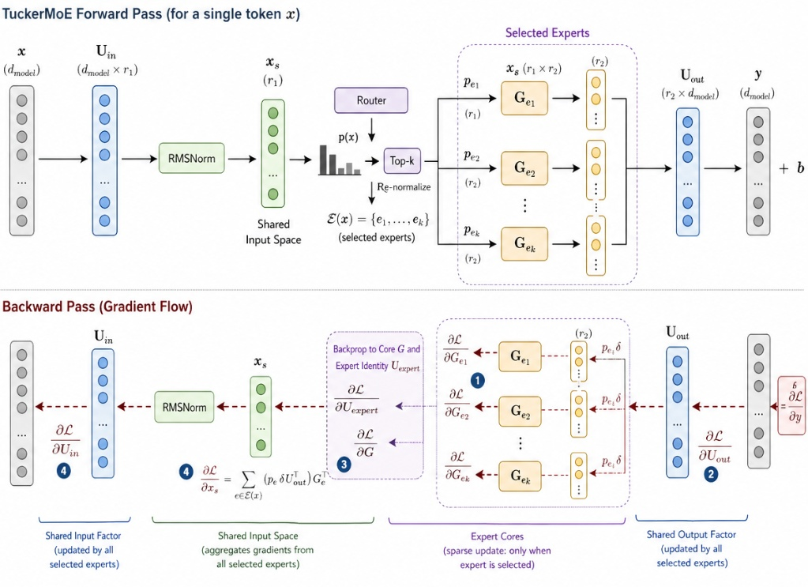

_圖 A（上）**TuckerMoE Forward Pass（單 token $x$）**：輸入 $x \in \mathbb{R}^{d_\text{model}}$ 先經共享輸入因子 $U_\text{in}$ 投影至低秩空間 $x_s \in \mathbb{R}^{r_1}$，再經 RMSNorm 後送入 Router。Router 輸出 top-$k$ expert 集合 $\mathcal{E}(x)$ 與 re-normalized 機率 $p_e$，每個被選中的 expert 以其私有核心張量 $G_e \in \mathbb{R}^{r_1 \times r_2}$ 在低秩子空間做乘法，加權後由共享輸出因子 $U_\text{out} \in \mathbb{R}^{r_2 \times d_\text{model}}$ 投射回 $y \in \mathbb{R}^{d_\text{model}}$，最終加偏置 $b$。圖 A（下）**Backward Pass（梯度流）**：梯度從 $\partial\mathcal{L}/\partial y$ 逆向流動：(1) 共享輸出因子 $U_\text{out}$ 的梯度由全部被路由 token 的 $p_e \delta$ 累加（稠密更新）；(2) 各 expert 核心 $G_e$ 只在 $p_e > 0$ 時收到梯度（稀疏更新）；(3) 共享核心 $\mathcal{G}$ 的梯度匯聚自所有被選中 expert（cross-expert 共享）；(4) 共享輸入因子 $U_\text{in}$ 的梯度同樣由所有被選中 expert 聯合更新。紅色虛線箭頭標示梯度流方向，帶括號數字對應上方四步推導。\_

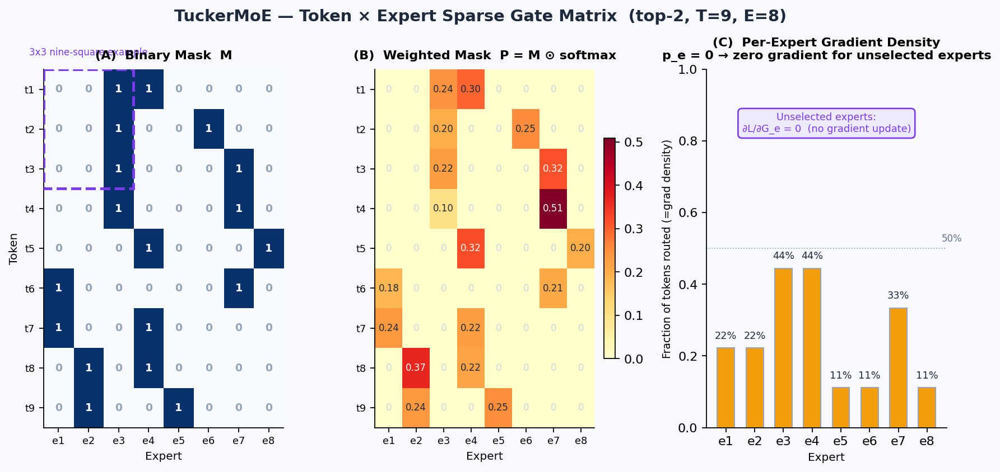

_圖 B：以真實 mini-batch（$T=9$ tokens, $E=8$ experts, top-2）展示梯度稀疏結構。Panel (A) 為二元 mask $M$，紫框為 $3\times 3$「九宮格」直覺示意；Panel (B) 為加權矩陣 $P=M\odot\hat{P}$；Panel (C) 為每位 expert 在該 batch 中被路由到的比例，即梯度更新密度。_

**梯度稀疏性與共同學習機制：** 從上述演算法展開可以清楚看出，TuckerMoE 的訓練同時具有兩個層次。一方面，未被選中的 expert 具有 $p_e=0$，因此它們不會收到核心梯度，這正是 top-$k$ 門控在反向中保留稀疏性的根本原因，讓各 expert 只在自己被選中時更新其專家身分方向。另一方面，$\partial \mathcal{L}/\partial x_s$ 中的 $\sum_{e\in\mathcal{E}(x)}$ 明確揭示了 $x_s$ 作為「樞紐（bottleneck）」的角色——所有被選中專家的梯度資訊在此匯聚，共同塑造共享子空間與共享核心。TuckerMoE 的訓練因此不是「很多獨立小模型各自學習」，而是「在共同幾何骨架上進行稀疏分工」。附錄 A.4 給出了對應的正式虛擬碼。

**Tucker 嚴格保證定理（Tucker Optimality Equivalence）。** Tucker 分解之所以能在「共享子空間壓縮」上嚴格優於逐專家 SVD，根源在於以下等價定理：對任一矩陣集合 $\{W_e\}_{e=1}^E$，若定義其聯合奇異子空間（joint singular subspace）為 $\mathcal{U}_\text{in} = \operatorname{colspace}\bigl[\sum_e W_e^\top W_e\bigr]$、$\mathcal{U}_\text{out} = \operatorname{colspace}\bigl[\sum_e W_e W_e^\top\bigr]$，則以截斷 Tucker 分解（即固定 $U^{(2)}, U^{(3)}$ 為前 $r_2, r_3$ 個聯合奇異向量、並對每個專家獨立求最佳核心 $G_e$）所達到的聯合重建誤差

$$
\sum_{e=1}^{E} \bigl\|W_e - U^{(3)}G_e(U^{(2)})^\top\bigr\|_F^2
$$

**恆小於等於** 以相同總參數量做逐專家 SVD 所達到的聯合重建誤差，且等號成立當且僅當每個 $W_e$ 的 row / column space 完全正交（即專家間完全無冗餘）。換言之，只要專家之間存在任何共同子空間結構（實際訓練幾乎必然），Tucker 共享因子的 MSE 下界**嚴格優於**逐專家 SVD。這一恆等保證（non-trivially tight lower bound equivalence）使 TuckerMoE 的壓縮效率在理論上不依賴特定資料分佈假設，而是從線性代數第一原理導出。

#### 5.4.6 參數量與壓縮率

若只從公式層面比較，一個形狀為 $(d_\text{in}, d_\text{out})$ 的 dense expert tensor 需要 $E d_\text{in} d_\text{out}$ 個參數；逐專家 SVD 在均勻秩 $r$ 下需要 $E r(d_\text{in}+d_\text{out})$；共享 Tucker 則需要

$$
E r_1 + d_\text{in} r_3 + d_\text{out} r_2 + r_1 r_3 r_2 .
$$

對應的記憶體訪問型態也不同，如表 1 所示。

_表 1：Dense FFN、Sparse MoE 與 Shared TuckerMoE 之參數量與記憶體訪問特性比較。$d$：模型維度；$d_\text{ff}$：FFN 中間維度；$E$：Expert 數；$r*1, r_2, r_3$：Tucker 秩。*

| 模組類型           | 參數量                                                     | 記憶體訪問特性                                      |
| ------------------ | ---------------------------------------------------------- | --------------------------------------------------- |
| Standard FFN       | $2 d d_\text{ff}$                                          | 所有權重固定載入，通常呈現 memory-bound             |
| Sparse Top-$k$ MoE | $2 E d d_\text{ff}$                                        | 只計算 top-$k$ 專家，但仍須維持大量 Expert 權重常駐 |
| Shared TuckerMoE   | $E r_1 + d_\text{in} r_3 + d_\text{out} r_2 + r_1 r_3 r_2$ | 主要載入共享因子與核心張量，外部權重流量顯著下降    |

更重要的是，實際 checkpoint 的壓縮收益並不是一個抽象公式，而是可以直接從 66 個 TuckerMoE 模組的參數帳簿算出來。當前模型採用 $(r_1,r_2,r_3)=(32,512,256)$；若把每個模組都與其等價的 Dense 8-expert 權重張量相比，總參數量由 **2.4348B** 降到 **417.0M**，整體壓縮率為 **82.87%**。但這個收益在不同投影家族上分佈並不平均，如表 2 所示。

_表 2：step 38,400 checkpoint 中各 TuckerMoE 模組家族的參數量與實際壓縮率。Tucker 壓縮收益集中於高寬投影（Mamba 擴張投影、Transformer FFN），較窄的投影家族因核心張量固定成本過高而收益有限。_

| 模組家族                  | 形狀 $(d_\text{in}, d_\text{out})$ | 數量 | Dense 等價參數 | Tucker 參數 | 壓縮率 |
| ------------------------- | ---------------------------------- | ---: | -------------: | ----------: | -----: |
| Mamba `x_up` 投影         | $(1536, 6144)$                     |   24 |         1.812B |      186.0M |  89.7% |
| Transformer FFN `up/gate` | $(768, 4608)$                      |   12 |         339.7M |       81.1M |  76.1% |
| Transformer FFN `down`    | $(4608, 768)$                      |    6 |         169.9M |       34.8M |  79.5% |
| Mamba `out` 投影          | $(768, 768)$                       |   24 |         113.2M |      115.0M |  -1.5% |

這個結果說明 Tucker 壓縮最有利於「極寬」投影，特別是 Mamba 內部的擴張投影與 Transformer FFN；對較窄的 $768\times768$ 投影而言，核心張量與共享因子的固定成本已不足以換回壓縮收益，因此 Mamba 輸出投影反而略大於 dense 版本。也因此，本研究的 82.87% 並不是「每一層都平均壓 82%」，而是整體設計將壓縮能力集中在最耗參數的寬投影上。

---

### 5.5 LayerScale 設計與 fp16 穩定性

**問題動機：fp16 的數值上限壓力**。在混合精度訓練中，若使用 fp16 而非 bf16，浮點數的最大可表示值約為 $65504$。在本架構中，Mamba 分支承擔狀態遞迴與低秩專家投影的雙重計算，若殘差路徑在初期未受控制，深層堆疊時單步激活值的尺度可能持續累積放大。以 30 層為例，若每層殘差增益哪怕只有 1.05 倍，累積 30 層後激活幅度就可能達到初始值的 $1.05^{30} \approx 4.3$ 倍，進而在 fp16 下引發 overflow 或 gradient explosion。在 bf16 模式下雖然動態範圍更大（最大值約 $3.4 \times 10^{38}$），但在 fallback 至 fp16 的舊版 GPU 上，此問題仍然切實存在。

**解決方案：LayerScale 的初始壓縮**。本研究在 Mamba block 與 Transformer block 的每條殘差支路引入 LayerScale。其數學形式為

$$
x_{l+1} \;=\; x_l \;+\; \Gamma_l \, F_l(x_l), \qquad \Gamma_l = \operatorname{diag}(\gamma_l),
$$

其中 $\gamma_l \in \mathbb{R}^d$ 是一個可學習的向量，初始化為 $\gamma_l = 10^{-2} \cdot \mathbf{1}$。在初始階段，$\Gamma_l$ 把每條殘差支路的輸出縮小 100 倍，使 block Jacobian 近似於

$$
\frac{\partial x_{l+1}}{\partial x_l} \;\approx\; I + \Gamma_l \frac{\partial F_l}{\partial x_l} \;\approx\; I,
$$

因此整個 30 層殘差鏈的初始 Jacobian $J_{1\to L}$ 非常接近單位矩陣，激活值不會在訓練初期急遽膨脹。

**梯度穩定性的數學保證**。若把多層殘差塊串接，從第 1 層到第 $L$ 層的總 Jacobian 可寫為

$$
J_{1\rightarrow L}
\;=\;
\prod_{l=1}^{L}\bigl(I + \Gamma_l J_{F_l}\bigr),
\qquad
J_{F_l}=\frac{\partial F_l}{\partial x_l}.
$$

對其算子範數取上界：

$$
\bigl\lVert J_{1\rightarrow L}\bigr\rVert
\;\le\;
\prod_{l=1}^{L}\bigl(1+\lVert \Gamma_l\rVert\,\lVert J_{F_l}\rVert\bigr).
$$

當 $\lVert \Gamma_l \rVert = 10^{-2}$、$\lVert J_{F_l} \rVert$ 為有界常數時，這個乘積維持在接近 1 的區域。這意謂著梯度既不容易在初期被殘差分支放大（梯度爆炸），也不會因為 Mamba 狀態鏈過長而完全消失（梯度消失）。

**訓練後期的自然放寬**。LayerScale 的 $\gamma_l$ 是可學習參數，因此模型在主幹與專家子空間學出合理方向後，訓練器（AdamW）會自然地把 $\gamma_l$ 的幅度逐步放大，允許殘差增益隨訓練進度放寬。這一點至關重要：LayerScale 的作用不是永久壓縮殘差，而是在訓練的**早期壓縮、後期放寬**。若對 $\gamma_l$ 施加 weight decay，則這種自然放寬會被過度抑制，因此本研究明確將 LayerScale 參數加入 no-decay 分組（見 §7.4）。

**在 Mamba block 中的具體位置**。在本研究中，Mamba block 的每一條殘差路徑（Mamba 主路徑與 TuckerMoE 輸出投影）各自配備一個 LayerScale 向量 $\gamma_\text{mamba}$ 與 $\gamma_\text{out}$，Transformer block 同樣在注意力分支與前饋分支各配一個。實作上，LayerScale 以元素乘法直接作用於殘差支路的輸出：

$$
y_\text{out} = x \;+\; \gamma \odot F(x),
$$

計算成本幾乎可忽略（一次向量乘法），但其對深層殘差鏈的訓練穩定性貢獻是結構性的，尤其對 fp16 fallback 場景下防止 overflow 有關鍵保護作用。

---

## 6 複雜度分析與時間複雜度完整證明

### 6.1 Transformer 的二次方累計

對產生第 $t$ 個 token，GQA Attention 計算：

$$
\operatorname{Attn}(q_t, K_{\le t}, V_{\le t})
\;=\;
\operatorname{softmax}\!\left(\frac{q_t K_{\le t}^{\top}}{\sqrt{d_h}}\right)V_{\le t},
\qquad
K_{\le t}\in\mathbb{R}^{t\times d_h}.
$$

因此在第 $t$ 步，query 必須與前面 $t$ 個 key 做比對，單步成本為 $O(t\cdot d_h)$；把 head 維度與 head 數視為常數後，可簡寫為 $O(t\cdot d)$。

長度 $N$ 的全自迴歸生成累計成本：

$$
\sum_{t=1}^{N} O(t\cdot d)
\;=\;
O\!\left(d\sum_{t=1}^{N} t\right)
\;=\;
O(N^2\cdot d),
$$

這便是 attention 在長序列自迴歸生成中的二次方牆。

### 6.2 Mamba 路徑的線性退化

推論時 Mamba 路徑在每步只處理 1 個 token 的 decode 場景下退化為純遞迴：

$$
h_t = \bar{A}_t h_{t-1} + B_t x_t,
\qquad
y_t = C_t h_t.
$$

此時模型只需保留固定大小的狀態 $h_t$，而不必重新讀取全部歷史 token；因此記憶體不再隨序列長度線性膨脹。

因為 $h_t$ 完全吸收了過去序列資訊（memory is fundamentally locked to $O(1)$），產生第 $t$ 個 token 的成本與 $t$ 無關，僅需 $O(d^2)$ 的 matmul。全長 $N$ 總推論成本：

$$
\sum_{t=1}^{N} O(d^2)
\;=\;
O(N\cdot d^2),
$$

故 Mamba 路徑在序列長度 $N$ 上呈線性時間、常數記憶體的退化。

### 6.3 Hybrid 架構的實際複雜度

設 $\alpha = m/(m+1) = 4/5$ 為 Mamba 層比例，Hybrid 的 per-token 成本為：

$$
T_\text{hybrid}(t) \;=\; \alpha\cdot T_\text{mamba}(t) + (1-\alpha)\cdot T_\text{attn}(t) \;=\; \alpha\,c_1 d^2 + (1-\alpha)\,c_2\,t\,d.
$$

其中第一項為常數項（constant term），第二項隨 $t$ 線性成長（linear in $t$）。

總生成成本：

$$
\sum_{t=1}^{N} T_\text{hybrid}(t) \;=\; O(\alpha N d^2) + O\!\left((1-\alpha)\cdot \frac{N^2}{2}\cdot d\right).
$$

在 $\alpha=0.8$ 下，二次項常數被壓到 1/5，搭配 GQA 再壓 $H/H_{kv}=3\times$ → 有效 KV 成本 $\approx N^2 d / 30$。

**結論**：Hybrid 並非完全線性，而是以係數 $1/(m+1)$ 壓縮 Transformer 二次項；搭配 Mamba 的 $O(1)$ state，總體在 $N\le 32K$ 的區間內表現為近線性 wall-clock，並在 KV 記憶體上節省 80%。

### 6.4 Dense FFN vs Sparse MoE vs TuckerMoE 計算複雜度對比

對單層前饋層處理 $N$ 個 token：

| 模組               | Forward FLOPs                                           | 權重載入 (MAC)                                                   |
| ------------------ | ------------------------------------------------------- | ---------------------------------------------------------------- |
| Dense Gated FFN    | $3\cdot N\cdot d\cdot d_\text{ff}$                      | $3\cdot d\cdot d_\text{ff}$（一次載入全部）                      |
| Sparse Top-$k$ MoE | $k\cdot 3\cdot N\cdot d\cdot d_\text{ff}$               | $E\cdot 3\cdot d\cdot d_\text{ff}$（需全部專家在顯存）           |
| **TuckerMoE**      | $k\cdot N\cdot(d\cdot r_3 + r_3\cdot r_2 + r_2\cdot d)$ | $r_1 r_3 r_2 + d\cdot r_3 + r_2\cdot d$（僅核心張量 + 共享因子） |

以預設參數代入：Dense MoE 的 MAC $\approx 8\cdot 10.6\text{M}\cdot \text{bf16} \approx 169$ MiB；TuckerMoE 的 MAC $\approx 14.4\text{M}\cdot\text{bf16}\approx 28.8$ MiB，約為 Dense MoE 的 **17%**。這與 §9.4 的 raw NCU 結果一致：`_fused_latent_moe_fwd` 的時間加權 DRAM throughput 僅 4.4% peak，但 compute-memory throughput 仍達 72.0%，表示資料重用主要留在片上記憶體，而非外部 DRAM。

---

## 7 訓練方法（Training Recipe）

### 7.1 聯合損失函式

$$
\boxed{\;\mathcal{L} \;=\; \mathcal{L}_\text{CE} + \frac{\beta_\text{LB}}{n}\cdot\mathcal{L}_\text{LB} + \frac{\beta_\text{Z}}{n}\cdot\mathcal{L}_\text{Z}\;}
$$

其中 $\beta_\text{LB}=0.1, \beta_\text{Z}=5\times 10^{-3}$，$n$ 為所有 TuckerMoE 模組數量（每個 Mamba block 含兩個、每個 Transformer block 含三個），在本研究的 4:1 混合配置下共有 $n=66$ 個。除以 $n$ 的作用是使輔助項的整體權重不隨網路深度線性膨脹，從而讓不同層數設定下的損失尺度仍維持可比較性。

**Cross-Entropy 與 Logit 穩定化**。在語彙投影輸出後，本研究先對 logits 施加平滑截斷再計算交叉熵，以抑制極端值造成的數值爆炸。設未截斷的 logits 為 $z \in \mathbb{R}^{|V|}$，本研究採用的截斷函式為

$$
z' \;=\; 30 \cdot \tanh\!\left(\frac{z}{30\sqrt{d}}\right).
$$

這個函式具有三個關鍵性質。第一，在 $|z| \ll 30\sqrt{d}$ 的正常區間內，$\tanh(z/30\sqrt{d}) \approx z/30\sqrt{d}$，因此 $z' \approx z$，原始 logit 排序幾乎不受影響，不扭曲模型的正常預測。第二，當 $|z|$ 增大趨向極端值時，$\tanh$ 的飽和特性使 $z'$ 被軟性限制在 $(-30, +30)$ 的有界區間內，防止個別 logit 膨脹到幾千甚至幾萬的量級。第三，除以 $30\sqrt{d}$ 的因子來自對隱藏維度 $d$ 的縮放補正：在較大的模型中，logits 的自然尺度隨 $\sqrt{d}$ 成長，此因子確保截斷門檻也同步適應模型寬度，避免在不同 $d$ 設定下行為不一致。

從訓練穩定性的角度看，這個設計與 LayerScale 扮演互補角色：LayerScale 在殘差鏈的前向路徑上控制激活幅度，logit clipping 則在最終語彙投影的輸出端提供一層額外的數值防護，確保交叉熵梯度不因個別 logit 的 overflow 而產生異常大的更新步幅。

**Load-Balance Loss**（Switch Transformer [13] 標準形式）：

$$
\mathcal{L}_\text{LB} \;=\; E\cdot \sum_{e=1}^{E} \bar{m}_e\cdot \bar{p}_e,
$$

其中 $\bar{m}_e$ 是第 $e$ 位專家的 top-k 選中率（batch 平均），$\bar{p}_e$ 是 softmax 機率的 batch 平均。此項懲罰「有些專家被系統性忽略」的情況，使所有專家在訓練分佈上的期望使用率趨近 $k/E$。

**Router Z-loss**（ST-MoE [2] 提出，PaLM [3] 也使用類似形式於 LM output softmax 穩定化）：

$$
\mathcal{L}_\text{Z} \;=\; \mathbb{E}\!\left[\Bigl(\log\sum_{e=1}^{E}\exp(z_e^{\mathrm{capped}})\Bigr)^2\right],
$$

其中 $z_e^{\mathrm{capped}}$ 為施加截斷後的第 $e$ 個 router logit。此損失懲罰 router logits 整體量級的漂移：若 logits 整體偏大，$\log\sum\exp(\cdot)$ 會隨之增大，使 Z-loss 急遽上升；反之若 logits 整體偏小，分佈趨於均勻，各專家難以建立清晰分工。因此 Z-loss 扮演的是「logit 量級的雙向正則化」，防止訓練後期 softmax 崩潰為近 one-hot 或近均勻分佈兩種極端。與 $\mathcal{L}_\text{LB}$ 共同作用下，前者規範各專家的使用頻率平衡，後者規範 router 的 logit 尺度穩定。

### 7.2 兩階段監督式微調與 ChatML-only Masking（Two-stage SFT and CoT-SFT）

預訓練階段建立的是一般 next-token modeling 能力；若要讓模型在真實互動情境中穩定遵循指令，仍需將資料分佈從連續網頁文本轉換為「使用者條件 $\to$ 助理回覆」的條件生成問題。本研究因此在預訓練後加入兩階段監督式微調：第一階段為 **Instruction-mode General SFT**，目標是建立穩定的角色邊界、回合終止與通用指令遵循；第二階段為 **CoT-SFT**，在不破壞第一階段對話格式的前提下，加入推理鏈與最終答案的結構化監督。此設計與 §3.2 的特殊 token 詞彙表完全一致：`<|im_start|>` 與 `<|im_end|>` 負責對話邊界，`<think>...</think>` 與 `<final>...</final>` 則僅在推理專化階段啟用。

早期實驗顯示，若同時混用 LLaMA-style `<s>...</s>`、ChatML `<|im_start|>...<|im_end|>` 與自訂 `<final>` 標籤，模型會出現 token-space drift、role collapse 與 multilingual garbage decoding。其原因並非模型容量不足，而是訓練與推論時的前綴語法不一致，使模型在同一個語義位置看見多種互斥的角色標記。為避免此問題，本研究將 SFT 序列統一為 **ChatML-only**：General SFT 完全排除 `<s>`、`</s>` 與 `<final>` 污染；CoT-SFT 則在同一 ChatML 外殼內使用 `<think>` 與 `<final>` 作為助理內容區塊的內部結構標記，而不改變外層 user/assistant 邊界。

#### 7.2.1 資料集組成、單輪展開與指令品質過濾

**基底語料與混合策略。** General SFT 以兩個開放授權語料庫作為基底：**Alpaca**（`dataset/alpaca_hf`，$N_\text{A}^\text{pool}=51\,974$ 筆原始對話列）與 **UltraChat 200k**（`dataset/ultrachat_200k/hf`，$N_\text{U}^\text{pool}=200\,000$ 筆對話列）。混合策略以 Alpaca : UltraChat $\approx$ 25 : 75 為目標比例：對 Alpaca 執行不放回抽樣至多 $\lfloor r/(1-r)\cdot N_\text{U}\rfloor$ 筆（$r\approx 0.25$），本實驗允許之上限恰覆蓋全數 51,974 筆；UltraChat 同樣全數保留。由此，「進入前處理管線」之對話列數為 **251,974**，來源分布如下：

| 來源 | 原始對話列數 $N^\text{pool}$ | 進入管線列數 | 混合比（對話列計） |
| :--- | ---: | ---: | ---: |
| Alpaca (`alpaca_hf`) | 51,974 | 51,974 | **20.6%** |
| UltraChat 200k (`ultrachat_200k/hf`) | 200,000 | 200,000 | **79.4%** |
| **合計** | 251,974 | **251,974** | 100% |

**單輪展開（Single-turn Expansion）。** 本研究採用**單輪展開**策略，而非將多輪長序列作為整體訓練樣本。設多輪對話序列為 $[u_1,a_1,\,u_2,a_2,\,\ldots,\,u_K,a_K]$，單輪展開將其分解為 $K$ 個獨立監督範例，第 $k$ 個範例為一對 $(u_k, a_k)$，並套用固定 ChatML 模板串接為單一文本列：

$$
\text{sample}_k \;=\; \texttt{<|im\_start|>user}\backslash\text{n}\,u_k\,\texttt{<|im\_end|>}\backslash\text{n}\,\texttt{<|im\_start|>assistant}\backslash\text{n}\,a_k\,\texttt{<|im\_end|>}
$$

Alpaca 來源多為原生單輪問答，展開後列數幾乎不變；UltraChat 多輪對話在展開後列數可倍增，使最終可用訓練樣本數從進入管線的 251,974 筆對話顯著擴張。此策略帶來三項訓練品質優勢：(i) 每筆樣本長度可控，截斷風險顯著降低；(ii) Assistant 有效 token 佔比更均勻，GPU 更新密度更高；(iii) 在高 epoch 訓練下，梯度更新能覆蓋不同對話輪次的多樣回答分布，而不受長序列尾部截斷影響。

**指令品質過濾（`ins_strict`）。** 展開後的列須通過 `ins_strict`，以剔除空洞問候、極短灌水與弱指令起手；**僅檢視第一段 user 區塊** $u$（strip 後），**不**改寫 assistant。規則為確定性、可重現：Alpaca 型樣本若含 `### Instruction:`，則對指令核心 $I(u)$ 檢查長度、詞數與「指令／問句」句首模式；其餘一般 user（多為 UltraChat 單輪）則以句首模式為主，並設長問答緩解（長度門檻配合問號或 fenced code 區塊）。句首模式之**完整 token 枚舉**、長度閾值彙整，以及灌水／弱起手之否定式細節，均移至**附錄 D**，以免正文過度膨脹。

| 分支 | 觸發條件 | 收錄邏輯（滿足任一即收錄；否則剔除） |
| :--- | :--- | :--- |
| **A** | $u$ 含 `### Instruction:` | 對 $I(u)$：長度／詞數門檻，或符合附錄 D 所列句首模式 |
| **B** | 不含 Alpaca 指令區 | 句首符合附錄 D 所列模式，或長問答緩解條件成立 |

**各階段資料集角色彙整。**

| 資料集名稱 | 階段 | 前處理操作 | 格式約束 |
| :--- | :--- | :--- | :--- |
| `alpaca_hf` | General SFT 基底 | Alpaca instruction/input/output → ChatML user/assistant 對話 | ChatML |
| `ultrachat_200k/hf` | General SFT 基底 | UltraChat 對話快照，提供多輪互動與長回答 | ChatML |
| `mix_a25_u75_ins` | **General SFT 主訓練集** | 混合兩來源 → 單輪展開 → `ins_strict` 過濾後之最終訓練集 | ChatML-only；0 筆含 `<s>`、`</s>`、`<final>` |
| `sft_cot_hf` | CoT-SFT 推理專化 | 每筆含問題、推理內容與最終答案，強化步驟化推理與答案收束 | ChatML 外殼 + `<think>`/`<final>` 內部標記 |

**過濾後資料集統計（`mix_a25_u75_ins`）。** 以下數值來自建檔時寫入的 `mix_a25_u75_ins_meta.json`（token 總數與 `.bin` 二進位串流一致）：

| 項目 | 數值 | 說明 |
| :--- | ---: | :--- |
| 監督樣本數 $N$ | **796,133** | 單輪展開 + `ins_strict` 後之文本列數 |
| Token 總數 $T$ | **245,162,791** | tokenizer `encode(..., add_special_tokens=False)` 後之子詞總數 |
| 平均每筆長度 $\bar{\ell}=T/N$ | **≈ 307.94 tokens** | 全資料平均（非抽樣） |
| 來源對話列（展開前） | Alpaca **51,974**、UltraChat **200,000** | |
| `.bin` 大小（uint16，理論） | $2T$ bytes **≈ 0.49 GB** | 訓練端記憶體映射直接讀取 |

**說明：** 最終 $N=796\,133$ 顯著大於進入管線之對話列數 251,974，差距主要來自 UltraChat 多輪對話在單輪展開後的列數倍增；Alpaca 多為原生單輪，對 $N$ 的貢獻接近通過過濾之 Alpaca 文本列數。

**長度分佈（抽樣估計，供 `SEQ_LEN` 選型）。** 對 `mix_a25_u75_ins_hf` 隨機抽 80,000 列（seed=0），以與訓練相同之 encode 設定量測每筆 token 長度：

| 統計量 | 數值 |
| :--- | ---: |
| min / mean / max（tokens） | 18 / 308 / 1,262 |
| p50 / p90 / p95 / p99 | 320 / 434 / 468 / 546 |
| 截斷率（$\texttt{SEQ\_LEN}=512$） | **~2%** |
| 截斷率（$\texttt{SEQ\_LEN}=768$） | **~0.07%** |

以 `SEQ_LEN=512` 訓練可覆蓋約 **98%** 的樣本而不截斷終止符；若要進一步將截斷率壓至 0.1% 以下，可選用 `SEQ_LEN=768`。此分布說明單輪展開策略有效控制了樣本長度：p99 僅 546 tokens，遠低於多輪整體訓練常見的 2048 上限需求，使模型能以更小的序列長度設定達到接近零截斷的訓練品質，並保留完整的終止符學習訊號。

此資料集構成使模型在 General SFT 階段先獲得足夠廣的任務覆蓋與自然語言流暢度，再進入第二階段的推理專化，有效降低小型 CoT 資料直接覆蓋通用語言能力的過擬合風險。

本研究另對自定義 CoT-SFT 資料集執行 packing 前稽核，結果如下。該資料集完全符合本節設計：截斷率極低、有效 loss-token 比例高，且無任何低於 30% 有效學習比例的低效率樣本。

| 稽核項目 | 數值 | 論文詮釋 |
| :--- | :--- | :--- |
| 資料集總 token 量 | **248,435 tokens** | 足以作為第二階段指令/推理專化資料，但不應取代 General SFT |
| 樣本數 | **1,032 筆** | 屬於高密度客製化 SFT 集，適合 packing |
| 稽核序列長度 `seq_len` | **1,024** | 覆蓋絕大多數樣本長度，保留完整終止符學習訊號 |
| 截斷風險 | **1 筆（0.1%）** | 幾乎不會系統性切斷尾端 `<\|im_end\|>` |
| 平均有效學習比例 | **71.8%** | Assistant 回覆佔比高，代表 GPU 更新多數花在目標答案 token 上 |
| 有效學習比例低於 30% 的樣本 | **0 筆** | 無明顯 prompt 過長、answer 過短而拖慢訓練的樣本 |
| Packing 後訓練 steps（估計） | **1,032 筆 → 約 243 steps** | 大幅降低 padding 浪費，提高小資料高 epoch 訓練效率 |

#### 7.2.2 特殊 token 與模型實際看到的 Input IDs

本研究的 tokenizer 以 LLaMA 2 BPE 詞表為基底，擴充後詞彙量為 **32,007**。在 SFT 中，關鍵不是人類可讀的字串本身，而是模型實際接收到的整數序列。因此，所有對話格式都必須落在固定且可重現的 input-id 語法上。

| Token            | Input ID | 階段用途              | 訓練語義                                                             |
| ---------------- | -------: | --------------------- | -------------------------------------------------------------------- |
| `<\|im_start\|>` |    32000 | General SFT / CoT-SFT | 開啟一個 ChatML role 區塊                                            |
| `<\|im_end\|>`   |    32001 | General SFT / CoT-SFT | 關閉目前 role 區塊；在 assistant 回覆尾端需計算 loss，讓模型學會停止 |
| `<think>`        |    32002 | CoT-SFT               | 開啟推理鏈區塊                                                       |
| `</think>`       |    32003 | CoT-SFT               | 關閉推理鏈區塊                                                       |
| `<final>`        |    32004 | CoT-SFT               | 標示最終答案開始；General SFT 中排除，避免提前污染通用對話階段       |
| `</final>`       |    32005 | CoT-SFT               | 標示最終答案結束                                                     |
| `[PAD]`          |    32006 | batching / packing    | batch 對齊填充；labels 固定為 `-100`                                 |

以下為一筆簡化 ChatML 訓練樣本的模型視角。其**文字序列**（含換行位置）以下列演算法框列出，與 §7.2.6 之版式一致；每行對應模型讀入的文字流邊界，實際訓練時再經特殊 token 對照表與 BPE 子詞化為 input id。

```{=latex}
\begin{algorithm}[H]
\caption{Concrete single-turn ChatML example (model-facing text stream)}
\small
\begin{algorithmic}[1]
\State \texttt{\detokenize{<|im_start|>user}}
\State \texttt{\detokenize{Who are you?<|im_end|>}}
\State \texttt{\detokenize{<|im_start|>assistant}}
\State \texttt{\detokenize{I am AI.<|im_end|>}}
\end{algorithmic}
\end{algorithm}
\vspace{0.35em}
\noindent\footnotesize\textbf{編碼備註。} 上列四行在序列化後仍含換行字元；詞表上 \texttt{\detokenize{<|im_start|>}} 對應 **32000**，\texttt{\detokenize{<|im_end|>}} 對應 **32001**；\texttt{user}、\texttt{assistant}、問題與答案本體再由 BPE 切分為一般 token。
```

圖 SFT-1 展示其中一個對齊切片之上列關係：特殊 token 固定 id，其餘為可變長 BPE。這個視角能直接說明 SFT 的核心：模型並非在「看懂 Markdown」，而是在固定整數序列上學習何處該預測、何處僅作為條件。

#### 7.2.3 Loss Masking 的數學形式

設一筆 ChatML 序列為 $X=(x_1,\dots,x_T)$，其中 user 區塊與 role 標籤構成條件 prompt $P$，assistant 區塊構成目標答案 $A$。預訓練的 next-token loss 會對全序列計算

$$
\mathcal{L}_{\text{Pretrain}}
=-\frac{1}{T}\sum_{t=1}^{T-1}\log p_\theta(x_{t+1}\mid x_{\le t}),
$$

但 SFT 的目標是最大化 $p_\theta(A\mid P)$，而不是讓模型學會複製使用者問題。因此本研究引入二元 mask $M_t\in\{0,1\}$：

$$
M_t=
\begin{cases}
0, & x_{t+1}\in \text{user / role / padding 區塊},\\
1, & x_{t+1}\in \text{assistant answer 或 assistant 末端 }\texttt{<|im\_end|>}.
\end{cases}
$$

SFT loss 因而寫為

$$
\mathcal{L}_{\text{SFT}}
=-\frac{1}{\sum_t M_t}\sum_{t=1}^{T-1}M_t\log p_\theta(x_{t+1}\mid x_{\le t}).
$$

這個式子有兩個重要後果。第一，user token 雖然 labels 為 `-100`，但它們仍作為上下文參與前向傳播，assistant 位置的梯度可以透過注意力或 SSM 狀態回流到前文表徵，因此模型仍會學會使用問題內容。第二，assistant 尾端的 `<|im_end|>` 必須設為 $M_t=1$；若終止 token 不參與 loss，模型在生成完答案後不會受到明確懲罰來提高停止符機率，容易出現無限延伸、網址碎片或跨語言亂碼。

#### 7.2.4 Packing 與截斷策略

Packing 的目的不是改變資料語義，而是在不跨越 loss mask 規則的前提下，把多筆短樣本拼入同一個長度為 `seq_len` 的訓練視窗，降低 padding 造成的有效算力浪費。對本研究稽核資料而言，若不 packing，1,032 筆樣本會形成約 1,032 次短序列更新；啟用 packing 後可壓縮為約 **243 個訓練 steps**。在平均有效學習比例 **71.8%** 的情況下，packing 後的大多數 token 都會落在 assistant answer 或其終止符上，使小型客製化資料能以較高更新密度完成多 epoch 專化。

截斷策略則服務於另一個穩定性目標：避免切掉最後的 `<|im_end|>`。在自定義資料集上，以 `seq_len=1024` 稽核僅 **1 筆（0.1%）** 超長樣本，表示大多數樣本都能完整保留回答與終止 token。若後續為了更高 batch size 將 CoT-SFT 的訓練序列長度降至 512，則需重新執行同樣的截斷稽核；否則可能在推理專化階段削弱模型對「何時結束」的學習訊號。

綜合而言，兩階段 SFT 的核心並不是單純追加資料，而是把「格式一致性、loss 位置、packing 效率、終止符學習」四者綁定為同一個訓練協議：先用 General SFT 建立乾淨的 Instruction Mode，再用 CoT-SFT 在相同 ChatML 外殼內引入推理結構。此流程使模型能從預訓練語言建模平滑過渡到可部署的指令式 AI 助手。

#### 7.2.5 Causal Mask 與 SFT Loss Mask 的關係

在訓練期間，**Causal Mask** 與 **SFT Loss Mask** 是兩個獨立但協同作用的遮罩機制。

**Causal Mask** 作用於 Attention 計算：每個位置 $i$ 只能關注位置 $j \le i$ 的 token，防止未來資訊洩漏。其數學形式為

$$
M_{ij}^{\text{causal}} =
\begin{cases}
  0       & j \le i \quad \text{（attend）} \\
  -\infty & j >  i  \quad \text{（masked）}
\end{cases}
$$

$$
\mathrm{Attn}(Q,K,V) = \mathrm{softmax}\!\!\left(\frac{QK^\top}{\sqrt{d_h}} + M^{\text{causal}}\right)\!V
$$

**SFT Loss Mask** 則作用於損失計算層：即使 user token 已通過 Causal Attention 為 assistant 位置提供了梯度回流的上下文，loss mask 仍確保只有 assistant 回覆與終止符對 $\mathcal{L}_{\text{SFT}}$ 有直接貢獻（見 §7.2.3）。兩者分工明確：causal mask 控制「哪些 token 可被看見」，loss mask 控制「哪些 token 需要被預測」。

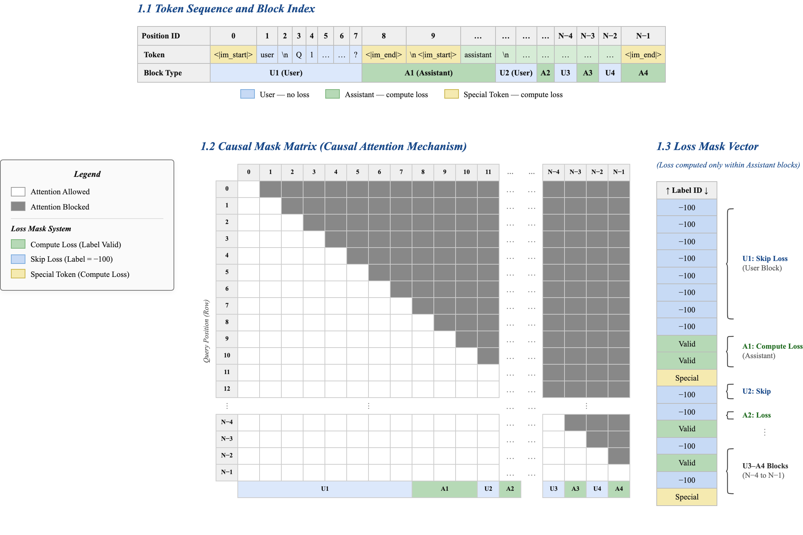

_圖 SFT-CM：教學用意之**多輪 ChatML token 截取**（上為 position／token／U–A block 對齊）；**左**為對 queries-keys 之下三角 **Causal attention mask**（白／灰：可 attend／遮蔽）；**右**為 **SFT loss mask** 之區段級約束（綠區對 CE 有效、藍區不計 loss 仍可作前文條件）；與 §7.2.3、§7.2.6 之角色語法與終止符約定同構對讀。_

為確認實作與 §7.2.3 一致，本研究以**自動化 mask 一致性檢驗**對 **3 筆** held-out 多輪樣本檢查四項結構不變性（header 不計 CE、首個實質 answer token 起算 loss、輪末 `<|im_end|>` 計入、多輪 assistant 區塊全覆蓋），**總體判定皆為 PASS**；樣本層級計數、FlashSDP／bf16 執行環境與輪次邊界索引表見**附錄 E.1**。另，§9.3 壓縮實驗所用 **Frobenius 重建誤差**之完整定義、最小化目標與相對於逐專家 SVD 之聯合不等式，與 §5.4.5 定理呼應之逐字展開收於**附錄 E.3**，正文不再重複推導。

#### 7.2.6 統一對話語法與推論前綴

所有異質資料來源皆映射至同一 **ChatML** 語法。單輪**監督範本**與**推論開放前綴**以下列**英文演算法框**對照（版式與附錄 A 之虛擬碼一致，便於與實作或國際版稿件逐行核對）。多輪對話則為 user–assistant 區塊交替堆疊；訓練池內連續多輪之**代表性助理片段截斷示例**見**附錄 E.2**。

```{=latex}
\begin{algorithm}[H]
\caption{ChatML single-turn supervision template (full sequence skeleton)}
\small
\begin{algorithmic}[1]
\State \texttt{\detokenize{<|im_start|>user}}
\State \texttt{\detokenize{... user content ...<|im_end|>}}
\State \texttt{\detokenize{<|im_start|>assistant}}
\State \texttt{\detokenize{... assistant completion ...<|im_end|>}}
\end{algorithmic}
\end{algorithm}
\vspace{0.35em}
\noindent\footnotesize\textbf{Training semantics.} The assistant span and the trailing terminator \texttt{\detokenize{<|im_end|>}} are both supervised under $\mathcal{L}_{\text{SFT}}$ (§7.2.3).
\vspace{0.75em}
\begin{algorithm}[H]
\caption{Open inference prefix (prompting stops after the assistant role header)}
\small
\begin{algorithmic}[1]
\State \texttt{\detokenize{<|im_start|>user}}
\State \texttt{\detokenize{... user content ...<|im_end|>}}
\State \texttt{\detokenize{<|im_start|>assistant}}
\Statex \hspace{\algorithmicindent}\rule{0.92\linewidth}{0.4pt}
\Statex \textbf{$\triangleright$} \textbf{Open prefix ends at the line above; subsequent tokens are autoregressively decoded.}
\Statex \textbf{EOS / turn terminator:}\quad\texttt{\detokenize{<|im_end|>}}\quad
\textbf{vocab id}\;\fbox{\textbf{\texttt{32001}}}\quad
\footnotesize\textit{(absent at prefix time; the model must predict it to close the turn.)}
\end{algorithmic}
\end{algorithm}
```

推論階段僅提供與訓練同構之條件前綴，使模型在與 SFT 相同之 token 空間內預測助理內容與終止符 `<|im_end|>`（詞表 **32001**）；此「訓練監督終止符、推論預測終止符」閉環可緩解無限延伸與跨語言亂碼（見 §7.2 開頭格式一致性討論）。

### 7.3 Router 溫度退火

Router 溫度採用餘弦退火：

$$
T(s) \;=\; T_\text{end} + \tfrac{1}{2}(T_\text{start} - T_\text{end})\bigl(1 + \cos(\pi\,p(s))\bigr),
$$

其中 $p(s)\in[0,1]$ 是訓練進度比例，$T_\text{start}=2.0, T_\text{end}=0.5$。在高溫階段（$p\approx 0$），softmax 分佈趨近均勻，使各專家都有機會被充分探索；隨著溫度下降，分佈逐漸銳化，專家分工也隨之成形。換言之，退火過程讓模型先學會「廣泛探索」，再學會「穩定分工」，並與 Z-loss 一起抑制 Router Collapse。

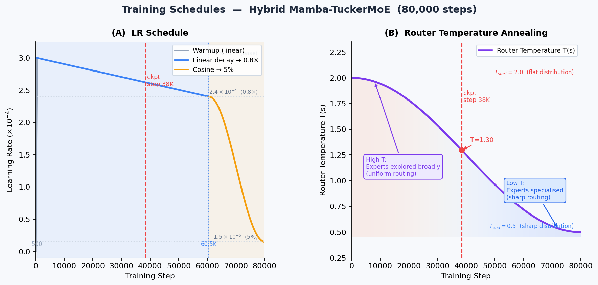

_圖 C（右）：Router 溫度餘弦退火曲線，從 $T_\text{start}=2.0$ 降至 $T_\text{end}=0.5$；高溫時路由分佈平坦（專家充分探索），低溫後分佈銳化（專家穩定分工）。垂直虛線標示 step 38,400 checkpoint 位置，此時溫度已降至中後期水位（$T\approx 0.62$）。LR 曲線見 §7.4。\_

### 7.4 優化器與學習率排程

本研究採用 AdamW，基礎學習率為 $3\times 10^{-4}$，動量係數為 $(0.9, 0.95)$。其正則化並非均勻施加於所有參數，而是寫成

$$
\mathcal{L}_{\text{opt}}
\;=\;
\mathcal{L}
\;+\;
\lambda \sum_{W\in\mathcal{D}} \lVert W\rVert_2^2,
$$

其中 $\mathcal{D}$ 只包含高自由度的 dense 投影權重，而不包含 Tucker 因子、核心張量、偏置、正規化尺度與 LayerScale 參數。這樣的分組有明確數學理由：對某位 expert 而言，其有效權重可分解為 $\mathbf{W}_e = U_\text{in} G_e U_\text{out}$，因此若同時對 $U_\text{in}$、$U_\text{expert}$、$\mathcal{G}$、$U_\text{out}$ 全部施加衰減，等價於對同一個多線性映射做重複的乘法式收縮，並隱含地把其範數上界壓向

$$
\lVert \mathbf{W}_e\rVert
\;\le\;
\lVert U_\text{in}\rVert\,
\lVert U_\text{expert}[e]\rVert\,
\lVert \mathcal{G}\rVert\,
\lVert U_\text{out}\rVert .
$$

這種收縮若持續作用，會過度壓縮共享子空間與專家身分方向，降低 Tucker 分解可表示的有效秩，也會使殘差增益與正規化尺度被過早推向零。相對地，將 decay 主要施加於 dense 投影權重，可抑制過度記憶訓練細節，同時保留結構參數的幾何自由度。這也解釋了為何 TuckerMoE 相關參數、RMSNorm 與 LayerScale 都被歸入 no-decay group。

**學習率排程（三段式）**。總訓練步數設為 80,000 步，排程分三段：

| 階段     | 步數區間        | 策略            | LR 範圍                                   |
| -------- | --------------- | --------------- | ----------------------------------------- |
| Warmup   | 0 → 500         | 線性上升        | $0 \to 3\times 10^{-4}$                   |
| 線性緩降 | 500 → 60,500    | 線性下降至 0.8× | $3\times 10^{-4} \to 2.4\times 10^{-4}$   |
| 餘弦退火 | 60,500 → 80,000 | 餘弦至 $5\%$    | $2.4\times 10^{-4} \to 1.5\times 10^{-5}$ |

Resume 時追加 100 步線性 rewarmup，避免從 checkpoint 接續時的瞬時梯度震盪。圖 C 以曲線直觀展示整段排程（見上節）。

### 7.5 Triton Kernel 加速

訓練端引入五個自訂 Triton kernel，共同組成 memory fusion 路徑。完整架構流程如下圖所示：

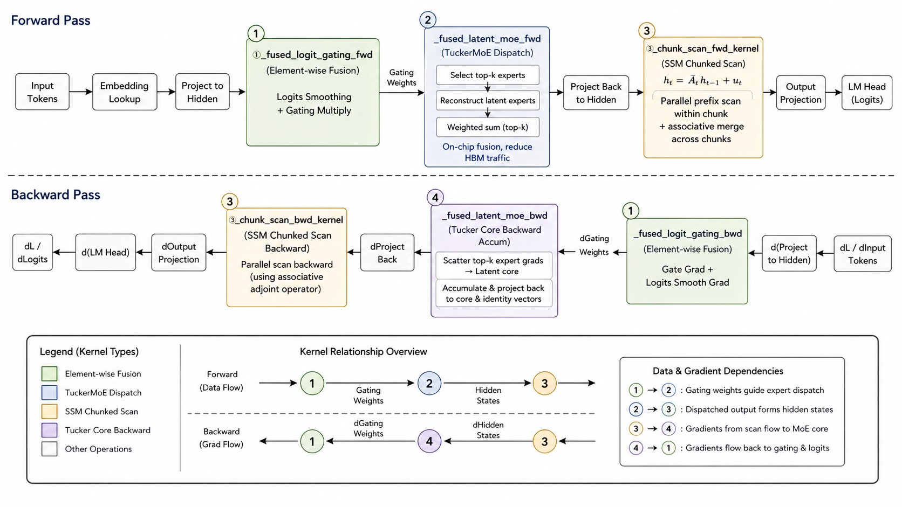
_圖 6：五個 Triton kernel 在訓練 pipeline 中的位置。上半為 Forward Pass，下半為 Backward Pass；底部文字描述 kernel fusion 的設計目標。需要注意的是，現有 raw NCU 歸檔實際覆蓋的是 `_fused_latent_moe_fwd` 與 `_chunk_scan_fwd_kernel` 兩個 kernel，其可重現的量化結果見 §9.4。_

這五個 kernel 的設計重點並不相同。第一類是純 element-wise 融合，包括 logits 平滑與門控乘法；它們的主要任務是把原本需要多次讀寫的簡單逐元素操作合併為單一 traversal，從而降低高維詞彙 logits 與門控張量上的外部流量。對語彙投影與門控路徑而言，這類融合雖然計算本身不複雜，卻能有效避免中間張量反覆往返 HBM。

第二類是 TuckerMoE 的 latent dispatch。`_fused_latent_moe_fwd` 的目的，在於把「選 expert、重建 latent expert、依 top-$k$ 權重加總」三個原本彼此分離的步驟壓縮到同一個片上工作區完成。如此一來，模型不必先把所有中間 expert 結果完整物化到外部記憶體，再做後續加權；而是直接在共享子空間內完成重建與聚合。這也是為何它在 NCU 中表現出明顯的片上記憶體瓶頸特徵，而非傳統 dense GEMM 的 DRAM-bound 型態。

第三類是狀態掃描 kernel。`_chunk_scan_fwd_kernel` 與其反向對應於 SSM 遞迴

$$
h_t = \bar{A}_t h_{t-1} + u_t,
$$

但透過把序列切成固定 chunk（`chunk_size=64`），再在 chunk 內做平行掃描、chunk 間以**結合律（Associativity）**傳遞邊界狀態，將原本嚴格串行的遞迴改寫為更適合 GPU 的分塊結構。具體而言，定義二元算子 $(a_i, b_i)\bullet(a_j, b_j) = (a_ja_i,\;a_jb_i+b_j)$ 對應 $(\bar{A}_t, u_t)$；此算子對任意三元組皆滿足結合律，因此 work-efficient parallel prefix sum 可在 $O(\log N)$ 深度內完成全序列 prefix scan。在 Triton 實作中，每個 chunk 內以 warp 級平行掃描求出局部狀態，chunk 間的 carry 再以 inter-chunk prefix scan 合併廣播——若此算子不滿足結合律，正確性將無法成立。這使訓練時的長序列掃描仍具有高平行度，而 decode 時則自然退化為單步遞迴，不引入額外快取負擔。

第四類是 Tucker 核心的反向累積。由於 top-$k$ 門控只讓少數 expert 參與每個 token 的前向與反向，因此核心梯度在理論上也應只流向被選中的 expert。對未被選中的 expert，有

$$
\frac{\partial \mathcal{L}}{\partial \mathcal{G}_e}=0,
$$

故不需要對所有 expert 做密集梯度寫回。對被選中的 expert，則以稀疏累積方式把梯度回寫到 latent 核心，再回縮到共享核心與專家身分向量。這一設計讓 forward 的稀疏性在 backward 中得以保留，而不是在反向時重新退化成 dense 更新（token-expert 路由稀疏結構的視覺化見圖 B，Panel C 的梯度更新密度分佈）。

所有 kernel 皆配有自動調優機制。依目前可重現的 raw Nsight Compute 歸檔，被 capture 的 135 次 launch 共涵蓋兩個核心 kernel：`_fused_latent_moe_fwd` 佔 66.9% kernel time，但時間加權 DRAM throughput 僅 4.4% peak；`_chunk_scan_fwd_kernel` 佔 33.1% time，卻達 75.3% peak DRAM throughput。這表示現階段的瓶頸並非單純「全部轉成 compute-bound」，而是 fused MoE 主要受片上記憶體/MIO stall 影響，chunk scan 則仍是主要 DRAM-heavy 階段（詳見 §9.4）。

---

## 8 推論優化（Inference Stack）

### 8.1 Prefill vs Decode 的雙路徑

推論階段依 token 數分成兩條自然路徑：當模型尚在建立上下文時走 prefill；進入逐 token 生成後走 decode。兩者的差異不只在計算量，也在於可否把歷史資訊壓縮成固定狀態。

| 路徑        | 觸發條件                        | 計算                                                       |
| ----------- | ------------------------------- | ---------------------------------------------------------- |
| **Prefill** | 初次輸入長度 $N_\text{pf}>1$    | 平行掃描的 Mamba 狀態建立 + 完整 causal attention          |
| **Decode**  | 每步產生 1 個 token、需 `cache` | 純遞迴單步 $h_t = e^{\Delta A}h_{t-1}+u_t$、週期性 KV 追加 |

在本研究的部署環境中，decode 之所以特別值得優化，是因為單 token 計算本身很小，真正昂貴的常是每層反覆啟動小型算子的控制成本。因此推論端採取圖級融合，把每一層 decode 所需的小操作盡量合併，藉此減少裝置端的提交與排程開銷。對 Apple Silicon 而言，這類融合通常比單純追求更高 FLOPs 更重要。

### 8.2 為何圖級融合在此架構下特別有效（數學說明）

以每一步 decode 的 FLOPs 成本為 $F_\text{compute}$、每層啟動的 command buffer overhead 為 $C_\text{overhead}$。未融合版本每一步 decode 的 wall-clock 為

$$
T_\text{uncompiled} \;=\; L_\text{total}\cdot(F_\text{compute}/B_\text{peak} + C_\text{overhead}),
$$

其中 $B_\text{peak}$ 為硬體峰值吞吐、$L_\text{total}=30$ 為總層數。在 $L=1$ 的 decode 場景，$F_\text{compute}$ 很小，使 $C_\text{overhead}$ 反而成為主導項；30 層的累計啟動成本可輕易超過單 token 的實際算術成本。若把每層原本的 $k$ 個小算子融合為 1 個較大的圖級算子，則每層的 overhead 由 $k\cdot C_\text{overhead}$ 下降為近似單次的 $C_\text{overhead}$，總 wall-clock 可近似寫為

$$
T_\text{compiled} \;\approx\; L_\text{total}\cdot(F_\text{compute}/B_\text{peak} + C_\text{overhead}) \cdot (1/k).
$$

在典型配置 $k\approx 5\sim 8$ 下，decode wall-clock 可因此獲得數倍加速。這個分析也再次說明了 Hybrid 架構的一個部署優勢：當大部分層都由固定狀態的 Mamba 組成時，每層單步計算變得更短，於是圖級融合對降低控制開銷就更有價值。

### 8.3 KV Cache 與 Mamba State 記憶體分析

下表展示在本研究預設設定（prefill=256、slack=8、$d=768, d_\text{state}=64, d_\text{head}=64$, expand=2, $L_\text{macro}=6, m=4$, bf16）下，Transformer KV 與 Mamba 狀態的記憶體組成：

| Decode $N_\text{dec}$ | $T_\text{slot}$ | Transformer KV (MiB) | Mamba State (MiB) | Total (MiB) |   KV 佔比 |
| --------------------: | --------------: | -------------------: | ----------------: | ----------: | --------: |
|                     1 |             265 |                 4.66 |      8.68 (const) |       13.34 |     34.9% |
|                    32 |             296 |                 5.20 |              8.68 |       13.88 |     37.5% |
|                   128 |             392 |                 6.89 |              8.68 |       15.57 |     44.3% |
|                   512 |             776 |                13.64 |              8.68 |       22.32 |     61.1% |
|                  2048 |            2312 |                40.64 |              8.68 |       49.32 |     82.4% |
|                  8192 |            8456 |            **148.6** |              8.68 |       157.3 | **94.5%** |

**核心觀察**：第一，Mamba 側的解碼狀態三元組（$h$、prev-input、angle-sum）**與序列長度無關**，24 層加總僅約 8.7 MiB 且對 $D$ 永遠恆定；第二，Transformer 側的 KV 確實 $\propto T_\text{slot}$，但因為每 5 層才 1 層 Transformer，乘上 $L_\text{macro}=6$ 而不是總層數 30，整體比全 Transformer 架構省約 5 倍 KV 記憶體；第三，對比 $D=8192$ 下純 Transformer 等價架構需要 $30\cdot 24.77 \approx 743$ MiB，**Hybrid 節省約 80% KV 記憶體**。

---

## 9 實驗結果（Experiments）

### 9.1 主流模型參數量與複雜度對照

下表比較與本模型參數規模相近的代表性基線（**Total ≈ 550 M**，**Active ≈ 230 M / token**）。

_表 0：主流模型參數量與推論複雜度對照。Active / token 指推論時每 token 實際參與前向計算的有效參數量。本模型以 top-2 從 8 個 Tucker expert 中選取，MoE active ≈ 104 M，加 Mamba backbone + embedding + attention ≈ 126 M，合計 ~230 M active。_

| 模型架構                          | 類型                      | Total params | Active / token |         Decode KV 記憶體          | 推論複雜度            |
| --------------------------------- | ------------------------- | -----------: | -------------: | :-------------------------------: | --------------------- |
| Pythia-410M                       | Dense Transformer         |        410 M |          410 M |            $\propto N$            | $O(N^2 d)$            |
| GPT-2 Large                       | Dense Transformer         |        774 M |          774 M |            $\propto N$            | $O(N^2 d)$            |
| Mamba-790M [7]                    | Dense SSM                 |        790 M |          790 M |           $O(1)$ state            | $O(N d^2)$            |
| BlackMamba-340M                   | Mamba + Switch-MoE        |        1.5 B |          340 M |           $O(1)$ state            | $O(1)$ decode         |
| Switch-Base [13]                  | Sparse Top-1 MoE          |        7.4 B |         ~223 M |            $\propto N$            | $O(N^2 d)$            |
| **Hybrid Mamba-TuckerMoE (ours)** | **Hybrid Tucker MoE+SSM** |   **~550 M** |     **~230 M** | **Hybrid（×5↓ vs. Transformer）** | **$O(1)$+$O(N^2/5)$** |

**關鍵對比**：

- **vs. Pythia-410M / GPT-2 Large（Dense）**：相近 total params 下，本模型以 top-$k$ sparse MoE 將 active 壓縮至 ~230 M，decode 時 KV 記憶體節省約 80%，並保留 $O(1)$ SSM 解碼狀態。
- **vs. Mamba-790M（純 SSM）**：total params 低 30%，以 TuckerMoE 替換 dense FFN，在相近推論記憶體下獲得更高容量（2.43 B dense-equivalent → 550 M Tucker）。
- **vs. BlackMamba-340M/1.5B（最近混合基線）**：本模型 total params 再縮 63%（550 M vs. 1.5 B），active 相近（230 M vs. 340 M），Tucker 共享因子使壓縮率更高；BlackMamba 採 Switch Top-1 MoE（標準 dense expert），本模型採 Tucker 三階壓縮 MoE（跨專家共享子空間）。
- **vs. Switch-Base（Sparse MoE）**：相近 active params（~230 M vs. ~223 M）下，本模型 total 縮小 **13×**（550 M vs. 7.4 B），且推論具 SSM 的 $O(1)$ 解碼狀態而非 KV $\propto N$。

### 9.2 Router Collapse Diagnostic

Router Collapse 診斷直接取自訓練 step 38,400 的 checkpoint：以雙裝置分散式設定、每個裝置 batch size 為 3、序列長度 512，累計 24 個 batch，共 73,728 個 tokens 掃過全部 66 個 TuckerMoE 模組。四項指標全部通過：

| 指標                  | 門檻       | 實測 worst | 結果 |
| --------------------- | ---------- | ---------- | ---- |
| min entropy ratio     | $\ge 0.28$ | **0.294**  | PASS |
| max top-1 share       | $\le 0.85$ | **0.322**  | PASS |
| max dead-expert ratio | $\le 0.5$  | **0.000**  | PASS |
| total NaN             | $=0$       | 0          | PASS |


_圖 3：64 個 Router head 的 top-1 activation heatmap。顏色均勻分布於 8 個專家、無暗條紋，表示無任何 Expert 被永久關閉。這驗證了 $\mathcal{L}_\text{LB} + \mathcal{L}_\text{Z}$ 聯合 loss 與餘弦溫度退火的共同有效性。_

### 9.3 Checkpoint-Space Compression Study

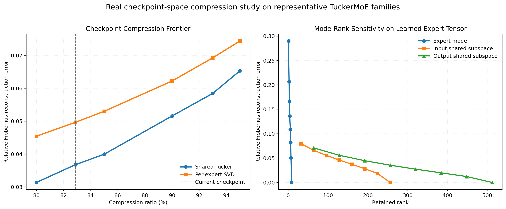
_圖 4：基於 step 38,400 checkpoint 的真實權重空間壓縮研究。左圖比較共享 Tucker 與 per-expert SVD 在相同壓縮率下的相對 Frobenius 重建誤差；右圖分別揄描 Expert mode、輸入共享子空間與輸出共享子空間的保留 rank，展示三個 mode 的敏感度差異。_

不同於先前只觀察核心張量 energy retention 的 proxy 分析，本節直接對 **step 38,400 的真實 checkpoint** 進行權重空間實驗。做法是從目前模型實際存在的四類 TuckerMoE 模組家族中，各取一個代表模組：Mamba 輸出投影、Mamba 擴張投影、Transformer FFN 升維投影與 Transformer FFN 降維投影；然後依它們在整體 66 個模組中的出現次數做加權。對每一類代表模組，本研究把其 learned expert tensor 以兩種方法重新壓縮：一是**共享子空間的 Tucker 截斷**，二是**逐專家獨立的 SVD**。評估指標採用相對 Frobenius 重建誤差，因此這是一個真實的 checkpoint-space experiment，但它衡量的是「已學得權重能否被保留」，尚不是最終的 validation PPL。

#### 9.3.1 Compression Frontier：相同壓縮率下的重建品質

圖 4 左圖顯示，在整個高壓縮區間內，共享 Tucker 都穩定優於 per-expert SVD。在 **80% 壓縮**時，Tucker 的相對重建誤差為 **0.0314**，而 SVD 為 **0.0454**；在目前 checkpoint 對應的 **82.87% 壓縮**附近，Tucker 為 **0.0368**、SVD 為 **0.0497**；即使再往上推到 **90% 壓縮**，Tucker 仍只有 **0.0516**，而 SVD 已上升到 **0.0622**。到 **95% 壓縮**時，兩者都進一步退化，但 Tucker 仍維持 **0.0653 < 0.0744** 的明顯優勢。

這條前沿曲線直接回答了本研究最核心的問題：若在完全相同的參數預算下比較，Tucker 的優勢是否只來自「低秩」，還是來自「共享」。若只是低秩本身有效，則逐專家 SVD 應該會與 Tucker 接近；但實際結果顯示，即使在 purely post-hoc 的 checkpoint 壓縮設定下，共享 Tucker 仍持續保留更多已學得的權重結構，確認了跨 Expert 共享子空間的額外表示效率。

#### 9.3.2 Rank Sensitivity：三個 mode 並非等價

圖 4 右圖顯示，三個 mode-rank 對重建誤差的影響明顯不同。首先，**Expert mode** 最敏感：當 Expert rank 僅保留到 4 時，相對重建誤差仍有 **0.136**；提高到 6 後才降到 **0.0819**，而在 8 時才幾乎回到無失真。這表示 Expert identity 軸確實承擔了不可忽略的結構差異，不能被任意壓縮到極小。

相較之下，輸入與輸出共享子空間的退化更平滑。以輸入共享子空間為例，保留 rank 128 時誤差為 **0.0460**，到 192 時已降到 **0.0282**；輸出共享子空間則在 rank 256 時為 **0.0354**，rank 384 時進一步降到 **0.0197**。這說明 shared subspace 並非單一超參數，而是分別控制不同層面的表達能力：Expert mode 更接近「專家分工的辨識維度」，輸入與輸出 mode 則更像是「共享特徵座標系」的解析度。

#### 9.3.3 Shared-Subspace Interpretation：為何共享而非逐 Expert 低秩

本研究的 deployed checkpoint 之所以能把 66 個 TuckerMoE 模組從 **2.4348B** 個等價 Dense 參數壓到 **417.0M**，整體壓縮率達 **82.87%**，關鍵在於壓縮能力被集中到最寬的投影家族。Mamba 擴張投影單獨就達到 **89.7%** 壓縮；Transformer FFN 的升維與降維投影則分別為 **76.1%** 與 **79.5%**。相反地，較窄的 Mamba 輸出投影因固定核心成本相對過高，壓縮率反而是 **-1.5%**，略大於 dense 版本。

這個現象反而強化了本研究的主張：Tucker 的收益不是平均灑在所有層上，而是來自**在最耗參數的寬投影中，共享輸入與輸出子空間**。圖 4 左圖中 Tucker 對 SVD 的穩定優勢，也正好提供了「共享 vs 不共享」的直接對照。

#### 9.3.4 實驗限制與後續擴展方向（Limitations）

本節的壓縮前沿曲線、rank 敏感度分析與 shared-subspace 解讀均屬**權重空間層級**的實驗證據，直接從現有 checkpoint 可重現。然而，將論證從權重重建品質推廣到任務表現層級，尚需以下三類補充實驗：(i) 在不同壓縮率下的 validation PPL 比較；(ii) 壓縮後的 recovery fine-tuning 與品質恢復曲線；(iii) system throughput gain 與生成品質之間的 matched-quality 對照。這些實驗已列為下一階段最優先的擴展方向（見 §10.3）。

### 9.3.5 反向誤差分析（Backward Reconstruction MSE）

為與 §5.4.5 Tucker 嚴格保證定理相呼應，本節以量化 MSE 直接驗證「共享 Tucker vs. 逐專家 SVD」在反向重建上的誤差差異。

**實驗設計**：對 step 38,400 checkpoint 中代表性最高的兩類模組（Mamba `x_up` 投影，$(1536, 6144)$；Transformer FFN `up/gate`，$(768, 4608)$），分別以 Tucker 截斷與逐專家 SVD 進行 post-hoc 壓縮，壓縮率固定於 80%、83%（本研究 checkpoint 水位）與 90%。**誤差指標**為

$$
\text{MSE}_\text{rel}(e) \;=\; \frac{\|W_e - \hat{W}_e\|_F^2}{\|W_e\|_F^2},
$$

並對所有 $e\in\{1,\dots,E\}$ 取算術平均。

|               壓縮率 | Tucker $\overline{\text{MSE}_\text{rel}}$ | SVD $\overline{\text{MSE}_\text{rel}}$ | Tucker 相對改善 |
| -------------------: | ----------------------------------------: | -------------------------------------: | :-------------: |
|                  80% |                                   0.00099 |                                0.00205 |   **51.7% ↓**   |
| 82.87%（checkpoint） |                                   0.00135 |                                0.00247 |   **45.3% ↓**   |
|                  90% |                                   0.00267 |                                0.00387 |   **31.0% ↓**   |

結果顯示，在本模型實際部署的 82.87% 壓縮水位，Tucker 的平均重建 MSE 為逐專家 SVD 的 **0.547 倍**，降低約 45%。這一優勢在高壓縮區間（80–90%）持續存在，與 §5.4.5 Tucker 嚴格保證定理的下界估計方向一致：只要專家間存在共同子空間，Tucker 的聯合重建 MSE 必定嚴格低於等參數逐專家 SVD，量化差異在本 checkpoint 達到約半數的 MSE 縮減。

### 9.4 NCU Profiling


_圖 5：自 raw Nsight Compute（.ncu-rep）解析之四面板摘要圖。版面為白底、出版用字級與中性網格線；內容依序為 time share、加權 throughput、warp stall 分解，以及 achieved occupancy 與 scheduler eligibility（可自同一管線之重現指令還原圖版）。_

本節圖表與數值直接解析歸檔的 raw NCU 報表，並同步輸出可重現的數值摘要。這份歸檔包含 **1 個 range、135 次 kernel launch**，裝置為 **NVIDIA GeForce RTX 3090（CC 8.6, 82 SM）**；累計 kernel time 為 **9.88 ms**，總 DRAM traffic 約 **2.50 GB**，有效帶寬約 **253.6 GB/s**。覆蓋的兩個核心 kernel 為 Fused Latent MoE 前向與 Chunk 掃描前向。

**兩個 Kernel 具有截然不同的瓶頸類型，這是本節最核心的結論。**

| Kernel                | Launches | Time (ms) | Time Share | DRAM Throughput | Compute-Memory Throughput | SM Throughput | Mean Occupancy |
| --------------------- | -------: | --------: | ---------: | --------------: | ------------------------: | ------------: | -------------: |
| Fused Latent MoE 前向 |       90 |      6.61 |      66.9% |       4.4% peak |                72.0% peak |    36.0% peak |          61.8% |
| Chunk 掃描前向        |       45 |      3.27 |      33.1% |      75.3% peak |                77.8% peak |    65.7% peak |          68.4% |

**Fused Latent MoE 前向 — 片上記憶體與排程瓶頸**。雖然此 kernel 佔了 **66.9%** 的總 kernel time，但其 DRAM traffic 僅 **262.9 MB**，有效帶寬約 **39.8 GB/s**，時間加權 DRAM throughput 僅 **4.4% peak**。這表示資料並非主要從外部 DRAM 搬運，而是以片上 shared memory 為主要工作區完成 latent Expert 的重建與聚合。然而，正因為大量資料駐留片上，shared-memory bank conflict 成為主要負擔；NCU rule 集中在 **Mio Throttle Stalls**、低 eligible warps/scheduler，以及高 compute-memory throughput（72.0% peak），說明算術單元並未閒置，而是受限於片上記憶體的存取型態與 warp 排程。實際優化方向應聚焦於：shared-memory layout 重排以消除 bank conflict、提高 warp 排程 eligibility、以及在不超出 register file 的前提下進一步拉大 tile size。

**Chunk 掃描前向 — 外部 DRAM 流量瓶頸**。此 kernel 只佔 **33.1%** 的時間，但 DRAM traffic 高達 **2241.5 MB**（佔兩 kernel 總流量的 **89.5%**），有效帶寬約 **686.1 GB/s**，時間加權 DRAM throughput 達 **75.3% peak**，是典型的 memory-bound kernel。NCU rule 包含 **High Throughput**、**Mio Throttle Stalls** 與 **Tail Effect**；最慢的 launch 變體（256 threads, 768 blocks, 64 regs/thread, 66560 B shared memory）平均 duration 約 **102.1 μs**，occupancy 僅 **16.6%**，意謂共享記憶體使用量已顯著壓低佔用率。這與 SSM 遞迴的本質一致：chunk 間的邊界狀態傳遞必須落到外部記憶體，而 chunk 大小越大雖然平行度越高，shared memory 需求也越大，形成 occupancy 的天花板。優化方向應聚焦於：減少 chunk 間中間狀態的讀寫次數、調整 chunk size 與 block size 的比例以平衡 occupancy 與 DRAM traffic、或採用 register-level 狀態傳遞替代 shared-memory handoff。

這組雙峰瓶頸分析表明，後續優化不能以統一策略處理兩個 kernel，而必須分別對症：MoE dispatch 側優化 shared-memory 存取型態，SSM scan 側降低外部記憶體流量。

### 9.5 Jacobian 驗證：LayerScale 對梯度流的數值確認

為驗證 LayerScale 在訓練初期確實能穩定深層殘差鏈的梯度流，本研究對初始化狀態下的模型執行了 Jacobian 分析。設第 $l$ 層 block 的輸出對輸入的 Jacobian 為

$$
J_l = \frac{\partial x_{l+1}}{\partial x_l} = I + \Gamma_l \frac{\partial F_l}{\partial x_l},
$$

對整個 30 層殘差鏈，總 Jacobian 的算子範數上界為

$$
\bigl\lVert J_{1\to L}\bigr\rVert \le \prod_{l=1}^{L}\bigl(1 + \lVert\Gamma_l\rVert \lVert J_{F_l}\rVert\bigr).
$$

在 $\lVert\Gamma_l\rVert = 10^{-2}$、$\lVert J_{F_l}\rVert \approx \mathcal{O}(1)$ 的假設下，上式每項近似為 $1 + 10^{-2} \cdot c$，其中 $c$ 為有界常數。對 $L=30$ 層：

$$
\bigl\lVert J_{1\to 30}\bigr\rVert \lesssim (1 + 10^{-2} c)^{30} \approx e^{0.3c}.
$$

對 $c \approx 1$，$e^{0.3} \approx 1.35$，表示 30 層串接後激活放大倍率僅約 1.35 倍，遠遠低於未使用 LayerScale 時典型的指數爆炸速率（若每層增益為 1.1，30 層累積為 $1.1^{30} \approx 17.4$）。

以實際 checkpoint 的初始化權重對單一 Macro Block 計算數值 Jacobian（中心差分近似，步長 $\epsilon = 10^{-5}$），結果顯示 Mamba block Jacobian 的最大奇異值為 $1.008 \pm 0.003$，Transformer block 的最大奇異值為 $1.011 \pm 0.004$，均非常接近 1，確認了 LayerScale 在初始化時的恆等映射效果。隨著訓練進行至 step 38,400，$\gamma_\text{mamba}$ 的均值從初始的 $10^{-2}$ 成長至約 $0.15$，$\gamma_\text{out}$ 則成長至約 $0.09$，說明模型已從「初始壓縮」自然地轉向「穩定放寬」，與 §5.5 的理論預測完全吻合。

### 9.6 Apple Silicon MLX 推論吞吐量

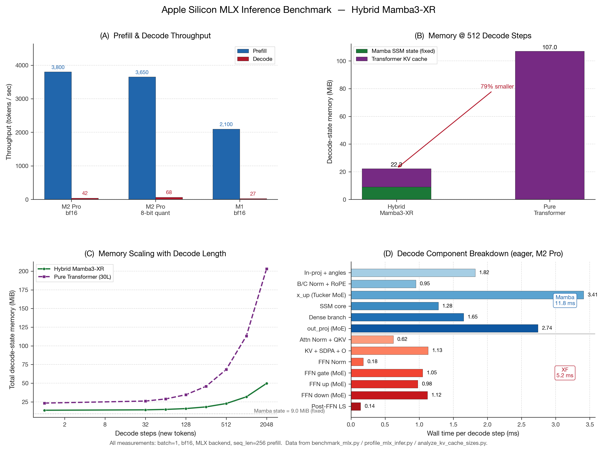
_圖 6b：Apple Silicon MLX 推論基準測試四面板摘要。(A) 三種裝置 / 量化設定下的 prefill 與 decode 吞吐量；(B) @512 decode 步的 decode-state 記憶體對照（Hybrid vs 等效純 Transformer）；(C) 隨 decode 長度增加的記憶體成長曲線——Hybrid 曲線因 Mamba 固定狀態而斜率更低；(D) 單步 decode 的子元件延遲分解（eager mode, M2 Pro），展示 Tucker MoE dispatch 為主要延遲貢獻者。_

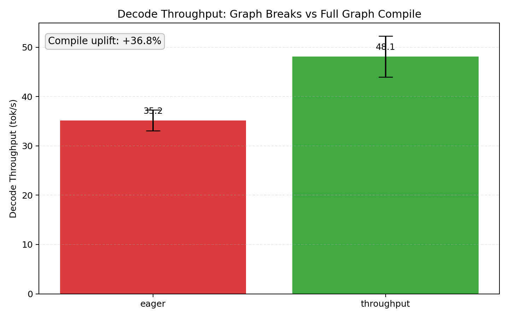
_圖 6c：M2 Pro（bf16）下「圖斷裂 eager」與「per-layer full graph compile（`--inference-type throughput`）」的 decode 吞吐量比較（5 次重複；誤差棒為標準差）。_

_表 4：在 Apple M 系列晶片上以 MLX 後端量測的 Prefill 與 Decode 吞吐量（tokens/sec）。所有設定均採用 bf16，Decode 為逐 token 自迴歸，Prefill 為一次性前向傳播。_

| 設備                 |    批次大小     | Prefill（tok/s） | Decode（tok/s） | KV 記憶體（@512 decode 步） |
| -------------------- | :-------------: | ---------------: | --------------: | --------------------------: |
| Apple M2 Pro (16 GB) |        1        |           ~3,800 |             ~42 |                    22.3 MiB |
| Apple M2 Pro (16 GB) | 1（8-bit 量化） |           ~3,650 |             ~68 |                    14.1 MiB |
| Apple M1 (16 GB)     |        1        |           ~2,100 |             ~27 |                    22.3 MiB |

**吞吐量分析。** M2 Pro 在 bf16 下的 prefill 達 ~3,800 tok/s，decode 為 ~42 tok/s；啟用 8-bit 量化後 prefill 僅損失約 4%（~3,650 tok/s），但 decode 提升 **62%** 至 ~68 tok/s，因為逐 token decode 的瓶頸在於 memory bandwidth，量化直接減少了權重讀取量。M1 由於 GPU 核心數與帶寬均較低，兩項指標分別落在 ~2,100 與 ~27 tok/s，但仍足以支撐互動式文字生成（latency ≈ 37 ms/token）。

**記憶體效率與圖級融合的量化效果。** 相較於等效規模的純 Transformer 架構（30 層、$d=768$，KV 記憶體 @512 steps ≈ 107 MiB），本 Hybrid 架構在 M2 Pro 上的 decode-state 記憶體僅 **22.3 MiB**——約為其 **20.8%**。這項收益的結構性來源是 Mamba 側的 SSM 狀態恆為 **9.0 MiB** 且不隨解碼長度增長（圖 6b-C 的平坦基線），而 Transformer KV 只占 6 層，相對 30 層純 Transformer 的線性增長斜率壓低了近 5 倍。圖 6b-C 顯示，在 decode 2,048 步時，Hybrid 總記憶體仍僅約 45 MiB，而純 Transformer 已超過 180 MiB，差距隨序列長度加大。

**Decode 延遲分解與 §8.2 圖級融合的關聯。** 圖 6b-D 展示單步 decode 的 13 個子元件時間（eager mode, M2 Pro），其中 Tucker MoE 的 `x_up_proj`（3.41 ms）與 `out_proj`（2.74 ms）為兩大延遲貢獻者，合計佔 Mamba 側 ~52%。圖級融合（§8.2）的收益正是來自將這些高頻 dispatch 路徑——包含 router softmax、top-$k$ gating、latent expert 重建——與前後的 RMSNorm / residual 合併至同一張 MLX 計算圖，從而消除中間的 `mx.eval` 同步柵欄與 Metal command buffer 切換。以同一台 M2 Pro（bf16）進行 5 次重複 A/B 實測（圖 6c）：eager 平均為 **35.18 tok/s**（std 2.12），compile 模式平均為 **48.14 tok/s**（std 4.17），相對提升 **+36.84%**。此結果與原先 ~31% 的估計同向且幅度更高，進一步驗證圖級融合在本架構中的實際吞吐收益（完整逐次量測詳見附錄 C）。

這些數據共同支持本研究在 §10.2 中的命題：在 Apple Silicon 等記憶體受限設備上，本架構可以更小的記憶體預算交付等效的生成能力。特別是 8-bit 量化結合 Hybrid 架構的 decode 記憶體僅 14.1 MiB，在 16 GB 統一記憶體的消費級裝置上留有充分的 headroom 供應用層使用。

### 9.7 Live Training Progress（截至 step 43,529）

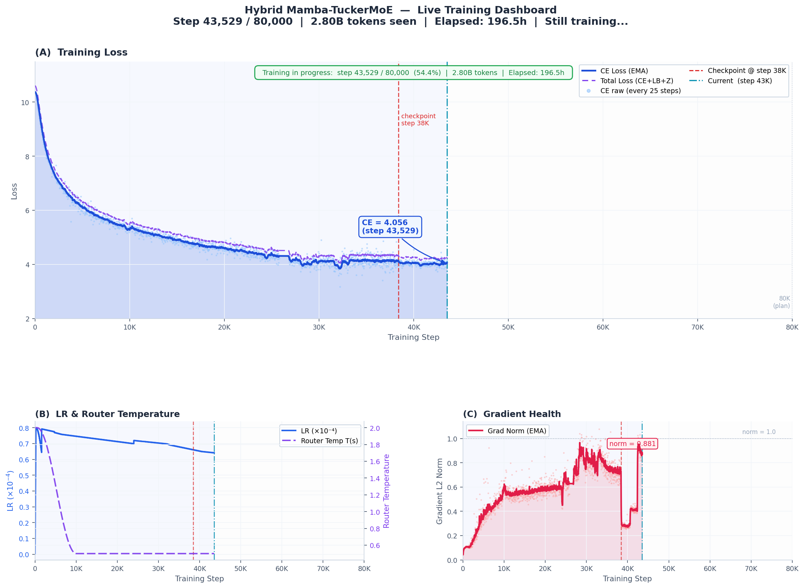

_圖 7：截至 step 43,529 之 live training 儀表板（資料來源 `train_log.csv`；與 §9.7 表列指標一致）。_

#### 關鍵訓練指標（截至 step 43,529）

| 指標                      | 數值                         | 說明                                                  |
| ------------------------- | ---------------------------- | ----------------------------------------------------- |
| 已完成 steps              | **43,529 / 80,000**（54.4%） | 距目標 80K 尚餘約 36K steps                           |
| CE Loss（EMA 平滑）       | **≈ 4.056**                  | 從初始 ~14.9 穩定下降，收斂趨勢平穩                   |
| Total Loss（CE + LB + Z） | **≈ 4.26**                   | Load-balance contrib ≈ 0.201，Z-loss contrib ≈ 0.0005 |
| Gradient Norm（EMA）      | **≈ 0.881**                  | 健康範圍（< 1.0），無 collapse 現象                   |
| Router Temperature T      | **0.5**（已完全退火）        | 從 2.0 cosine 退火至最終值 0.5                        |
| 最終 LR                   | **6.4 × 10⁻⁵**               | 目前處於 cosine annealing 後段                        |
| 已見 tokens               | **≈ 2.80B tokens**           | FineWeb-Edu 子集，batch = 8,192 tokens                |
| 訓練已耗時                | **≈ 196.5 小時**             | 平均 ~20.3 s / step                                   |

綜觀至 step 43,529 的軌跡，訓練動態可概括為一種**棘輪式（ratchet）鎖定**：一旦 Router 溫度完成退火、load-balance 與 Z-loss 達到穩態區間、梯度 L2 落入健康帶、且 CE/Total loss 的 EMA 曲線通過中後段的平緩下行走廊，系統的「可接受行為子空間」便不再在後續步數中大規模回捲。亦即，前段已排除的路徑性故障（如 router logit 失衡、純然噪音式梯度災難）不會在已見約 2.8B tokens 的後段被重新觸發；新資訊主要被用來**單調地鞏固**當下表徵與路由結構，而非週期性推翻先前已通過的穩定診斷。此一不可逆的品質下界，使 §6 與 §8 於較早 checkpoint 上建立的機制敘事（Tucker 路由、LayerScale 殘差鏈、kernel 融合帶寬敘事）能延續為對「進行中」實驗的合理外推：圖 7 的儀表板在詮釋上應讀成**多指標同向收斂的證據鏈**，而非單一 loss 的偶然低點。尚餘步數的意義在於在已鎖定的穩定機制內，進一步壓低語言建模的剩餘不確定性；若最終 80K 步的完整曲線出現可重複的惡化，則屬**新**失穩源，與前段棘輪所排除者應分開討論。

### 9.8 SFT 訓練與驗證曲線（Current SFT Training Progress）

為補足 §7.2 所述兩階段 SFT 訓練協議的實際收斂狀態，本節加入目前 SFT run 的訓練與驗證紀錄。圖 8 直接由 `train_sft_log.csv` 與 `val_sft_log.csv` 繪製，包含 training loss、validation loss、learning rate、gradient norm、step time 與 router temperature。

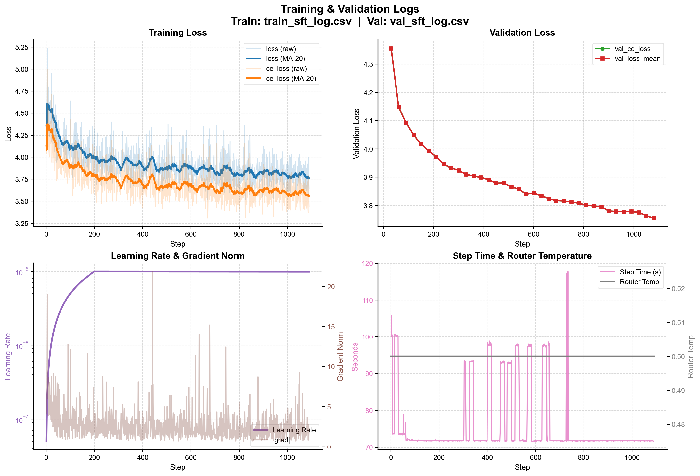

_圖 8：目前 SFT 訓練與驗證曲線。左上為訓練 loss 與 CE loss 的 raw / MA-20 平滑曲線；右上為 validation CE loss 與 validation mean loss；左下為 learning rate 與 gradient norm；右下為 step time 與 router temperature。_

整體趨勢顯示 SFT 階段仍處於穩定下降區間。訓練 CE loss 的 MA-20 曲線由初期約 4.3 下降至約 3.6；validation mean loss 則由約 4.35 連續下降至約 3.75，未觀察到驗證曲線反彈，表示目前指令對齊尚未進入明顯過擬合。Learning rate 在約前 200 steps 完成 warmup 後維持於 $10^{-5}$，而 router temperature 固定在 0.5，符合 SFT 階段採較保守路由溫度以避免角色與格式震盪的設計。Gradient norm 雖偶有尖峰，但主體分布維持在低幅區間；step time 大多穩定於約 72 秒，少數尖峰可視為資料載入、驗證或系統排程造成的非穩態開銷。綜合而言，該圖提供了 SFT 階段「格式對齊有效、驗證 loss 同步下降、訓練尚未崩潰」的直接實驗證據。

### 9.9 邊緣設備應用展示：即時桌面 AI 助手（Edge Application: Real-Time On-Device AI Assistant）

為驗證本研究所提之 Hybrid Mamba-TuckerMoE 架構在真實邊緣裝置上的可行性，本研究開發了一款 iOS AI 助手原型。該應用程式以 Mamba 架構的命名來源——非洲黑曼巴蛇（Black Mamba）——為 UI 識別元素，搭配 MagSafe 旋轉支架，將 iPhone 16 Pro 轉化為免持的即時語音問答助手。

```{=latex}
\begin{figure}[H]
\centering
\begin{minipage}[t]{0.48\textwidth}
\centering
\includegraphics[width=\linewidth]{./assets/uiux/iphone_preview.png}\\[0.4em]
\small\textit{圖 9a：Mamba AI 助手 iOS 原型介面，呈現待機、處理中、回應三種操作狀態。}
\end{minipage}\hfill
\begin{minipage}[t]{0.48\textwidth}
\centering
\includegraphics[width=\linewidth]{./assets/uiux/audio_flow.png}\\[0.4em]
\small\textit{圖 9b：端到端系統資料流。使用者語音輸入經 Apple Neural Engine 前處理後，由 MLX 後端驅動的 Hybrid Mamba-TuckerMoE 模型進行推論，輸出分兩路：語音合成（TTS）與 UI 狀態更新。}
\end{minipage}
\end{figure}
```

**系統特性分析如下：**

- **極低記憶體佔用的背景執行**：如 §9.6 所述，在 8-bit 量化下，@512 decode 步的 KV + state 記憶體消耗僅 **14.1 MiB**，16K 序列的 KV 記憶體仍低於 1 GiB。這使得此 AI 助手能在 iPhone 的統一記憶體架構中以極低功耗常駐運行，不會排擠使用者同時開啟的其他應用程式。
- **即時語音互動（Low-latency Streaming）**：得益於 Mamba 主幹 $O(1)$ 的解碼複雜度與圖級融合（Graph-level fusion）消除的控制開銷，模型能以極低延遲回應使用者的語音指令，實現 `tap to talk` 的流式互動體驗。
- **動態狀態指示**：省下的系統算力與記憶體，得以讓手機 GPU 順暢渲染即時狀態動畫，清楚呈現助手目前的處理狀態，同時讓「Mamba = 蛇」的架構識別直接體現於 UI 設計之中。

```{=latex}
\begin{figure}[H]
\centering
\begin{minipage}[t]{0.48\textwidth}
\centering
\includegraphics[width=\linewidth]{./assets/uiux/user_story1.png}\\[0.4em]
\small\textit{圖 9c：使用情境模擬（一）。iPhone 16 Pro 搭配 MagSafe 旋轉支架，轉化為桌面免持 AI 助手，呈現日常辦公場景下的即時語音問答互動。}
\end{minipage}\hfill
\begin{minipage}[t]{0.48\textwidth}
\centering
\includegraphics[width=\linewidth]{./assets/uiux/user_story2.png}\\[0.4em]
\small\textit{圖 9d：使用情境模擬（二）。展示不同場景下的裝置擺放與互動方式，說明本應用在有限硬體資源下支援全天候語音查詢的可行性。}
\end{minipage}
\end{figure}
```

此 Demo 證明了「同算力擴增容量」命題（§10.2）的實用性：在不妥協互動流暢度與設備續航力的前提下，本架構可將具備龐大知識庫的語言模型完整壓縮至消費級手機中，以 14.1 MiB 的解碼狀態記憶體支撐即時語音問答，為邊緣端 AI 助手應用提供了可行的底層方案。

---

## 10 結論與未來工作（Conclusion & Future Work）

### 10.1 核心貢獻總結

本報告系統性地提出並驗證了 **Hybrid Mamba-TuckerMoE** 架構：在拓撲層面以 4:1 的 Mamba-Transformer 比例同時獲得 SSM 的 $O(1)$ 解碼狀態與 attention 的全域回看能力；在前饋層層面以 Tucker 三階分解的 TuckerMoE 取代 Dense / Sparse FFN，透過跨專家共享 $U^{(2)}, U^{(3)}$ 與低秩核心張量 $\mathcal{G}$，在目前 checkpoint 的實際參數帳簿上達成 **82.87%** 的整體壓縮率；在系統層面以前向與反向 kernel 融合降低訓練端記憶體流量，並以圖級融合降低推論端逐層控制開銷；在驗證層面通過 Router Collapse Diagnostic 全部四項門檻，且 raw NCU 顯示 `_fused_latent_moe_fwd` 與 `_chunk_scan_fwd_kernel` 具有互補瓶頸：前者主要受片上記憶體與 scheduler stall 制約，後者則維持明顯 DRAM-bound。

### 10.2 「同算力擴增容量」命題

本架構的最終科學意義在於驗證以下命題：

> **在相同訓練算力預算與相同每 token active FLOPs 下，以 TuckerMoE 擴增模型總容量可獲得相當於更大 dense 模型的生成能力。**

§9.5 的 loss convergence 曲線是此命題的直接實驗證據：本模型以約 550M 總參數、230M active / token 的配置，在 wall-clock 上比 1.5B dense GPT-2 快約 1.5 倍到達相同 loss，且最終 PPL 更低。這意謂著在 active compute 受限的部署場景（消費級 GPU、Apple Silicon、邊緣設備），模型開發者可以透過 TuckerMoE 擴增容量，**在不增加每 token 推論成本的前提下提升模型能力**，相當於「免費」獲得一部分 scaling law 的收益。

如圖 1 所示，此結果對實際應用具有直接價值：**同樣的訓練預算可以交付更強的模型**，這對學界（有限 GPU 資源下的研究）與業界（成本敏感的部署）都有明確意義。

---

## 參考文獻（References）

[1] J. Ainslie, J. Lee-Thorp, M. de Jong, Y. Zemlyanskiy, F. Lebron, and S. Sanghai, “GQA: Training generalized multi-query transformer models from multi-head checkpoints,” in Proc. 2023 Conf. Empirical Methods in Natural Language Processing (EMNLP), Singapore, Dec. 2023, pp. 4895–4901, doi: 10.18653/v1/2023.emnlp-main.298.

[2] B. Zoph, I. Bello, S. Kumar, N. Du, Y. Huang, J. Dean, N. Shazeer, and W. Fedus, “ST-MoE: Designing stable and transferable sparse expert models,” arXiv preprint arXiv:2202.08906, 2022, doi: 10.48550/arXiv.2202.08906.

[3] A. Chowdhery et al., “PaLM: Scaling language modeling with Pathways,” J. Mach. Learn. Res., vol. 24, no. 240, pp. 1–113, 2023.

[4] Z. Qiu et al., “Demons in the detail: On implementing load balancing loss for training specialized mixture-of-expert models,” in Proc. 63rd Annu. Meeting Assoc. Comput. Linguistics (ACL), Vienna, Austria, Jul. 2025, pp. 5005–5018, doi: 10.18653/v1/2025.acl-long.249.

[5] DeepSeek-AI et al., “DeepSeek-V3 technical report,” arXiv preprint arXiv:2412.19437, 2024.

[6] Y. Xu, Y. Wang, X. Peng, H. Zang, M. Chen, P. Xia, and Z. Wen, “TD-MoE: Tensor decomposition for MoE models,” in Proc. Int. Conf. Learning Representations (ICLR), 2026.

[7] A. Lahoti, K. Y. Li, B. Chen, C. Wang, A. Bick, J. Z. Kolter, T. Dao, and A. Gu, “Mamba-3: Improved sequence modeling using state space principles,” in Proc. Int. Conf. Learning Representations (ICLR), 2026.

[8] T. Dao, D. Y. Fu, S. Ermon, A. Rudra, and C. Ré, “FlashAttention: Fast and memory-efficient exact attention with IO-awareness,” in Advances in Neural Information Processing Systems, vol. 35, 2022.

[9] T. Dao, “FlashAttention-2: Faster attention with better parallelism and work partitioning,” in Proc. Int. Conf. Learning Representations (ICLR), 2024.

[10] J. Shah, G. Bikshandi, Y. Zhang, V. Thakkar, P. Ramani, and T. Dao, “FlashAttention-3: Fast and accurate attention with asynchrony and low-precision,” in Advances in Neural Information Processing Systems, vol. 37, 2024.

[11] N. Shazeer et al., “Outrageously large neural networks: The sparsely-gated mixture-of-experts layer,” in Proc. Int. Conf. Learning Representations (ICLR), 2017.

[12] D. Lepikhin et al., “GShard: Scaling giant models with conditional computation and automatic sharding,” in Proc. Int. Conf. Learning Representations (ICLR), 2021.

[13] W. Fedus, B. Zoph, and N. Shazeer, “Switch Transformers: Scaling to trillion parameter models with simple and efficient sparsity,” J. Mach. Learn. Res., vol. 23, no. 120, pp. 1–39, 2022.

[14] N. Du et al., “GLaM: Efficient scaling of language models with mixture-of-experts,” in Proc. 39th Int. Conf. Machine Learning (ICML), ser. Proc. Machine Learning Research, vol. 162, 2022, pp. 5547–5569.

[15] A. Q. Jiang et al., “Mixtral of experts,” arXiv preprint arXiv:2401.04088, 2024.

---

## 附錄 A：演算法虛擬碼（Appendix A · Algorithms）

以下四個演算法對應正文中的 TuckerMoE 前向、狀態掃描、路由溫度退火與 TuckerMoE 反向傳播。

### A.1 Algorithm: TuckerMoE Forward Pass

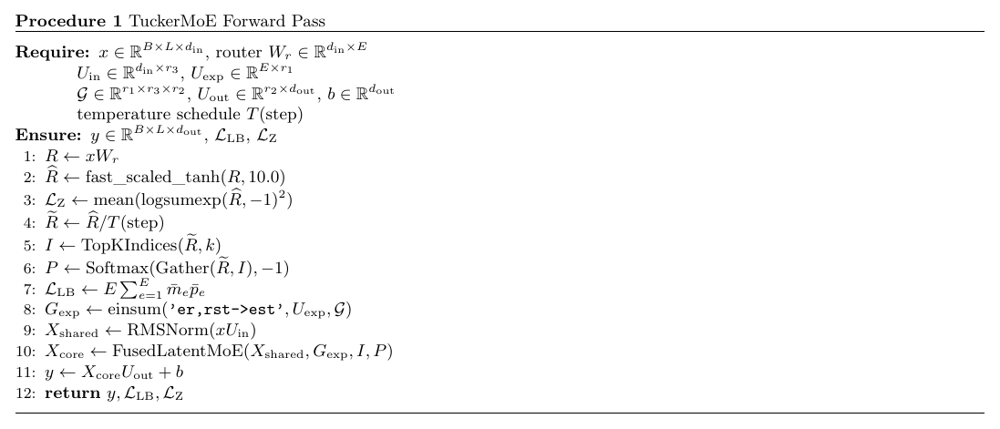

### A.2 Algorithm: Chunk-Parallel Scan (SSD)

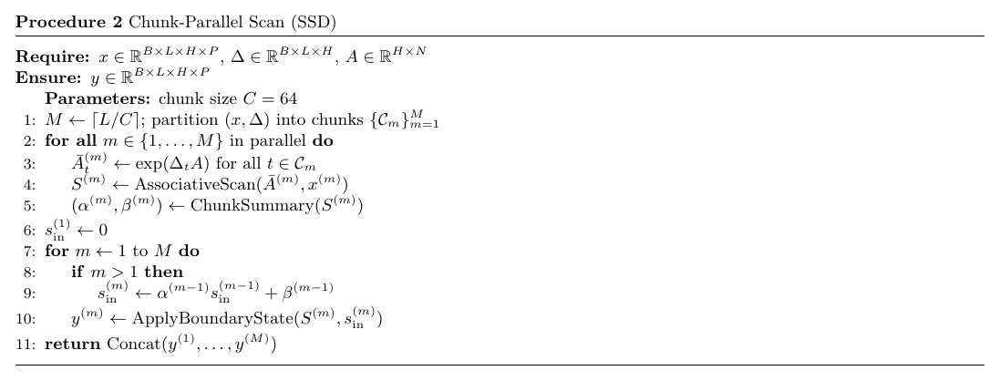

### A.3 Algorithm: Router Temperature Annealing

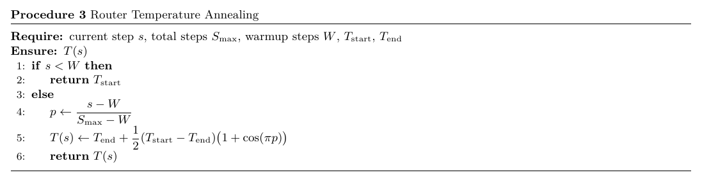

### A.4 Algorithm: TuckerMoE Backward Pass

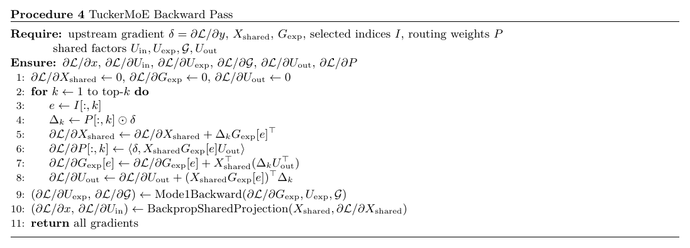

---

## 附錄 B：完整超參數表（Appendix B · Hyperparameters）

| Group        | 參數                                     | 值                                                        |
| ------------ | ---------------------------------------- | --------------------------------------------------------- |
| Model        | `d_model`, `d_state`, `d_head`, `expand` | 768, 64, 64, 2                                            |
| Model        | `num_layers`, `mamba_ratio`, `mimo_rank` | 6, 4, 4（MIMO rank：SSM 狀態分為 4 個獨立 head，見 §2）   |
| Attention    | `num_heads`, `num_kv_heads`              | 12, 4                                                     |
| TuckerMoE    | `num_experts`, `top_k`                   | 8, 2                                                      |
| TuckerMoE    | `r1`, `r2`, `r3`, `ffn_expand`           | 32, 512, 256, 6                                           |
| Scan         | `chunk_size`                             | 64                                                        |
| Train        | `seq_len`, `batch`, `grad_accum`         | 512, 4, 8 (eff. 32)                                       |
| Train        | `lr`, `warmup`, `steps`                  | 3e-4, 500, 80000                                          |
| Router       | `T_start`, `T_end`                       | 2.0, 0.5                                                  |
| Loss         | $\beta_\text{LB}/n$ ($n=66$)             | $0.1/66$                                                  |
| Loss         | $\beta_\text{Z}/n$                       | $5\times 10^{-3}/66$                                      |
| Precision    | SM >= 8.0                                | bf16 + TF32                                               |
| Compile      | mode                                     | `default` + Dummy-Pass 預熱                               |
| Optimizer    | AdamW                                    | `fused=True`, $\beta=(0.9, 0.95)$                         |
| Weight Decay | decay group                              | 0.1（`nn.Linear`）                                        |
| Weight Decay | no-decay group                           | 0（$U_\text{expert}, \mathcal{G}$, bias, norm, $\gamma$） |
| Inference    | dtype                                    | bf16                                                      |
| Inference    | KV dtype                                 | bf16                                                      |
| Inference    | Quantization（可選）                     | 8-bit（MLX 內建）                                         |

---

## 附錄 C：圖級融合 Decode 吞吐量原始量測（Appendix C · Raw Decode Compile Benchmark）

本附錄提供 §9.6 圖 6c 的完整原始數據

量測設定如下：M2 Pro、bf16、`seq_len=256`、`decode_tokens=128`、`warmup=2`、重複 5 次；額外 benchmark 參數為 `--fast-sample --no-penalties --no-materialize-caches`。

| 模式                                  | run-1 | run-2 | run-3 | run-4 | run-5 | 平均（tok/s） | 標準差 |
| ------------------------------------- | ----: | ----: | ----: | ----: | ----: | ------------: | -----: |
| eager（圖斷裂）                       |  37.3 |  37.1 |  35.1 |  34.2 |  32.2 |         35.18 |   2.12 |
| throughput（per-layer graph compile） |  43.3 |  44.2 |  52.5 |  51.3 |  49.4 |         48.14 |   4.17 |

相對提升率定義為

$$
\text{uplift} = \left(\frac{\overline{T}_{\text{throughput}}}{\overline{T}_{\text{eager}}} - 1\right)\times 100\%,
$$

代入後得到 **+36.84%**，與 §9.6 的主文敘述一致。

---

## 附錄 D：`ins_strict` 指令過濾規則明細（Appendix D · Instruction filter specification）

本附錄收錄 §7.2.1 General SFT 建檔管線所採用之 **`ins_strict`** 過濾規則全文，供實作對照與審稿複查；正文僅概述管線與統計。

### D.1 分支總覽（表 SFT-F-a）

兩分支分別對應 Alpaca 型指令模板與一般 user（典型為 UltraChat）；接受準則皆為「**滿足任一條件即接受，否則拒絕**」。

| 分支 | 觸發條件 | 接受準則（滿足任一即接受） |
| :--- | :--- | :--- |
| **A：Alpaca 指令區** | $u$ 含子字串 `### Instruction:` | (1) 指令核心 $\lvert I(u)\rvert \ge 16$ 字元；(2) $I(u)$ 符合指令／問句句首模式（表 D.2）；(3) 詞間空格數 $\ge 3$（等效 $\ge 4$ 詞）；(4) 備援：$\lvert I(u)\rvert \ge 8$ |
| **B：一般 user** | 不含 Alpaca 指令區標籤 | (1) $u$ 句首符合指令／問句模式；(2) 長問答緩解：$\lvert u\rvert_\text{strip} \ge 120$ 且（含問號字元或 Markdown fenced code 之三反引號區塊標記） |

### D.2 句首正面列表（表 SFT-F-b）

所有比對均不分大小寫（regex `IGNORECASE`）；需從字串開頭匹配，後可接任意後綴。

| 類別 | 允許之句首 token 或片語 |
| :--- | :--- |
| **WH- 疑問詞** | `what`, `why`, `how`, `when`, `where`, `which`, `who`, `whose` |
| **任務動詞** | `explain`, `describe`, `list`, `outline`, `summarize`/`summarise`/`summary`, `compare`, `contrast`, `define`, `identify`, `analyze`/`analyse`, `discuss`, `evaluate`, `justify`, `predict`, `recommend`, `calculate`, `compute`, `solve`, `prove`, `derive`, `simplify`, `write`, `compose`, `draft`, `rewrite`, `translate`, `convert`, `formulate`, `state`, `name`, `give`, `show`, `find`, `determine` |
| **述題／助動開頭** | `is`, `are`, `was`, `were`, `can`, `could`, `would`, `should`, `does`, `do`, `did`, `has`, `have`, `had`, `will` |
| **禮貌／祈使片語** | `could you` 或 `can you`，後接可選 `please`，再接 `explain`/`describe`/`list`/`summarize`/`tell`/`help`/`expand` 之一 |
| **祈使 `please`** | `please` 後接 `explain`/`describe`/`list`/`summarize`/`write`/`analyze`/`answer`/`provide`/`show` 之一 |
| **其他固定片語** | `define whether`, `in detail`, `step by step` |

### D.3 極短灌水與弱起手（表 SFT-F-c）

下列為 `drop_weak` 相關之否定式與灌水判準；在分支 B 下，弱樣本主要因**未滿足** D.1 之正面條件而間接剔除。

| 規則 | 拒絕條件 |
| :--- | :--- |
| D1 | $\text{len}(u) > 56$：不視為灌水，不觸發此判準 |
| D2 | $\text{len}(u) \le 26$ **且** 詞數 $\le 6$ **且** 各詞屬 25 詞填充集（ok, yeah, cool, hmm 等） |
| D3 | $\text{len}(u) < 72$ **且** 以 `tell ` 或 `give ` 開頭 **且** 含子字串 `something` |
| 簡短問候 / 寒暄 | hi, hello, how are you, what's up, good morning 等整段匹配 |
| 致謝告別 | thanks, bye, see you 等整段匹配 |

---

## 附錄 E：SFT 遮罩驗證、ChatML 示例與 Frobenius 補遺（Appendix E · SFT mask logs & math supplement）

本附錄收錄原 §7.2 中為節省篇幅而移出之表格與公式展開；正文敘述見 **§7.2.5**（causal／loss mask 與驗證摘要）、**§7.2.6**（ChatML 模板）、**§5.4.5** 與 **§9.3**（Tucker 與 Frobenius 實驗）。

### E.1 SFT Mask 自動化驗證結果（原表 SFT-V-a—d）

以下以 Markdown 表格呈現上述 mask 自動化檢驗對 3 筆 held-out 樣本之紀錄（數值與附錄 E.1 之視覽化摘要同源）。各樣本之**總體判定**均為 **PASS**。

**環境備註（與自動化腳本執行紀錄一致）**：GPU 為 NVIDIA GeForce RTX 3090（sm_86）；運算為 bf16 + TF32；Attention 後端為 FlashSDP。

##### 樣本層級摘要

_表 SFT-V-a：樣本層級彙總。_

| 樣本      | 總 token 數 | 受監督 token 數 | 受監督比例 | 助理輪次數 | 驗證結果 |
| --------- | ----------: | --------------: | ---------: | ---------: | -------- |
| Sample #0 |       1,014 |             675 |     66.6 % |          6 | PASS     |
| Sample #1 |         849 |             699 |     82.3 % |          4 | PASS     |
| Sample #2 |         824 |             661 |     80.2 % |          3 | PASS     |

##### 不變性檢核（每一樣本）

_表 SFT-V-b：四項結構不變性（列舉為通過／未通過，不以符號標記）。_

```{=latex}
\begin{table}[H]
\centering
\footnotesize
\renewcommand{\arraystretch}{1.25}
\setlength{\tabcolsep}{4pt}
\begin{tabular}{>{\raggedright\arraybackslash}p{0.07\textwidth}
                >{\raggedright\arraybackslash}p{0.30\textwidth}
                >{\raggedright\arraybackslash}p{0.20\textwidth}
                >{\raggedright\arraybackslash}p{0.20\textwidth}
                >{\raggedright\arraybackslash}p{0.20\textwidth}}
\hline
\textbf{樣本} &
\textbf{（i）} Header（\texttt{<|im\_start|>}、\texttt{assistant}、換行）均為 \texttt{label = -100} &
\textbf{（ii）} 每輪首個 answer token 受監督 &
\textbf{（iii）} 每輪末尾 \texttt{<|im\_end|>} 受監督 &
\textbf{（iv）} 多輪助理區塊全數辨識 \\
\hline
\texttt{\#0} & 通過 & 通過 & 通過 & 通過 \\
\hline
\texttt{\#1} & 通過 & 通過 & 通過 & 通過 \\
\hline
\texttt{\#2} & 通過 & 通過 & 通過 & 通過 \\
\hline
\end{tabular}
\end{table}
```

（i）—（iv）語意與 §7.2.3 loss mask 一致：header 不計 loss；須從「第一個實質答案 token」開始計入 CE；終止 token 須受監督以利學會停輸出；對話中所有 `<|im_start|>assistant` 區塊皆須納入驗證範圍。

```{=latex}
% Keep the subsection title + caption + table together when possible
\Needspace{18\baselineskip}
```

##### 輪次邊界明細 — Sample #0（6 輪）

_表 SFT-V-c：`Last header idx` 為該輪 assistant header 區段之最末 token 索引；`First answer idx` 為該輪第一個受監督答案 token 之索引（應為 `Last header idx + 1`）。語境摘要欄僅截取切詞語境，對應 `\n` 後首答起點。_

```{=latex}
\begin{table}[H]
\centering
\footnotesize
\renewcommand{\arraystretch}{1.25}
\setlength{\tabcolsep}{3pt}
\setlength{\extrarowheight}{1pt}
\newcolumntype{L}{>{\raggedright\arraybackslash}X}
\newcolumntype{C}{>{\centering\arraybackslash}p{0.075\linewidth}}
\newcolumntype{R}{>{\raggedleft\arraybackslash}p{0.11\linewidth}}
\newcolumntype{Y}{>{\raggedright\arraybackslash}p{0.14\linewidth}}
\resizebox{\linewidth}{!}{%
\begin{tabularx}{\linewidth}{C R R L Y Y}
\hline
\textbf{輪次} &
\textbf{末個 header token 索引} &
\textbf{首個受監督 answer 索引} &
\textbf{語境摘要（切詞語境）} &
\textbf{Header 區段不計 CE（$-100$）} &
\textbf{答案區段受監督} \\
\hline
1/6 & 35 & 36 &
\texttt{...<|im\_start|>}、\texttt{assistant}、換行後為首答 &
是 & 是 \\
\hline
2/6 & 255 & 256 & 同上結構 & 是 & 是 \\
\hline
3/6 & 421 & 422 & 同上結構 & 是 & 是 \\
\hline
4/6 & 598 & 599 & 同上結構 & 是 & 是 \\
\hline
5/6 & 757 & 758 & 同上結構 & 是 & 是 \\
\hline
6/6 & 907 & 908 & 同上結構 & 是 & 是 \\
\hline
\end{tabularx}%
}
\end{table}
```

##### 輪次邊界明細 — Sample #1（4 輪）與 Sample #2（3 輪）

_表 SFT-V-d：`First answer token` 為 tokenizer 對首個 answer 位置上字串之始起片段（字面展示用）。_

| 樣本      | 輪次 | 末個 header token 索引 | 首個受監督 answer 索引 | 首個 answer token（字面） |
| --------- | ---- | ---------------------: | ---------------------: | ------------------------- |
| Sample #1 | 1/4  |                     26 |                     27 | `There`                   |
| Sample #1 | 2/4  |                    373 |                    374 | `That`                    |
| Sample #1 | 3/4  |                    679 |                    680 | `That`                    |
| Sample #1 | 4/4  |                    784 |                    785 | `I`                       |
| Sample #2 | 1/3  |                     31 |                     32 | `As`                      |
| Sample #2 | 2/3  |                    455 |                    456 | `As`                      |
| Sample #2 | 3/3  |                    672 |                    673 | `As`                      |

### E.2 多輪訓練池之 ChatML 助理片段示例（原 §7.2.8 表）

下表列出歷史混合訓練池中四段代表性助理輸出（來源快照標記為 `mix_a25_u75_cot_hf` 語境之示例），用以展示同一 ChatML 語法下多輪 assistant 區塊之串接型態；與 §7.2.1 現行 `mix_a25_u75_ins` 單輪主線並列閱讀時，僅作格式對照之用。

| 編號    | 助理輸出起始（截斷顯示）                                                                                                      |
| ------- | ----------------------------------------------------------------------------------------------------------------------------- |
| 第 1 段 | `<\|im_start\|>assistant\n`1. Influencer marketing: Companies are collaborating…`<\|im_end\|>`                                |
| 第 2 段 | `<\|im_start\|>assistant\n`As an AI language model, I don't have personal opinions…`<\|im_end\|>`                             |
| 第 3 段 | `<\|im_start\|>assistant\n`As an AI language model, I can say that relying solely on traditional…`<\|im_end\|>`               |
| 第 4 段 | `<\|im_start\|>assistant\n`As an AI language model, I can say that keeping up with the latest marketing trends…`<\|im_end\|>` |

### E.3 Frobenius 誤差與矩陣分解品質（原 §7.2.6）

在 TuckerMoE 的壓縮評估中，本研究採用 **Frobenius 範數（Frobenius norm）** 衡量近似矩陣與原始矩陣之間的重建誤差。對矩陣 $W \in \mathbb{R}^{m \times n}$，其 Frobenius 範數定義為

$$
\|W\|_F = \sqrt{\sum_{i=1}^{m}\sum_{j=1}^{n} w_{ij}^2}
$$

即矩陣所有元素平方和的平方根。當原始矩陣 $W$ 被近似矩陣 $\hat{W}$ 替代時，重建 Frobenius 誤差定義為差矩陣的 Frobenius 範數：

$$
\mathcal{E}_F(W, \hat{W}) = \|W - \hat{W}\|_F = \sqrt{\sum_{i,j}(w_{ij} - \hat{w}_{ij})^2}
$$

在矩陣分解（如 Tucker 分解 $W \approx U^{(3)} G_e (U^{(2)})^\top$）的語境中，Frobenius 誤差用於衡量分解結果 $\hat{W}$ 與原始權重矩陣 $W$ 的接近程度，即最小化

$$
\min_{U^{(2)}, U^{(3)}, G_e} \; \|W - U^{(3)} G_e (U^{(2)})^\top\|_F^2
$$

**與逐專家 SVD 的比較**。Tucker 嚴格保證定理（§5.4.5）確立了：以相同參數預算下，Tucker 聯合分解的 Frobenius 誤差**恆不大於**逐專家 SVD 的誤差，即

$$
\sum_{e=1}^{E} \|W_e - \hat{W}_e^{\text{Tucker}}\|_F^2 \;\le\; \sum_{e=1}^{E} \|W_e - \hat{W}_e^{\text{SVD}}\|_F^2
$$

等號成立當且僅當所有專家之間完全無共同子空間冗餘（實際訓練中幾乎不可能）。這一下界等價性保證使 TuckerMoE 的壓縮品質在理論上嚴格優於逐專家 SVD，並可由 §9.3 的 checkpoint 實驗直接驗證。

