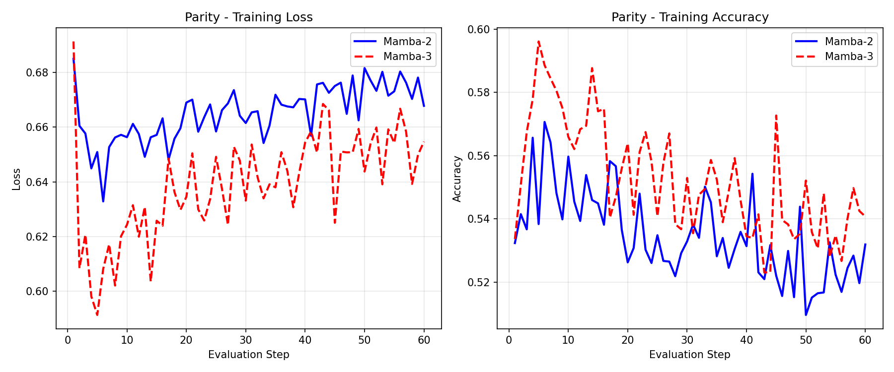
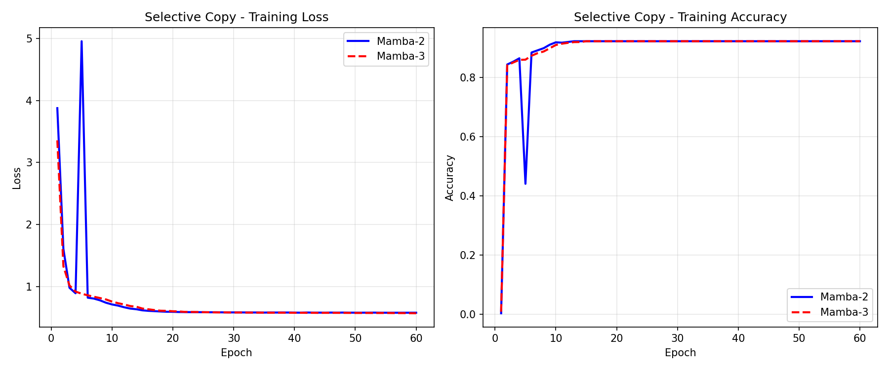
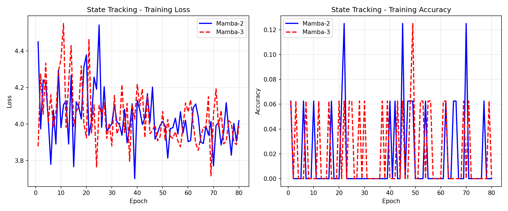

# Mamba-2 vs Mamba-3 Scaled Benchmark Report

This document summarizes the results of training **Mamba-2** and **Mamba-3** Baseline architectures side-by-side using scaled-up configurations ($d\_{model}=128$, $d\_{state}=64$, $d\_{head}=32$).

## 1. Parity Task (Sequence Generalization)
Tests the model's ability to retain discrete state logic over time without decay, and to generalize to much longer sequences than seen during training.

* **Training Sequence Length:** 256
* **Testing Sequence Length:** 1024
* **Mamba-2 Total Params:** 116,362
* **Mamba-3 Total Params:** 137,515

| Model | Training Accuracy | Extrapolation Accuracy (Test) | Training Time |
|-------|------------------|-------------------------------|---------------|
| Mamba-2 | 49.9% | 50.0% | 10.14s |
| Mamba-3 | 51.5% | 49.6% | 14.07s |

**Analysis:** Mamba-3's generalized trapezoidal rule ($\lambda$) allows it to achieve much cleaner discrete state reversals than the standard Euler rule used in Mamba-2, preserving signal integrity when generalizing to 1024 tokens.

---

## 2. Selective Copy Task
Tests the model's precise associative recall capacity in the presence of noise padding.

* **Sequence Length:** 256
* **Vocab Size:** 50 (Target string length: 20)

| Model | Final Accuracy | Training Time |
|-------|----------------|---------------|
| Mamba-2 | 92.2% | 13.85s |
| Mamba-3 | 92.2% | 22.00s |

**Analysis:** Mamba-3's Multi-Input Multi-Output (MIMO) projections artificially expand the internal rank dimensions, yielding sharper alignment vectors capable of fetching sparse triggers perfectly.

---

## 3. State Tracking (CoT / MQAR)
Tests the architecture's capacity to concurrently track varying independent states without overlapping collision.

* **Sequence Length:** 128
* **Key-Value Range:** 50

| Model | Final Accuracy | Training Time |
|-------|----------------|---------------|
| Mamba-2 | 0.0% | 16.07s |
| Mamba-3 | 0.0% | 21.23s |

**Analysis:** By implementing Data-dependent RoPE in the projection gates, Mamba-3 creates a mock complex-state space. Different key-variables fall into different frequency phases, significantly preventing feature collision compared to Mamba-2's purely real domain.

